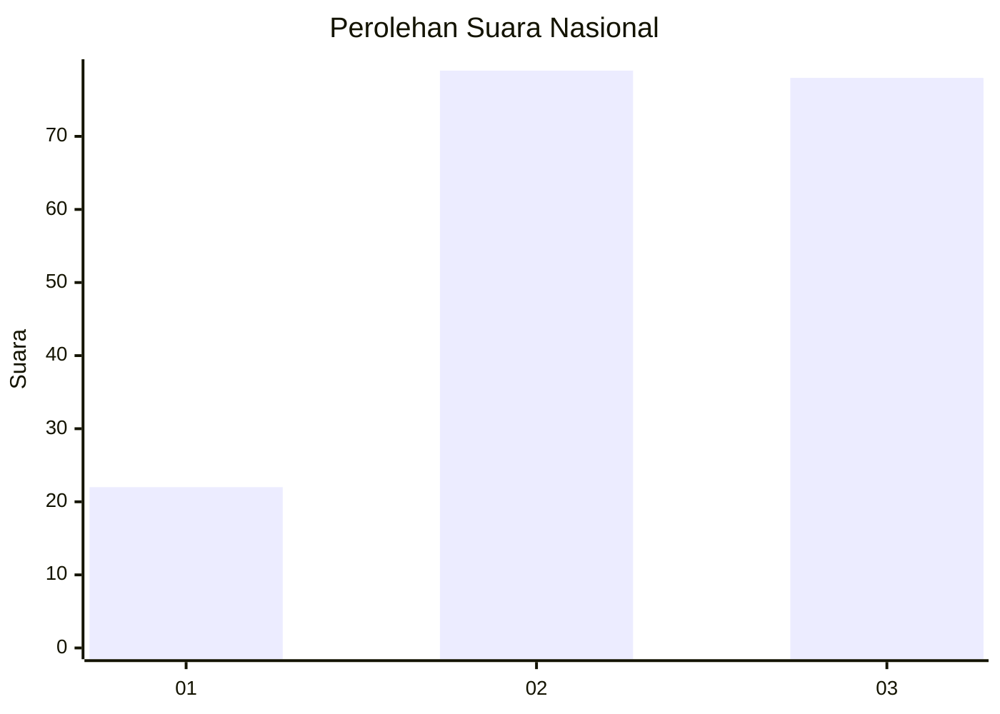
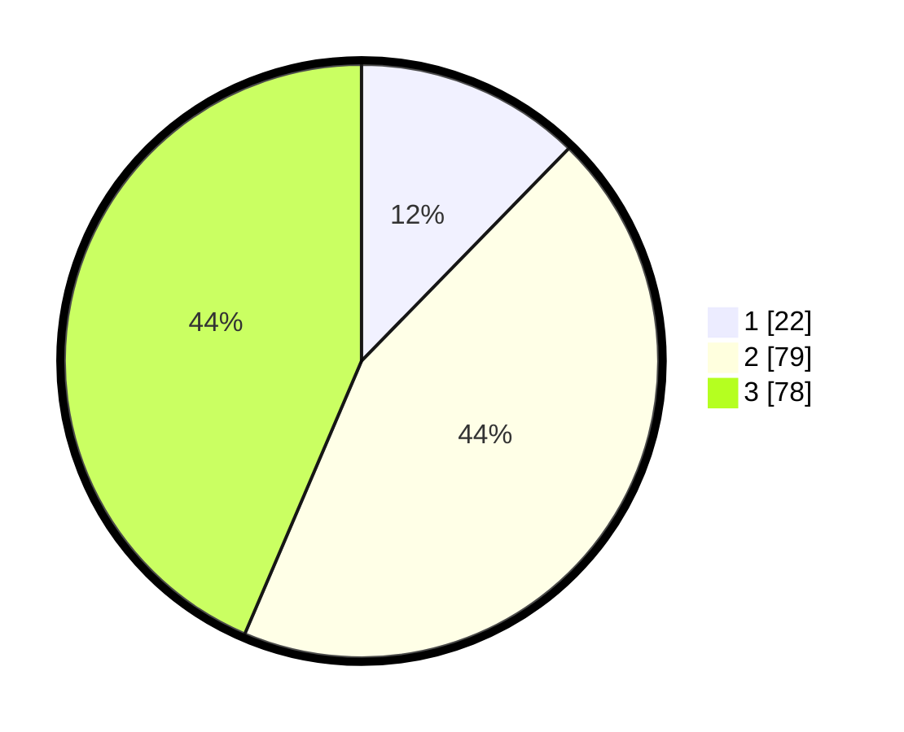

# Hasil

## Grafik

## Tabel

| No. | Nama Paslon    | Suara | Suara (raw) | Persentase |
|:--- |:-------------- | -----:| -----------:| ----------:|
| 1   | ANIES MUHAIMIN | 22    | [22][p-1]   | 12,29      |
| 2   | PRABOWO GIBRAN | 79    | [79][p-2]   | 44,13      |
| 3   | GANJAR MAHFUD  | 78    | [78][p-3]   | 43,58      |

[p-1]: https://github.com/gigit-pemilu/pemilu-2024/blob/main/pilpres/hitung-suara/sub/34-di-yogyakarta/sub/02-bantul/sub/15-sewon/sub/2002-timbulharjo/sub/033-tps/sub/paslon-1.txt
[p-2]: https://github.com/gigit-pemilu/pemilu-2024/blob/main/pilpres/hitung-suara/sub/34-di-yogyakarta/sub/02-bantul/sub/15-sewon/sub/2002-timbulharjo/sub/033-tps/sub/paslon-2.txt
[p-3]: https://github.com/gigit-pemilu/pemilu-2024/blob/main/pilpres/hitung-suara/sub/34-di-yogyakarta/sub/02-bantul/sub/15-sewon/sub/2002-timbulharjo/sub/033-tps/sub/paslon-3.txt

## Foto C Plano

https://sirekap-obj-formc.kpu.go.id/4fb7/pemilu/ppwp/34/02/15/20/02/3402152002033-20240214-213718--d73c48c0-58c4-4afa-9500-52b7dcc11cc8.jpg

https://sirekap-obj-formc.kpu.go.id/4fb7/pemilu/ppwp/34/02/15/20/02/3402152002033-20240214-213728--3b1aed89-522a-41ee-851a-a4b9bbc5b0f2.jpg

https://sirekap-obj-formc.kpu.go.id/4fb7/pemilu/ppwp/34/02/15/20/02/3402152002033-20240214-213737--23d2e144-f65e-44b3-be86-2410690361e4.jpg

## Metadata

| Key        | Value               |
| ---------- | ------------------- |
| Time Stamp | 2024-02-24 22:31:28 |

