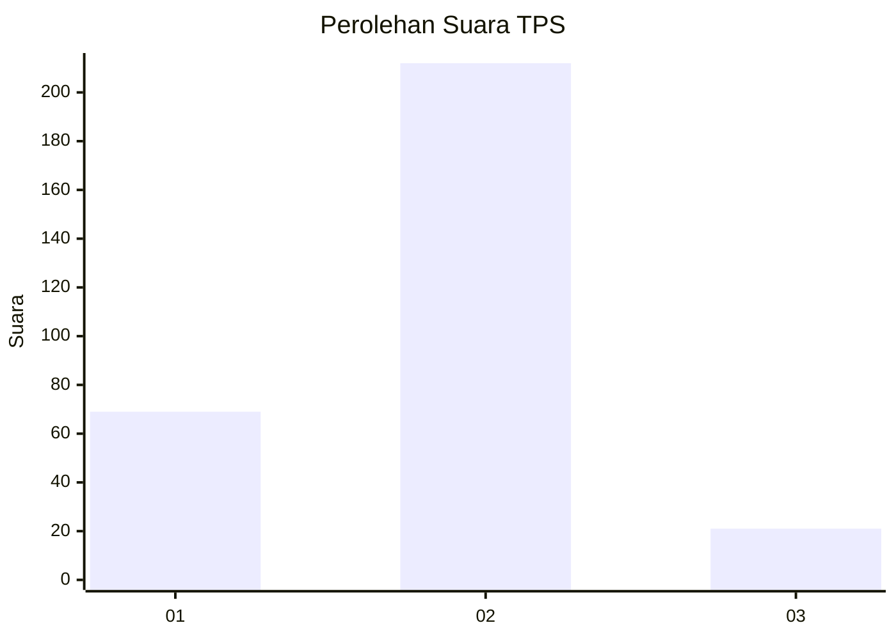

# Hasil

## Grafik

## Tabel

| No. | Nama Paslon    | Suara | Suara (raw) | Persentase |
|:--- |:-------------- | -----:| -----------:| ----------:|
| 1   | ANIES MUHAIMIN | 69    | [69][p-1]   | 22,85      |
| 2   | PRABOWO GIBRAN | 212   | [212][p-2]  | 70,20      |
| 3   | GANJAR MAHFUD  | 21    | [21][p-3]   | 6,95       |

[p-1]: https://github.com/gigit-pemilu/pemilu-2024-34-di-yogyakarta/blob/main/pilpres/hitung-suara/sub/34-di-yogyakarta/sub/02-bantul/sub/15-sewon/sub/2002-timbulharjo/sub/035-tps/sub/paslon-1.txt
[p-2]: https://github.com/gigit-pemilu/pemilu-2024-34-di-yogyakarta/blob/main/pilpres/hitung-suara/sub/34-di-yogyakarta/sub/02-bantul/sub/15-sewon/sub/2002-timbulharjo/sub/035-tps/sub/paslon-2.txt
[p-3]: https://github.com/gigit-pemilu/pemilu-2024-34-di-yogyakarta/blob/main/pilpres/hitung-suara/sub/34-di-yogyakarta/sub/02-bantul/sub/15-sewon/sub/2002-timbulharjo/sub/035-tps/sub/paslon-3.txt

## Foto C Plano

https://sirekap-obj-formc.kpu.go.id/7097/pemilu/ppwp/34/02/15/20/02/3402152002035-20240214-214443--f62e0ad7-ef55-44ee-b84a-c71f19db95c9.jpg

https://sirekap-obj-formc.kpu.go.id/7097/pemilu/ppwp/34/02/15/20/02/3402152002035-20240214-214533--b2f0c06a-04ff-466e-9f1a-1ebeb155b826.jpg

https://sirekap-obj-formc.kpu.go.id/7097/pemilu/ppwp/34/02/15/20/02/3402152002035-20240214-214650--f2ce16d8-0404-4774-bba1-745166248d05.jpg

## Metadata

| Key        | Value               |
| ---------- | ------------------- |
| Time Stamp | 2024-02-25 16:00:00 |

