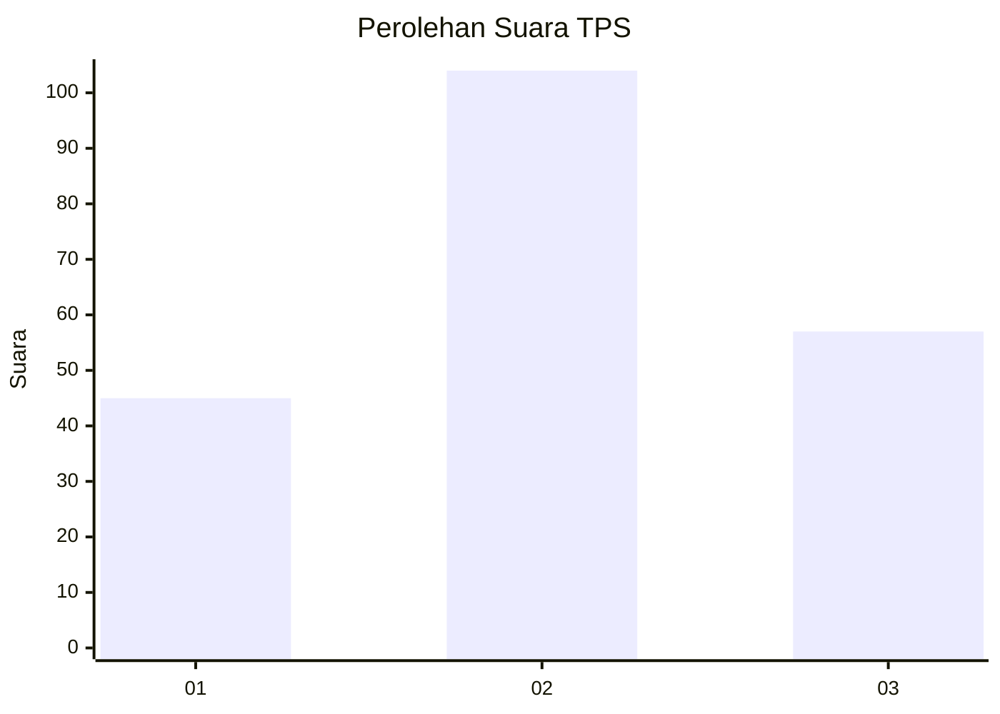
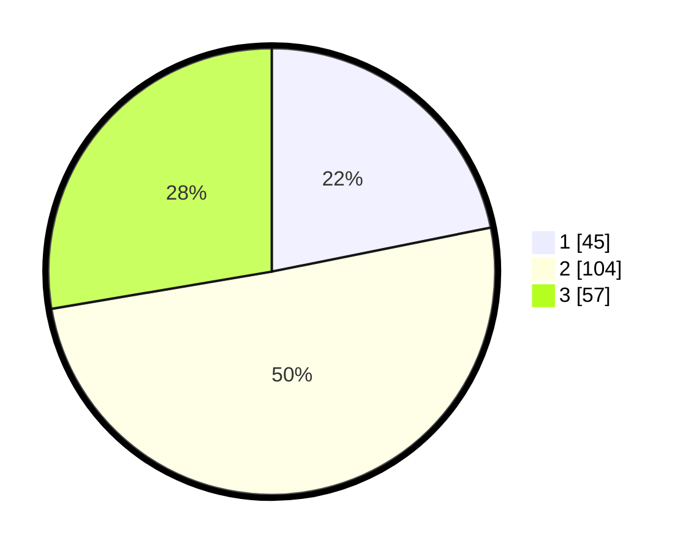

# Hasil

## Grafik

## Tabel

| No. | Nama Paslon    | Suara | Suara (raw) | Persentase |
|:--- |:-------------- | -----:| -----------:| ----------:|
| 1   | ANIES MUHAIMIN | 45    | [45][p-1]   | 21,84      |
| 2   | PRABOWO GIBRAN | 104   | [104][p-2]  | 50,49      |
| 3   | GANJAR MAHFUD  | 57    | [57][p-3]   | 27,67      |

[p-1]: https://github.com/gigit-pemilu/pemilu-2024-34-di-yogyakarta/blob/main/pilpres/hitung-suara/sub/34-di-yogyakarta/sub/02-bantul/sub/15-sewon/sub/2002-timbulharjo/sub/036-tps/sub/paslon-1.txt
[p-2]: https://github.com/gigit-pemilu/pemilu-2024-34-di-yogyakarta/blob/main/pilpres/hitung-suara/sub/34-di-yogyakarta/sub/02-bantul/sub/15-sewon/sub/2002-timbulharjo/sub/036-tps/sub/paslon-2.txt
[p-3]: https://github.com/gigit-pemilu/pemilu-2024-34-di-yogyakarta/blob/main/pilpres/hitung-suara/sub/34-di-yogyakarta/sub/02-bantul/sub/15-sewon/sub/2002-timbulharjo/sub/036-tps/sub/paslon-3.txt

## Foto C Plano

https://sirekap-obj-formc.kpu.go.id/b543/pemilu/ppwp/34/02/15/20/02/3402152002036-20240214-225039--506badb0-c8c2-4c46-bc93-3cc2f1ca8dbb.jpg

https://sirekap-obj-formc.kpu.go.id/b543/pemilu/ppwp/34/02/15/20/02/3402152002036-20240214-225157--685a0876-51ee-4be7-8ade-e1e39869ab17.jpg

https://sirekap-obj-formc.kpu.go.id/b543/pemilu/ppwp/34/02/15/20/02/3402152002036-20240214-225914--caf286fd-c482-4c34-b19f-20740554ce89.jpg

## Metadata

| Key        | Value               |
| ---------- | ------------------- |
| Time Stamp | 2024-02-24 22:31:28 |

