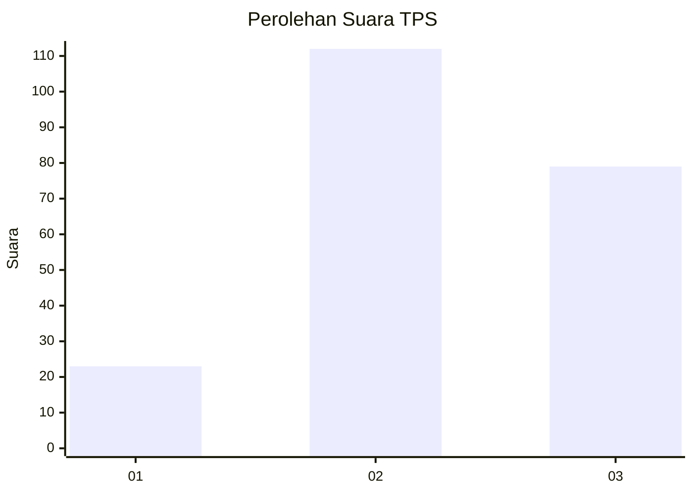
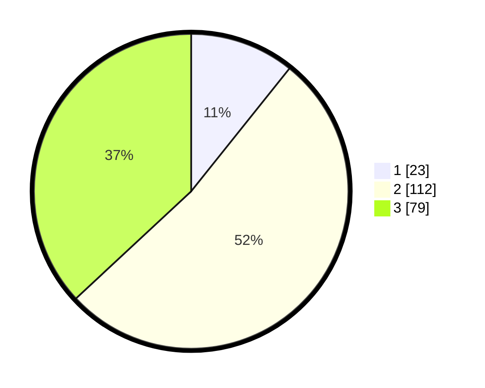

# Hasil

## Grafik

## Tabel

| No. | Nama Paslon    | Suara | Suara (raw) | Persentase |
|:--- |:-------------- | -----:| -----------:| ----------:|
| 1   | ANIES MUHAIMIN | 23    | [23][p-1]   | 10,75      |
| 2   | PRABOWO GIBRAN | 112   | [112][p-2]  | 52,34      |
| 3   | GANJAR MAHFUD  | 79    | [79][p-3]   | 36,92      |

[p-1]: https://github.com/gigit-pemilu/pemilu-2024-34-di-yogyakarta/blob/main/pilpres/hitung-suara/sub/34-di-yogyakarta/sub/02-bantul/sub/15-sewon/sub/2002-timbulharjo/sub/041-tps/sub/paslon-1.txt
[p-2]: https://github.com/gigit-pemilu/pemilu-2024-34-di-yogyakarta/blob/main/pilpres/hitung-suara/sub/34-di-yogyakarta/sub/02-bantul/sub/15-sewon/sub/2002-timbulharjo/sub/041-tps/sub/paslon-2.txt
[p-3]: https://github.com/gigit-pemilu/pemilu-2024-34-di-yogyakarta/blob/main/pilpres/hitung-suara/sub/34-di-yogyakarta/sub/02-bantul/sub/15-sewon/sub/2002-timbulharjo/sub/041-tps/sub/paslon-3.txt

## Foto C Plano

https://sirekap-obj-formc.kpu.go.id/e85f/pemilu/ppwp/34/02/15/20/02/3402152002041-20240214-233434--afef16d2-c450-473a-a41f-d9b4bfd5996f.jpg

https://sirekap-obj-formc.kpu.go.id/e85f/pemilu/ppwp/34/02/15/20/02/3402152002041-20240214-233522--17130608-ae4b-46b6-8aa9-3bd1fdb60791.jpg

https://sirekap-obj-formc.kpu.go.id/e85f/pemilu/ppwp/34/02/15/20/02/3402152002041-20240214-233610--73d11568-9ab8-4fda-95ff-a43f3b359dd4.jpg

## Metadata

| Key        | Value               |
| ---------- | ------------------- |
| Time Stamp | 2024-02-24 22:31:28 |

