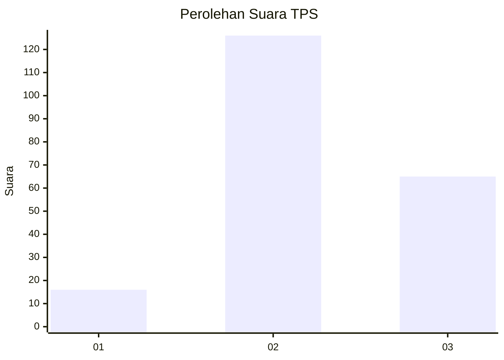
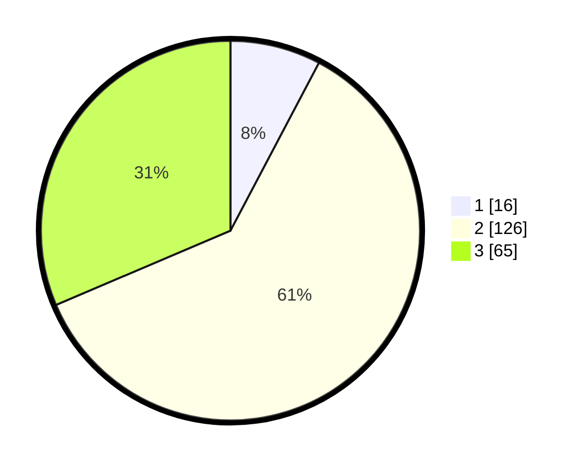

# Hasil

## Grafik

## Tabel

| No. | Nama Paslon    | Suara | Suara (raw) | Persentase |
|:--- |:-------------- | -----:| -----------:| ----------:|
| 1   | ANIES MUHAIMIN | 16    | [16][p-1]   | 7,73       |
| 2   | PRABOWO GIBRAN | 126   | [126][p-2]  | 60,87      |
| 3   | GANJAR MAHFUD  | 65    | [65][p-3]   | 31,40      |

[p-1]: https://github.com/gigit-pemilu/pemilu-2024-34-di-yogyakarta/blob/main/pilpres/hitung-suara/sub/34-di-yogyakarta/sub/02-bantul/sub/15-sewon/sub/2002-timbulharjo/sub/042-tps/sub/paslon-1.txt
[p-2]: https://github.com/gigit-pemilu/pemilu-2024-34-di-yogyakarta/blob/main/pilpres/hitung-suara/sub/34-di-yogyakarta/sub/02-bantul/sub/15-sewon/sub/2002-timbulharjo/sub/042-tps/sub/paslon-2.txt
[p-3]: https://github.com/gigit-pemilu/pemilu-2024-34-di-yogyakarta/blob/main/pilpres/hitung-suara/sub/34-di-yogyakarta/sub/02-bantul/sub/15-sewon/sub/2002-timbulharjo/sub/042-tps/sub/paslon-3.txt

## Foto C Plano

https://sirekap-obj-formc.kpu.go.id/9456/pemilu/ppwp/34/02/15/20/02/3402152002042-20240215-002345--f30e5a06-9cfe-4285-9c4c-966797383738.jpg

https://sirekap-obj-formc.kpu.go.id/9456/pemilu/ppwp/34/02/15/20/02/3402152002042-20240215-002428--413a9d49-db30-45cc-97c0-7fca336316c7.jpg

https://sirekap-obj-formc.kpu.go.id/9456/pemilu/ppwp/34/02/15/20/02/3402152002042-20240215-002626--3ece0f9e-c530-4386-b569-f7dec4b8b878.jpg

## Metadata

| Key        | Value               |
| ---------- | ------------------- |
| Time Stamp | 2024-02-24 22:31:28 |

