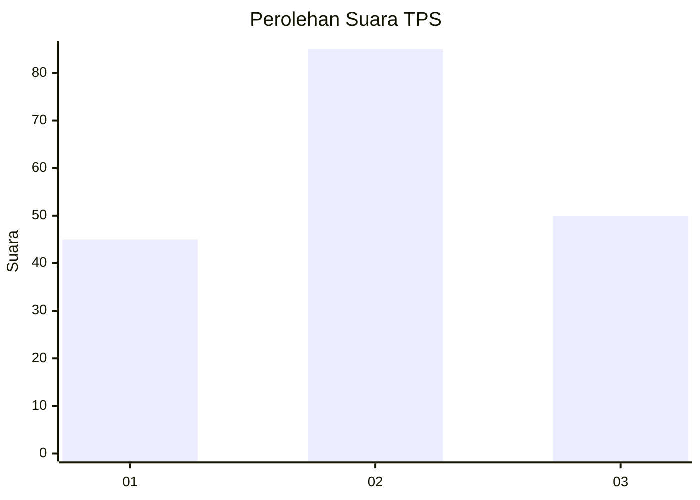
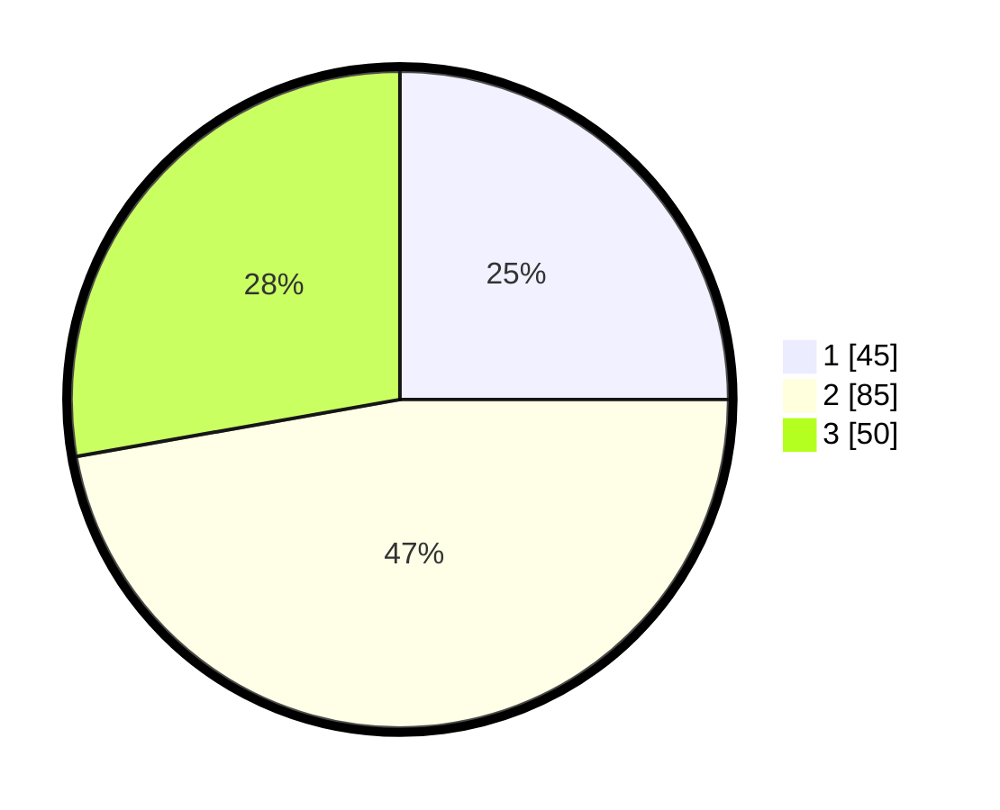

# Hasil

## Grafik

## Tabel

| No. | Nama Paslon    | Suara | Suara (raw) | Persentase |
|:--- |:-------------- | -----:| -----------:| ----------:|
| 1   | ANIES MUHAIMIN | 45    | [45][p-1]   | 25,00      |
| 2   | PRABOWO GIBRAN | 85    | [85][p-2]   | 47,22      |
| 3   | GANJAR MAHFUD  | 50    | [50][p-3]   | 27,78      |

[p-1]: https://github.com/gigit-pemilu/pemilu-2024-34-di-yogyakarta/blob/main/pilpres/hitung-suara/sub/34-di-yogyakarta/sub/02-bantul/sub/15-sewon/sub/2002-timbulharjo/sub/046-tps/sub/paslon-1.txt
[p-2]: https://github.com/gigit-pemilu/pemilu-2024-34-di-yogyakarta/blob/main/pilpres/hitung-suara/sub/34-di-yogyakarta/sub/02-bantul/sub/15-sewon/sub/2002-timbulharjo/sub/046-tps/sub/paslon-2.txt
[p-3]: https://github.com/gigit-pemilu/pemilu-2024-34-di-yogyakarta/blob/main/pilpres/hitung-suara/sub/34-di-yogyakarta/sub/02-bantul/sub/15-sewon/sub/2002-timbulharjo/sub/046-tps/sub/paslon-3.txt

## Foto C Plano

https://sirekap-obj-formc.kpu.go.id/f52a/pemilu/ppwp/34/02/15/20/02/3402152002046-20240215-010425--07b8e508-0e56-40c8-9f7b-91205b2547ff.jpg

https://sirekap-obj-formc.kpu.go.id/f52a/pemilu/ppwp/34/02/15/20/02/3402152002046-20240215-010639--35163cfe-1289-432e-a5f6-d74be55e0791.jpg

https://sirekap-obj-formc.kpu.go.id/f52a/pemilu/ppwp/34/02/15/20/02/3402152002046-20240215-011038--a1a118da-9782-4af7-b397-055542338e65.jpg

## Metadata

| Key        | Value               |
| ---------- | ------------------- |
| Time Stamp | 2024-02-24 22:31:28 |

