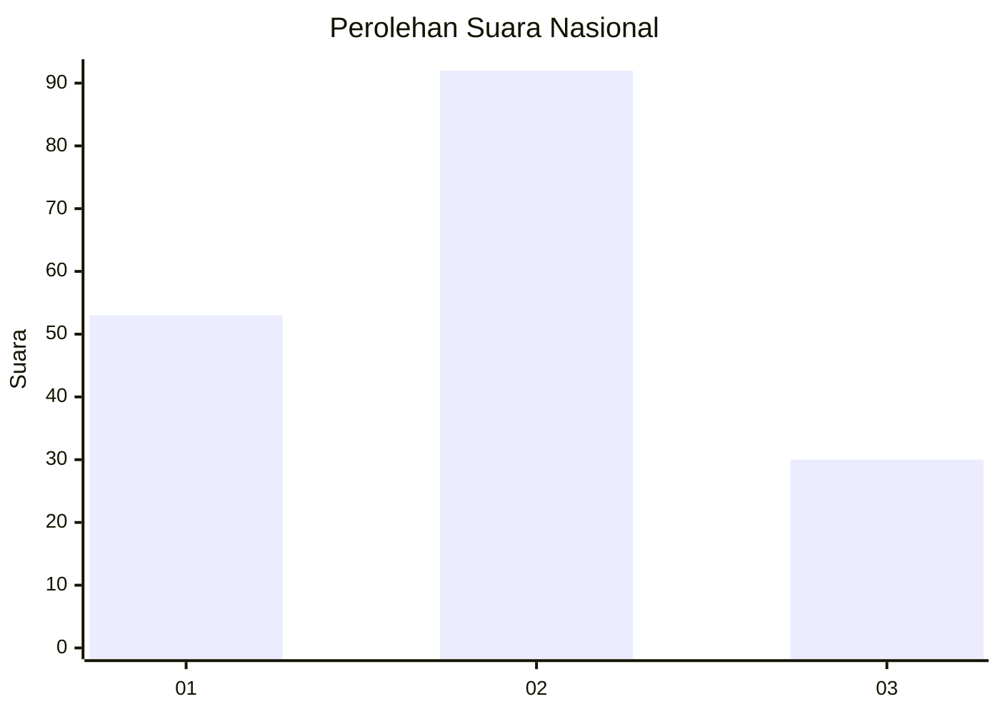
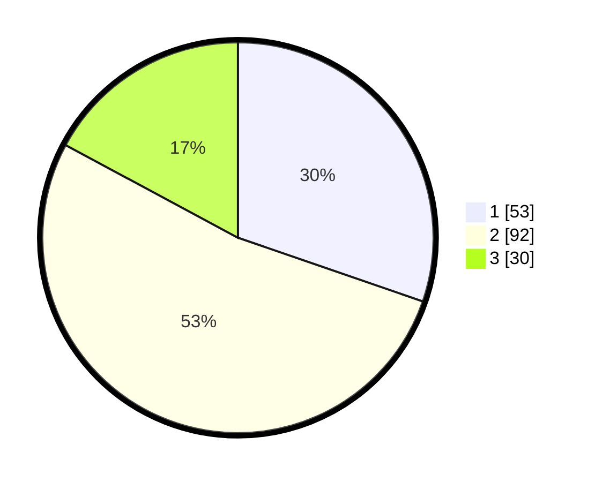

# Hasil

## Grafik

## Tabel

| No. | Nama Paslon    | Suara | Suara (raw) | Persentase |
|:--- |:-------------- | -----:| -----------:| ----------:|
| 1   | ANIES MUHAIMIN | 53    | [53][p-1]   | 30,29      |
| 2   | PRABOWO GIBRAN | 92    | [92][p-2]   | 52,57      |
| 3   | GANJAR MAHFUD  | 30    | [30][p-3]   | 17,14      |

[p-1]: https://github.com/gigit-pemilu/pemilu-2024/blob/main/pilpres/hitung-suara/sub/34-di-yogyakarta/sub/02-bantul/sub/15-sewon/sub/2002-timbulharjo/sub/052-tps/sub/paslon-1.txt
[p-2]: https://github.com/gigit-pemilu/pemilu-2024/blob/main/pilpres/hitung-suara/sub/34-di-yogyakarta/sub/02-bantul/sub/15-sewon/sub/2002-timbulharjo/sub/052-tps/sub/paslon-2.txt
[p-3]: https://github.com/gigit-pemilu/pemilu-2024/blob/main/pilpres/hitung-suara/sub/34-di-yogyakarta/sub/02-bantul/sub/15-sewon/sub/2002-timbulharjo/sub/052-tps/sub/paslon-3.txt

## Foto C Plano

https://sirekap-obj-formc.kpu.go.id/325c/pemilu/ppwp/34/02/15/20/02/3402152002052-20240214-231154--e5d5bcd7-e759-46dc-9408-a510e685f690.jpg

https://sirekap-obj-formc.kpu.go.id/325c/pemilu/ppwp/34/02/15/20/02/3402152002052-20240214-231510--5e677f92-e252-4cfa-a542-9ed5c6d94a1e.jpg

https://sirekap-obj-formc.kpu.go.id/325c/pemilu/ppwp/34/02/15/20/02/3402152002052-20240214-231614--20ea322e-f2e0-4166-9a19-8dc40c14d4a3.jpg

## Metadata

| Key        | Value               |
| ---------- | ------------------- |
| Time Stamp | 2024-02-24 22:31:28 |

