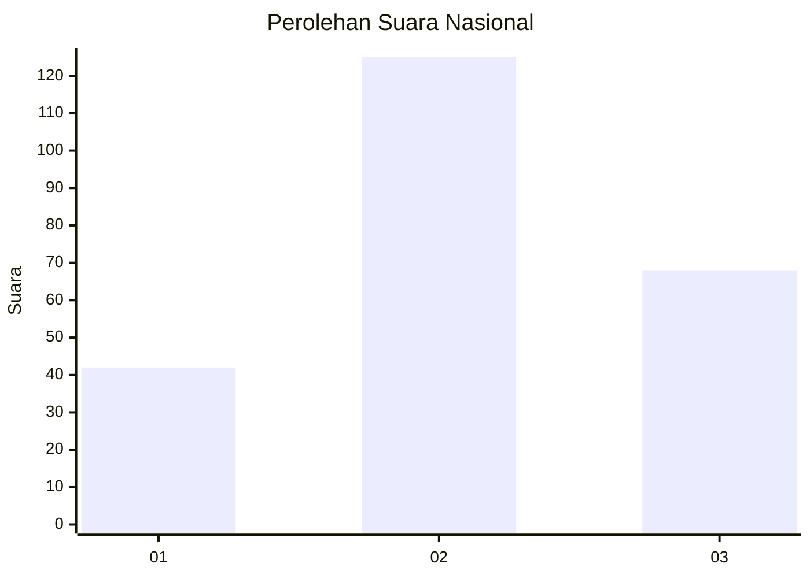
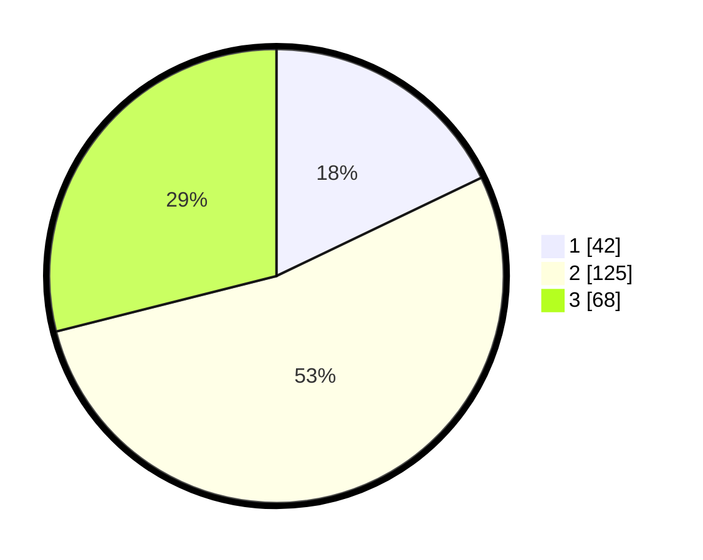

# Hasil

## Grafik

## Tabel

| No. | Nama Paslon    | Suara | Suara (raw) | Persentase |
|:--- |:-------------- | -----:| -----------:| ----------:|
| 1   | ANIES MUHAIMIN | 42    | [42][p-1]   | 17,87      |
| 2   | PRABOWO GIBRAN | 125   | [125][p-2]  | 53,19      |
| 3   | GANJAR MAHFUD  | 68    | [68][p-3]   | 28,94      |

[p-1]: https://github.com/gigit-pemilu/pemilu-2024/blob/main/pilpres/hitung-suara/sub/34-di-yogyakarta/sub/02-bantul/sub/15-sewon/sub/2002-timbulharjo/sub/056-tps/sub/paslon-1.txt
[p-2]: https://github.com/gigit-pemilu/pemilu-2024/blob/main/pilpres/hitung-suara/sub/34-di-yogyakarta/sub/02-bantul/sub/15-sewon/sub/2002-timbulharjo/sub/056-tps/sub/paslon-2.txt
[p-3]: https://github.com/gigit-pemilu/pemilu-2024/blob/main/pilpres/hitung-suara/sub/34-di-yogyakarta/sub/02-bantul/sub/15-sewon/sub/2002-timbulharjo/sub/056-tps/sub/paslon-3.txt

## Foto C Plano

https://sirekap-obj-formc.kpu.go.id/e7bc/pemilu/ppwp/34/02/15/20/02/3402152002056-20240214-215455--271f85d9-f153-43ab-ab2b-9b5b54666dd8.jpg

https://sirekap-obj-formc.kpu.go.id/e7bc/pemilu/ppwp/34/02/15/20/02/3402152002056-20240214-215505--ad80ea13-fff8-443e-9dd4-d0f7a116ec59.jpg

https://sirekap-obj-formc.kpu.go.id/e7bc/pemilu/ppwp/34/02/15/20/02/3402152002056-20240214-215509--27c274f5-c7b1-40de-883d-d5713f055e78.jpg

## Metadata

| Key        | Value               |
| ---------- | ------------------- |
| Time Stamp | 2024-02-15 15:00:29 |

