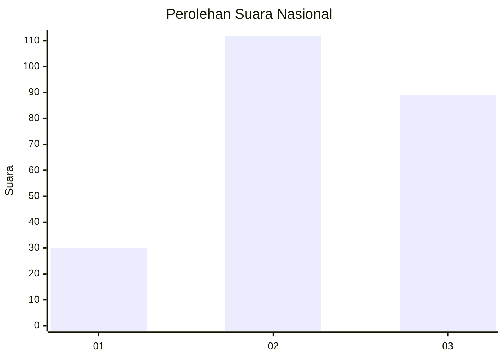
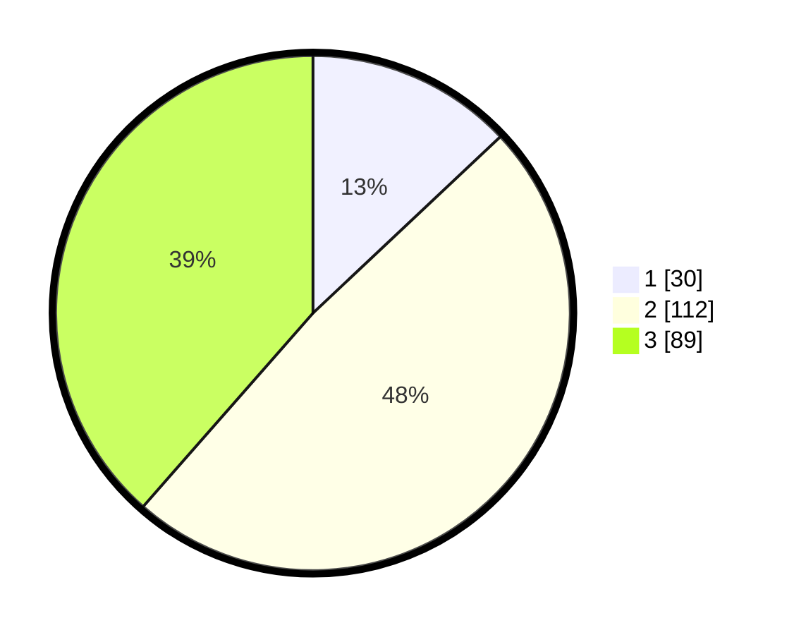

# Hasil

## Grafik

## Tabel

| No. | Nama Paslon    | Suara | Suara (raw) | Persentase |
|:--- |:-------------- | -----:| -----------:| ----------:|
| 1   | ANIES MUHAIMIN | 30    | [30][p-1]   | 12,99      |
| 2   | PRABOWO GIBRAN | 112   | [112][p-2]  | 48,48      |
| 3   | GANJAR MAHFUD  | 89    | [89][p-3]   | 38,53      |

[p-1]: https://github.com/gigit-pemilu/pemilu-2024/blob/main/pilpres/hitung-suara/sub/34-di-yogyakarta/sub/02-bantul/sub/15-sewon/sub/2002-timbulharjo/sub/057-tps/sub/paslon-1.txt
[p-2]: https://github.com/gigit-pemilu/pemilu-2024/blob/main/pilpres/hitung-suara/sub/34-di-yogyakarta/sub/02-bantul/sub/15-sewon/sub/2002-timbulharjo/sub/057-tps/sub/paslon-2.txt
[p-3]: https://github.com/gigit-pemilu/pemilu-2024/blob/main/pilpres/hitung-suara/sub/34-di-yogyakarta/sub/02-bantul/sub/15-sewon/sub/2002-timbulharjo/sub/057-tps/sub/paslon-3.txt

## Foto C Plano

https://sirekap-obj-formc.kpu.go.id/4825/pemilu/ppwp/34/02/15/20/02/3402152002057-20240216-165557--29c003ff-0bfb-4f16-a446-3c2991634cee.jpg

https://sirekap-obj-formc.kpu.go.id/4825/pemilu/ppwp/34/02/15/20/02/3402152002057-20240214-215332--b30a7984-7825-416b-b96c-eedd3e10c908.jpg

https://sirekap-obj-formc.kpu.go.id/4825/pemilu/ppwp/34/02/15/20/02/3402152002057-20240214-215418--b044f5c2-f679-43be-8f93-e82b2ef199ab.jpg

## Metadata

| Key        | Value               |
| ---------- | ------------------- |
| Time Stamp | 2024-02-25 12:00:00 |

