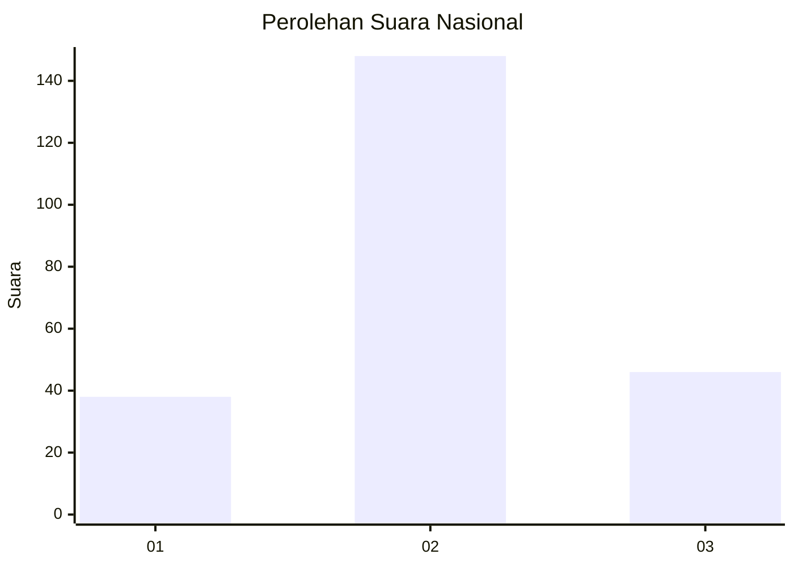
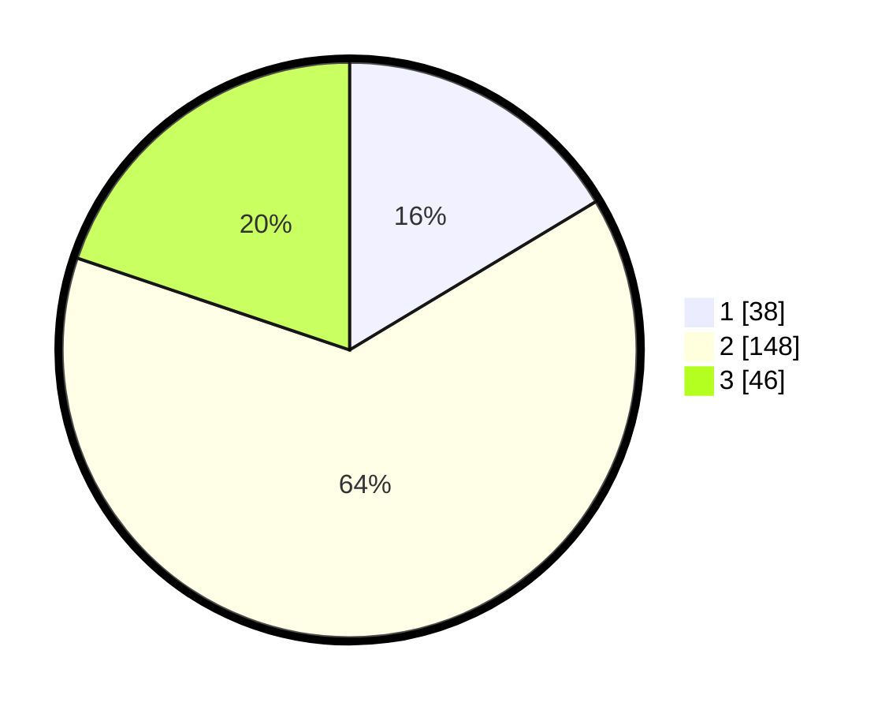

# Hasil

## Grafik

## Tabel

| No. | Nama Paslon    | Suara | Suara (raw) | Persentase |
|:--- |:-------------- | -----:| -----------:| ----------:|
| 1   | ANIES MUHAIMIN | 38    | [38][p-1]   | 16,38      |
| 2   | PRABOWO GIBRAN | 148   | [148][p-2]  | 63,79      |
| 3   | GANJAR MAHFUD  | 46    | [46][p-3]   | 19,83      |

[p-1]: https://github.com/gigit-pemilu/pemilu-2024/blob/main/pilpres/hitung-suara/sub/34-di-yogyakarta/sub/02-bantul/sub/15-sewon/sub/2002-timbulharjo/sub/058-tps/sub/paslon-1.txt
[p-2]: https://github.com/gigit-pemilu/pemilu-2024/blob/main/pilpres/hitung-suara/sub/34-di-yogyakarta/sub/02-bantul/sub/15-sewon/sub/2002-timbulharjo/sub/058-tps/sub/paslon-2.txt
[p-3]: https://github.com/gigit-pemilu/pemilu-2024/blob/main/pilpres/hitung-suara/sub/34-di-yogyakarta/sub/02-bantul/sub/15-sewon/sub/2002-timbulharjo/sub/058-tps/sub/paslon-3.txt

## Foto C Plano

https://sirekap-obj-formc.kpu.go.id/539e/pemilu/ppwp/34/02/15/20/02/3402152002058-20240215-021412--eed2bf60-8460-4678-9c7b-3e6044edab9b.jpg

https://sirekap-obj-formc.kpu.go.id/539e/pemilu/ppwp/34/02/15/20/02/3402152002058-20240215-021139--55523862-fd1d-440f-b69d-acf3932e0808.jpg

https://sirekap-obj-formc.kpu.go.id/539e/pemilu/ppwp/34/02/15/20/02/3402152002058-20240215-021533--116df19c-1a89-406a-9081-50ad0aa7fcbf.jpg

## Metadata

| Key        | Value               |
| ---------- | ------------------- |
| Time Stamp | 2024-02-25 13:00:00 |

