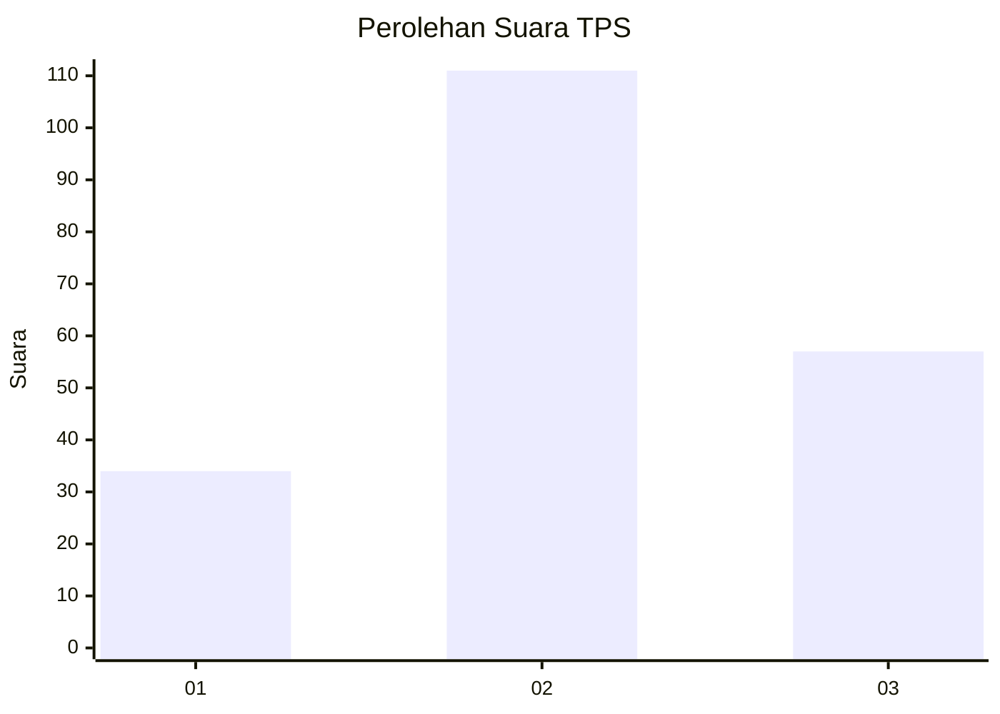
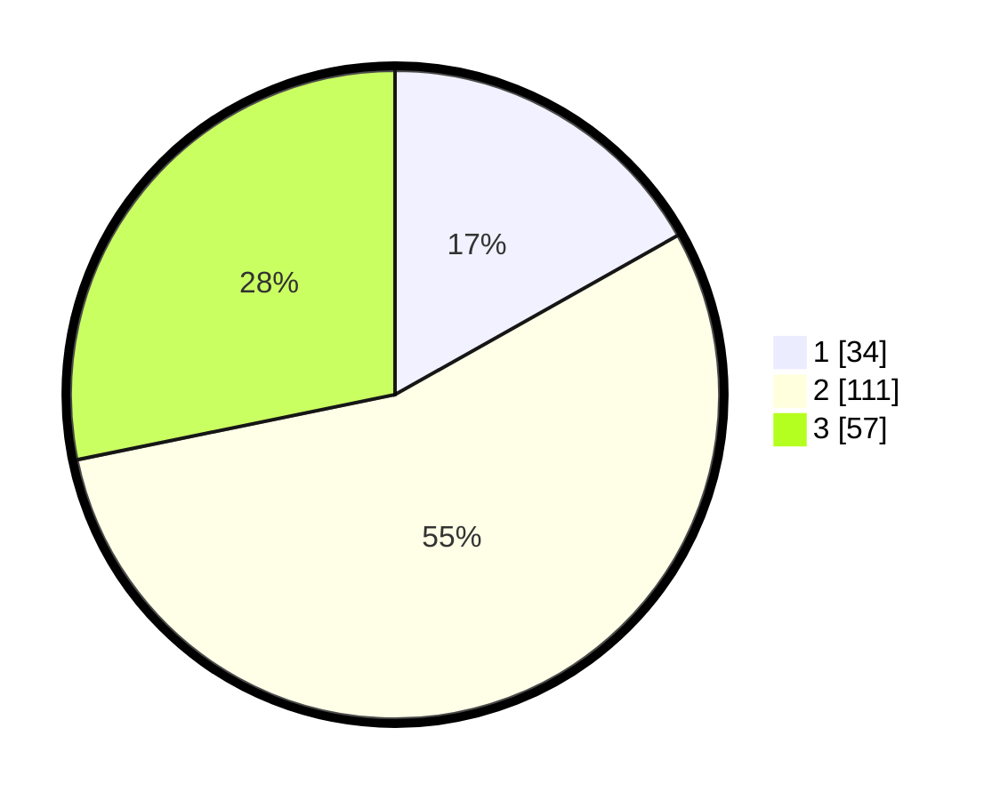

# Hasil

## Grafik

## Tabel

| No. | Nama Paslon    | Suara | Suara (raw) | Persentase |
|:--- |:-------------- | -----:| -----------:| ----------:|
| 1   | ANIES MUHAIMIN | 34    | [34][p-1]   | 16,83      |
| 2   | PRABOWO GIBRAN | 111   | [111][p-2]  | 54,95      |
| 3   | GANJAR MAHFUD  | 57    | [57][p-3]   | 28,22      |

[p-1]: https://github.com/gigit-pemilu/pemilu-2024-34-di-yogyakarta/blob/main/pilpres/hitung-suara/sub/34-di-yogyakarta/sub/02-bantul/sub/15-sewon/sub/2002-timbulharjo/sub/061-tps/sub/paslon-1.txt
[p-2]: https://github.com/gigit-pemilu/pemilu-2024-34-di-yogyakarta/blob/main/pilpres/hitung-suara/sub/34-di-yogyakarta/sub/02-bantul/sub/15-sewon/sub/2002-timbulharjo/sub/061-tps/sub/paslon-2.txt
[p-3]: https://github.com/gigit-pemilu/pemilu-2024-34-di-yogyakarta/blob/main/pilpres/hitung-suara/sub/34-di-yogyakarta/sub/02-bantul/sub/15-sewon/sub/2002-timbulharjo/sub/061-tps/sub/paslon-3.txt

## Foto C Plano

https://sirekap-obj-formc.kpu.go.id/7b17/pemilu/ppwp/34/02/15/20/02/3402152002061-20240215-010556--3b5cd486-c52b-4a39-b85b-fa80414168b7.jpg

https://sirekap-obj-formc.kpu.go.id/7b17/pemilu/ppwp/34/02/15/20/02/3402152002061-20240215-010602--ff893f98-59c3-4659-a218-486122322035.jpg

https://sirekap-obj-formc.kpu.go.id/7b17/pemilu/ppwp/34/02/15/20/02/3402152002061-20240215-010550--99bf3212-6b8d-4be1-a121-04824a807ad9.jpg

## Metadata

| Key        | Value               |
| ---------- | ------------------- |
| Time Stamp | 2024-02-24 22:31:28 |

