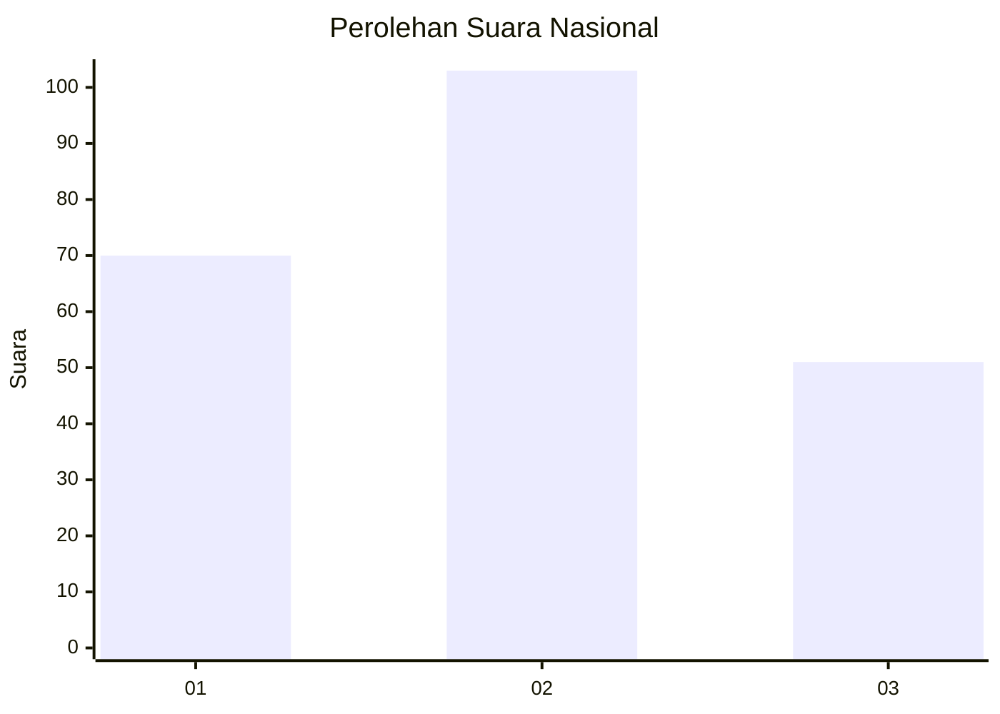
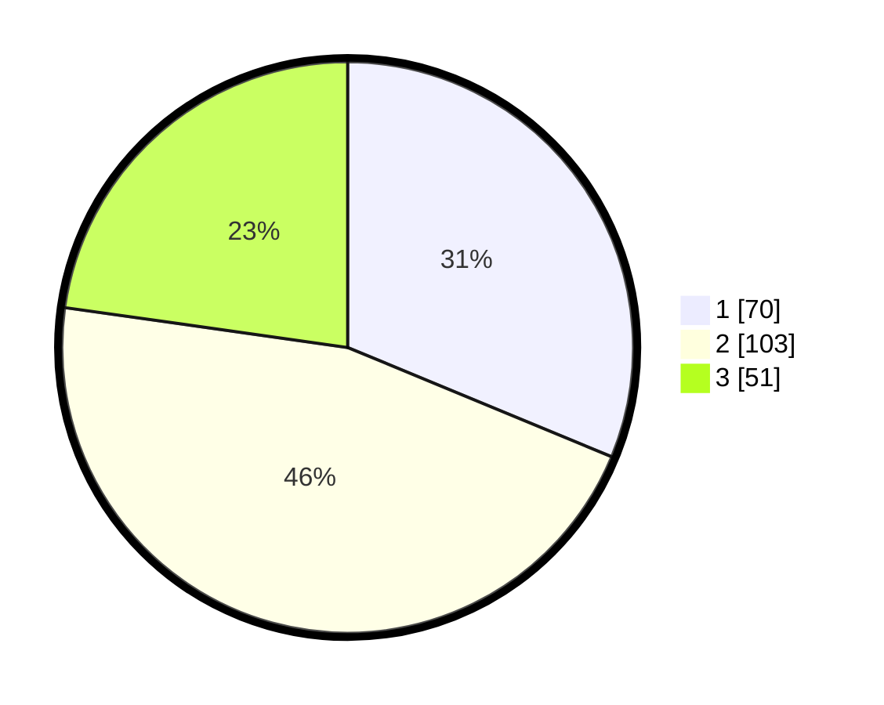

# Hasil

## Grafik

## Tabel

| No. | Nama Paslon    | Suara | Suara (raw) | Persentase |
|:--- |:-------------- | -----:| -----------:| ----------:|
| 1   | ANIES MUHAIMIN | 70    | [70][p-1]   | 31,25      |
| 2   | PRABOWO GIBRAN | 103   | [103][p-2]  | 45,98      |
| 3   | GANJAR MAHFUD  | 51    | [51][p-3]   | 22,77      |

[p-1]: https://github.com/gigit-pemilu/pemilu-2024/blob/main/pilpres/hitung-suara/sub/34-di-yogyakarta/sub/02-bantul/sub/15-sewon/sub/2002-timbulharjo/sub/063-tps/sub/paslon-1.txt
[p-2]: https://github.com/gigit-pemilu/pemilu-2024/blob/main/pilpres/hitung-suara/sub/34-di-yogyakarta/sub/02-bantul/sub/15-sewon/sub/2002-timbulharjo/sub/063-tps/sub/paslon-2.txt
[p-3]: https://github.com/gigit-pemilu/pemilu-2024/blob/main/pilpres/hitung-suara/sub/34-di-yogyakarta/sub/02-bantul/sub/15-sewon/sub/2002-timbulharjo/sub/063-tps/sub/paslon-3.txt

## Foto C Plano

https://sirekap-obj-formc.kpu.go.id/576b/pemilu/ppwp/34/02/15/20/02/3402152002063-20240214-234016--14a92634-9f6c-4a5d-9def-0f49bac7190c.jpg

https://sirekap-obj-formc.kpu.go.id/576b/pemilu/ppwp/34/02/15/20/02/3402152002063-20240214-234130--5038a13f-e249-42b5-8857-7d65e3af3a0b.jpg

https://sirekap-obj-formc.kpu.go.id/576b/pemilu/ppwp/34/02/15/20/02/3402152002063-20240214-234300--469894e5-aa9b-4d8b-8919-fce4490c3e84.jpg

## Metadata

| Key        | Value               |
| ---------- | ------------------- |
| Time Stamp | 2024-02-25 15:00:00 |

