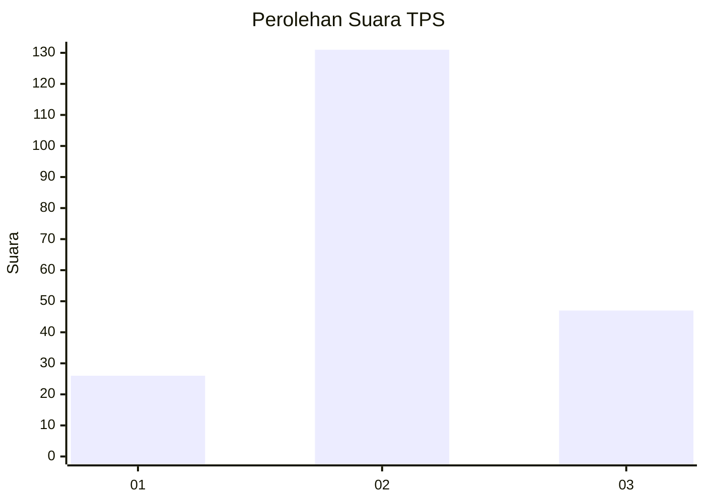
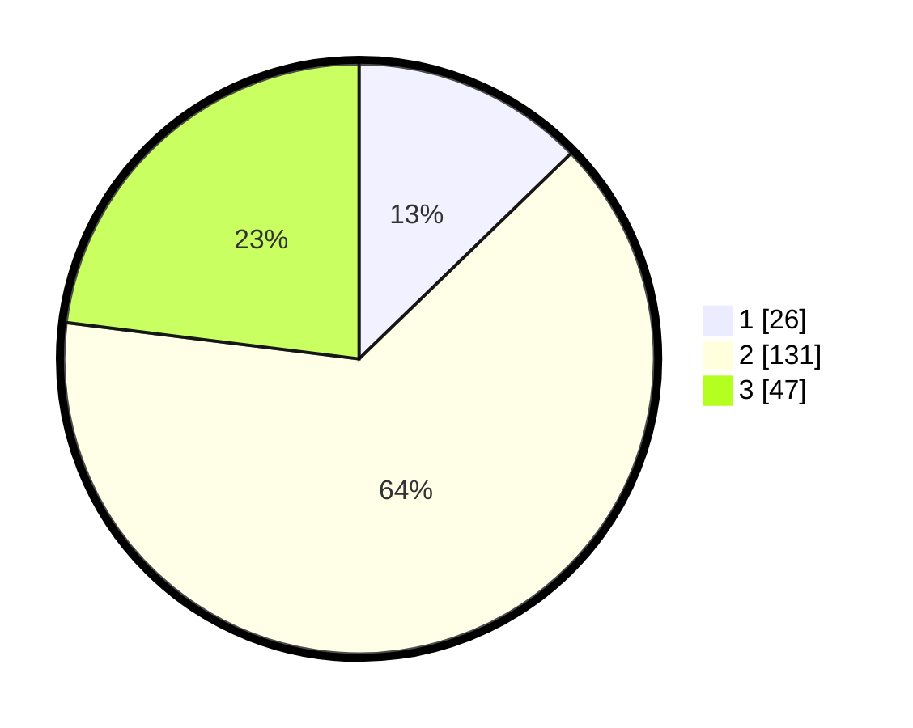

# Hasil

## Grafik

## Tabel

| No. | Nama Paslon    | Suara | Suara (raw) | Persentase |
|:--- |:-------------- | -----:| -----------:| ----------:|
| 1   | ANIES MUHAIMIN | 26    | [26][p-1]   | 12,75      |
| 2   | PRABOWO GIBRAN | 131   | [131][p-2]  | 64,22      |
| 3   | GANJAR MAHFUD  | 47    | [47][p-3]   | 23,04      |

[p-1]: https://github.com/gigit-pemilu/pemilu-2024-34-di-yogyakarta/blob/main/pilpres/hitung-suara/sub/34-di-yogyakarta/sub/02-bantul/sub/15-sewon/sub/2002-timbulharjo/sub/066-tps/sub/paslon-1.txt
[p-2]: https://github.com/gigit-pemilu/pemilu-2024-34-di-yogyakarta/blob/main/pilpres/hitung-suara/sub/34-di-yogyakarta/sub/02-bantul/sub/15-sewon/sub/2002-timbulharjo/sub/066-tps/sub/paslon-2.txt
[p-3]: https://github.com/gigit-pemilu/pemilu-2024-34-di-yogyakarta/blob/main/pilpres/hitung-suara/sub/34-di-yogyakarta/sub/02-bantul/sub/15-sewon/sub/2002-timbulharjo/sub/066-tps/sub/paslon-3.txt

## Foto C Plano

https://sirekap-obj-formc.kpu.go.id/66c9/pemilu/ppwp/34/02/15/20/02/3402152002066-20240214-234045--f6070ea3-931b-4401-8716-e57ecba1c796.jpg

https://sirekap-obj-formc.kpu.go.id/66c9/pemilu/ppwp/34/02/15/20/02/3402152002066-20240214-234119--879daf58-3925-4e93-b845-7ec6b7d8da22.jpg

https://sirekap-obj-formc.kpu.go.id/66c9/pemilu/ppwp/34/02/15/20/02/3402152002066-20240214-234241--61dbda19-b2e3-4b54-8e43-7b80627c6f4d.jpg

## Metadata

| Key        | Value               |
| ---------- | ------------------- |
| Time Stamp | 2024-02-15 12:00:28 |

