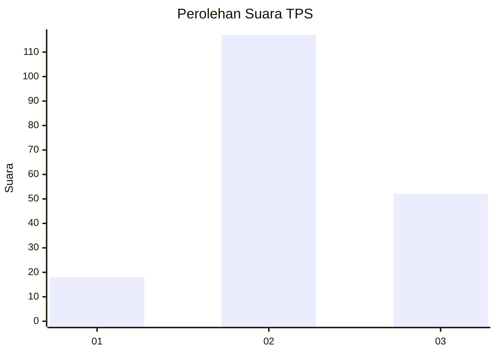
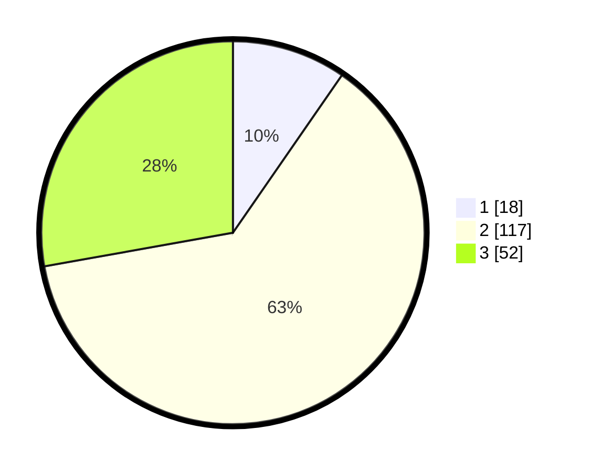

# Hasil

## Grafik

## Tabel

| No. | Nama Paslon    | Suara | Suara (raw) | Persentase |
|:--- |:-------------- | -----:| -----------:| ----------:|
| 1   | ANIES MUHAIMIN | 18    | [18][p-1]   | 9,63       |
| 2   | PRABOWO GIBRAN | 117   | [117][p-2]  | 62,57      |
| 3   | GANJAR MAHFUD  | 52    | [52][p-3]   | 27,81      |

[p-1]: https://github.com/gigit-pemilu/pemilu-2024-34-di-yogyakarta/blob/main/pilpres/hitung-suara/sub/34-di-yogyakarta/sub/02-bantul/sub/15-sewon/sub/2002-timbulharjo/sub/069-tps/sub/paslon-1.txt
[p-2]: https://github.com/gigit-pemilu/pemilu-2024-34-di-yogyakarta/blob/main/pilpres/hitung-suara/sub/34-di-yogyakarta/sub/02-bantul/sub/15-sewon/sub/2002-timbulharjo/sub/069-tps/sub/paslon-2.txt
[p-3]: https://github.com/gigit-pemilu/pemilu-2024-34-di-yogyakarta/blob/main/pilpres/hitung-suara/sub/34-di-yogyakarta/sub/02-bantul/sub/15-sewon/sub/2002-timbulharjo/sub/069-tps/sub/paslon-3.txt

## Foto C Plano

https://sirekap-obj-formc.kpu.go.id/6a96/pemilu/ppwp/34/02/15/20/02/3402152002069-20240214-233459--caa46599-364e-4bc6-ac79-2e46e2dad3e5.jpg

https://sirekap-obj-formc.kpu.go.id/6a96/pemilu/ppwp/34/02/15/20/02/3402152002069-20240214-235200--a1834834-9ab3-40d2-b213-3091c97ea248.jpg

https://sirekap-obj-formc.kpu.go.id/6a96/pemilu/ppwp/34/02/15/20/02/3402152002069-20240214-235339--6fde933b-4ce1-434d-bf41-e7f2fdeec849.jpg

## Metadata

| Key        | Value               |
| ---------- | ------------------- |
| Time Stamp | 2024-02-24 22:31:28 |

