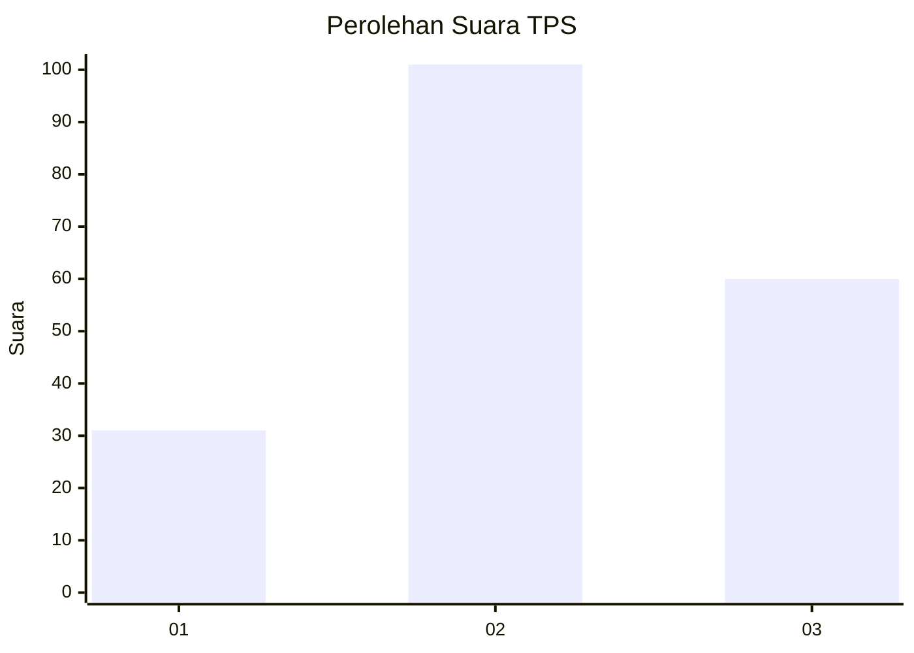
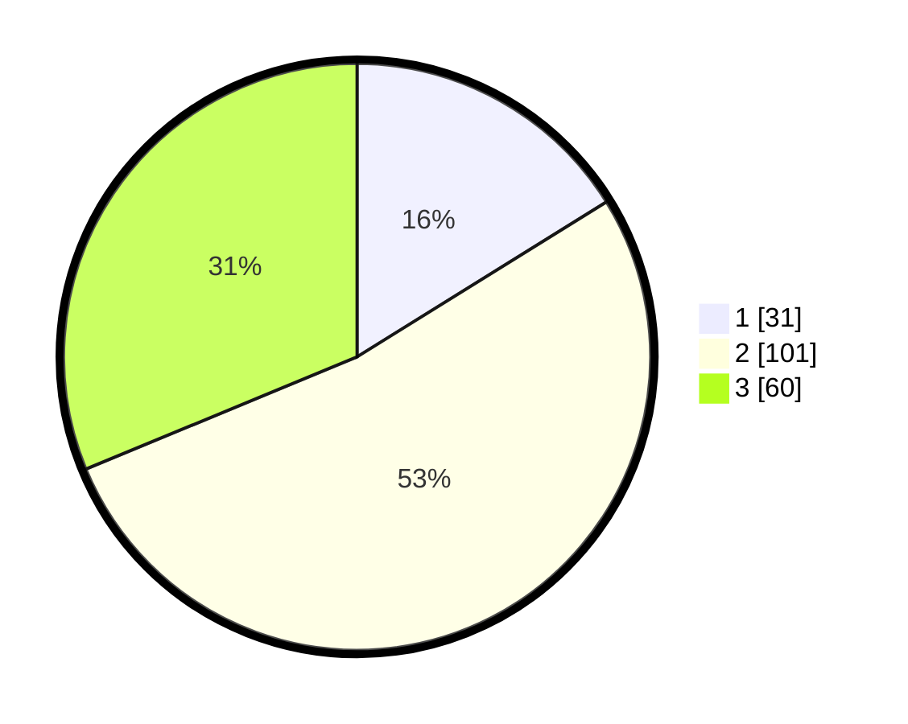

# Hasil

## Grafik

## Tabel

| No. | Nama Paslon    | Suara | Suara (raw) | Persentase |
|:--- |:-------------- | -----:| -----------:| ----------:|
| 1   | ANIES MUHAIMIN | 31    | [31][p-1]   | 16,15      |
| 2   | PRABOWO GIBRAN | 101   | [101][p-2]  | 52,60      |
| 3   | GANJAR MAHFUD  | 60    | [60][p-3]   | 31,25      |

[p-1]: https://github.com/gigit-pemilu/pemilu-2024-34-di-yogyakarta/blob/main/pilpres/hitung-suara/sub/34-di-yogyakarta/sub/02-bantul/sub/15-sewon/sub/2002-timbulharjo/sub/070-tps/sub/paslon-1.txt
[p-2]: https://github.com/gigit-pemilu/pemilu-2024-34-di-yogyakarta/blob/main/pilpres/hitung-suara/sub/34-di-yogyakarta/sub/02-bantul/sub/15-sewon/sub/2002-timbulharjo/sub/070-tps/sub/paslon-2.txt
[p-3]: https://github.com/gigit-pemilu/pemilu-2024-34-di-yogyakarta/blob/main/pilpres/hitung-suara/sub/34-di-yogyakarta/sub/02-bantul/sub/15-sewon/sub/2002-timbulharjo/sub/070-tps/sub/paslon-3.txt

## Foto C Plano

https://sirekap-obj-formc.kpu.go.id/b6ea/pemilu/ppwp/34/02/15/20/02/3402152002070-20240216-073624--96047e4e-ccbd-477e-a7ab-253068ef30d9.jpg

https://sirekap-obj-formc.kpu.go.id/b6ea/pemilu/ppwp/34/02/15/20/02/3402152002070-20240216-073633--36c79612-21b5-47ba-b791-c887ca2741fe.jpg

https://sirekap-obj-formc.kpu.go.id/b6ea/pemilu/ppwp/34/02/15/20/02/3402152002070-20240216-073807--6d7491cc-f3fd-4708-80a8-f1ab1646246f.jpg

## Metadata

| Key        | Value               |
| ---------- | ------------------- |
| Time Stamp | 2024-02-24 22:31:28 |

