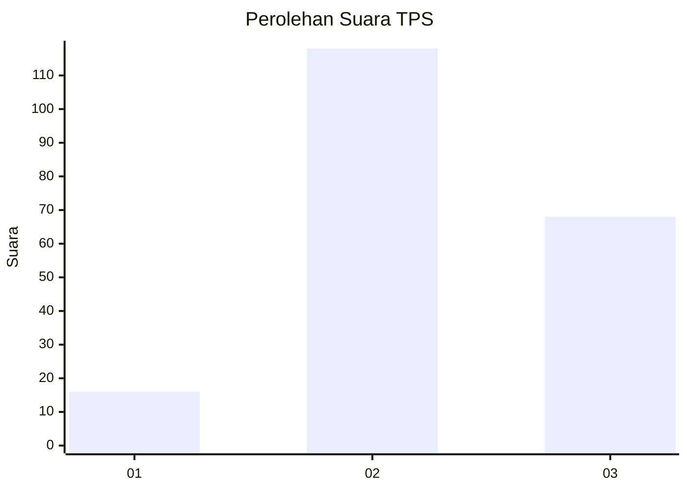
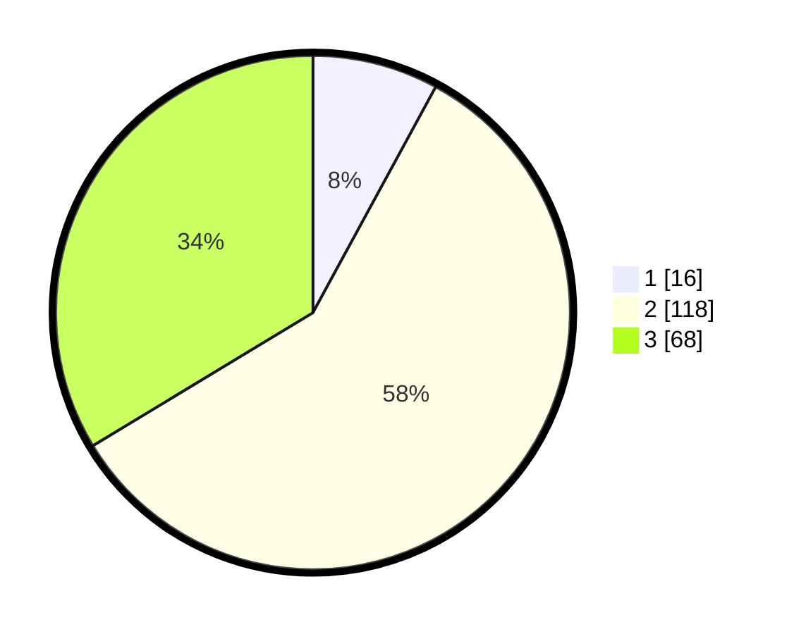

# Hasil

## Grafik

## Tabel

| No. | Nama Paslon    | Suara | Suara (raw) | Persentase |
|:--- |:-------------- | -----:| -----------:| ----------:|
| 1   | ANIES MUHAIMIN | 16    | [16][p-1]   | 7,92       |
| 2   | PRABOWO GIBRAN | 118   | [118][p-2]  | 58,42      |
| 3   | GANJAR MAHFUD  | 68    | [68][p-3]   | 33,66      |

[p-1]: https://github.com/gigit-pemilu/pemilu-2024-34-di-yogyakarta/blob/main/pilpres/hitung-suara/sub/34-di-yogyakarta/sub/02-bantul/sub/15-sewon/sub/2002-timbulharjo/sub/071-tps/sub/paslon-1.txt
[p-2]: https://github.com/gigit-pemilu/pemilu-2024-34-di-yogyakarta/blob/main/pilpres/hitung-suara/sub/34-di-yogyakarta/sub/02-bantul/sub/15-sewon/sub/2002-timbulharjo/sub/071-tps/sub/paslon-2.txt
[p-3]: https://github.com/gigit-pemilu/pemilu-2024-34-di-yogyakarta/blob/main/pilpres/hitung-suara/sub/34-di-yogyakarta/sub/02-bantul/sub/15-sewon/sub/2002-timbulharjo/sub/071-tps/sub/paslon-3.txt

## Foto C Plano

https://sirekap-obj-formc.kpu.go.id/c002/pemilu/ppwp/34/02/15/20/02/3402152002071-20240215-004123--b54e717a-007f-4125-b248-1d69ffa58c4c.jpg

https://sirekap-obj-formc.kpu.go.id/c002/pemilu/ppwp/34/02/15/20/02/3402152002071-20240215-002506--e1e0a654-b920-4d69-872d-957652a1fcdd.jpg

https://sirekap-obj-formc.kpu.go.id/c002/pemilu/ppwp/34/02/15/20/02/3402152002071-20240215-002739--e4cb7cda-ce8b-4263-93a3-65a1e34ee465.jpg

## Metadata

| Key        | Value               |
| ---------- | ------------------- |
| Time Stamp | 2024-02-25 12:00:00 |

