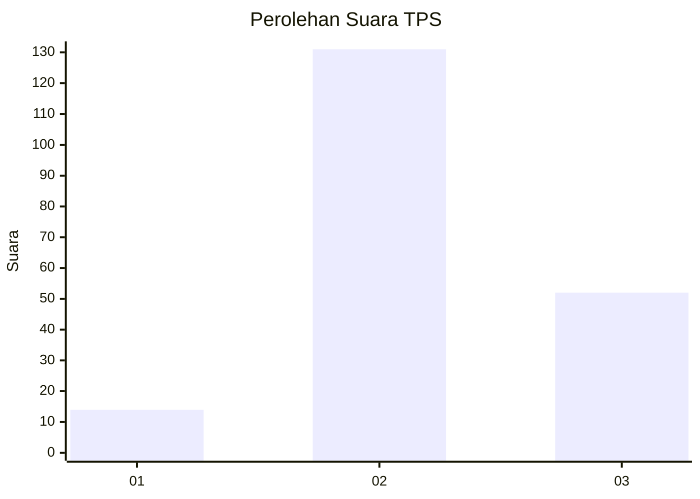

# Hasil

## Grafik

## Tabel

| No. | Nama Paslon    | Suara | Suara (raw) | Persentase |
|:--- |:-------------- | -----:| -----------:| ----------:|
| 1   | ANIES MUHAIMIN | 14    | [14][p-1]   | 7,11       |
| 2   | PRABOWO GIBRAN | 131   | [131][p-2]  | 66,50      |
| 3   | GANJAR MAHFUD  | 52    | [52][p-3]   | 26,40      |

[p-1]: https://github.com/gigit-pemilu/pemilu-2024-34-di-yogyakarta/blob/main/pilpres/hitung-suara/sub/34-di-yogyakarta/sub/02-bantul/sub/15-sewon/sub/2002-timbulharjo/sub/072-tps/sub/paslon-1.txt
[p-2]: https://github.com/gigit-pemilu/pemilu-2024-34-di-yogyakarta/blob/main/pilpres/hitung-suara/sub/34-di-yogyakarta/sub/02-bantul/sub/15-sewon/sub/2002-timbulharjo/sub/072-tps/sub/paslon-2.txt
[p-3]: https://github.com/gigit-pemilu/pemilu-2024-34-di-yogyakarta/blob/main/pilpres/hitung-suara/sub/34-di-yogyakarta/sub/02-bantul/sub/15-sewon/sub/2002-timbulharjo/sub/072-tps/sub/paslon-3.txt

## Foto C Plano

https://sirekap-obj-formc.kpu.go.id/e46b/pemilu/ppwp/34/02/15/20/02/3402152002072-20240215-211027--d9986715-c125-480f-b5cb-aebe4bdf8441.jpg

https://sirekap-obj-formc.kpu.go.id/e46b/pemilu/ppwp/34/02/15/20/02/3402152002072-20240215-211130--9ec62e4f-ad7e-4b77-a494-7e2a23275998.jpg

https://sirekap-obj-formc.kpu.go.id/e46b/pemilu/ppwp/34/02/15/20/02/3402152002072-20240215-211246--b266cad2-844d-45fd-b09a-4964717b48c2.jpg

## Metadata

| Key        | Value               |
| ---------- | ------------------- |
| Time Stamp | 2024-02-15 22:30:27 |

