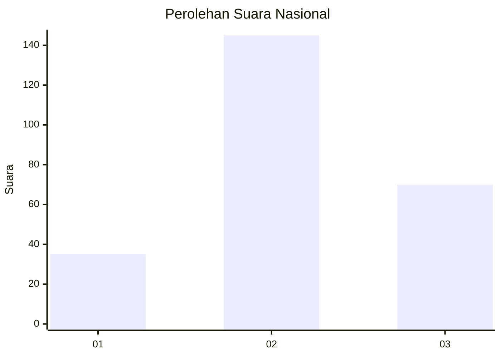
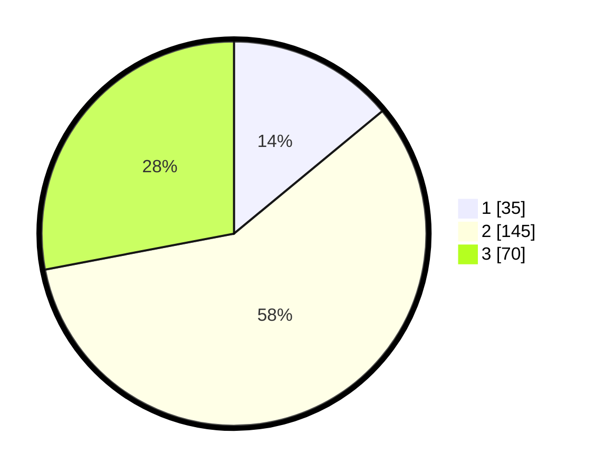

# Hasil

## Grafik

## Tabel

| No. | Nama Paslon    | Suara | Suara (raw) | Persentase |
|:--- |:-------------- | -----:| -----------:| ----------:|
| 1   | ANIES MUHAIMIN | 35    | [35][p-1]   | 14,00      |
| 2   | PRABOWO GIBRAN | 145   | [145][p-2]  | 58,00      |
| 3   | GANJAR MAHFUD  | 70    | [70][p-3]   | 28,00      |

[p-1]: https://github.com/gigit-pemilu/pemilu-2024/blob/main/pilpres/hitung-suara/sub/34-di-yogyakarta/sub/02-bantul/sub/15-sewon/sub/2002-timbulharjo/sub/073-tps/sub/paslon-1.txt
[p-2]: https://github.com/gigit-pemilu/pemilu-2024/blob/main/pilpres/hitung-suara/sub/34-di-yogyakarta/sub/02-bantul/sub/15-sewon/sub/2002-timbulharjo/sub/073-tps/sub/paslon-2.txt
[p-3]: https://github.com/gigit-pemilu/pemilu-2024/blob/main/pilpres/hitung-suara/sub/34-di-yogyakarta/sub/02-bantul/sub/15-sewon/sub/2002-timbulharjo/sub/073-tps/sub/paslon-3.txt

## Foto C Plano

https://sirekap-obj-formc.kpu.go.id/5cea/pemilu/ppwp/34/02/15/20/02/3402152002073-20240214-225005--5308b746-dfa9-4077-9816-4e6c4723bdad.jpg

https://sirekap-obj-formc.kpu.go.id/5cea/pemilu/ppwp/34/02/15/20/02/3402152002073-20240214-225152--18e92cb3-7963-4878-b8b1-613f06eed355.jpg

https://sirekap-obj-formc.kpu.go.id/5cea/pemilu/ppwp/34/02/15/20/02/3402152002073-20240214-225334--25bdaffb-ded8-479e-8dc8-1590fe763650.jpg

## Metadata

| Key        | Value               |
| ---------- | ------------------- |
| Time Stamp | 2024-02-25 22:00:00 |

