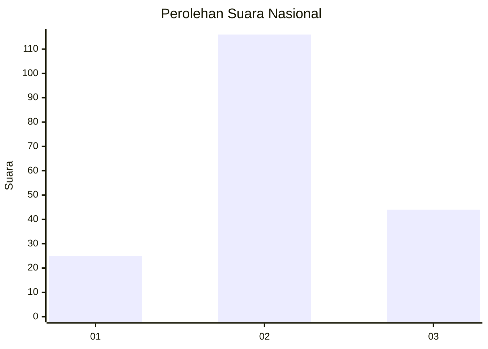
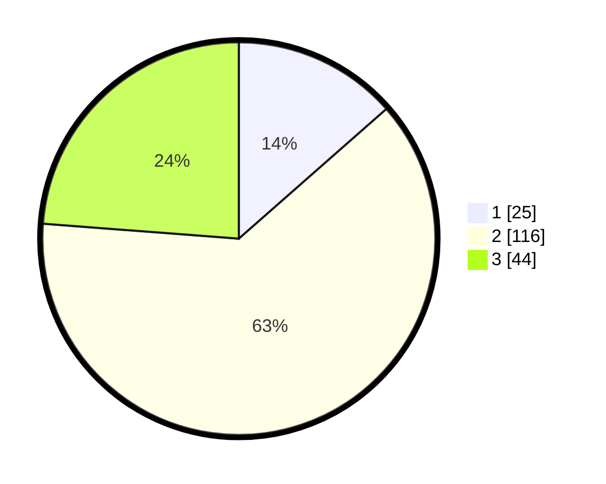

# Hasil

## Grafik

## Tabel

| No. | Nama Paslon    | Suara | Suara (raw) | Persentase |
|:--- |:-------------- | -----:| -----------:| ----------:|
| 1   | ANIES MUHAIMIN | 25    | [25][p-1]   | 13,51      |
| 2   | PRABOWO GIBRAN | 116   | [116][p-2]  | 62,70      |
| 3   | GANJAR MAHFUD  | 44    | [44][p-3]   | 23,78      |

[p-1]: https://github.com/gigit-pemilu/pemilu-2024/blob/main/pilpres/hitung-suara/sub/34-di-yogyakarta/sub/02-bantul/sub/15-sewon/sub/2002-timbulharjo/sub/075-tps/sub/paslon-1.txt
[p-2]: https://github.com/gigit-pemilu/pemilu-2024/blob/main/pilpres/hitung-suara/sub/34-di-yogyakarta/sub/02-bantul/sub/15-sewon/sub/2002-timbulharjo/sub/075-tps/sub/paslon-2.txt
[p-3]: https://github.com/gigit-pemilu/pemilu-2024/blob/main/pilpres/hitung-suara/sub/34-di-yogyakarta/sub/02-bantul/sub/15-sewon/sub/2002-timbulharjo/sub/075-tps/sub/paslon-3.txt

## Foto C Plano

https://sirekap-obj-formc.kpu.go.id/1c48/pemilu/ppwp/34/02/15/20/02/3402152002075-20240214-225228--86d72a1e-f740-4544-84d3-0ce28e045cbf.jpg

https://sirekap-obj-formc.kpu.go.id/1c48/pemilu/ppwp/34/02/15/20/02/3402152002075-20240214-223709--1ccd0526-d2a1-4fb4-bd01-0f82f56300f6.jpg

https://sirekap-obj-formc.kpu.go.id/1c48/pemilu/ppwp/34/02/15/20/02/3402152002075-20240214-225336--c0800271-823a-46ec-b75d-db480cb7aeee.jpg

## Metadata

| Key        | Value               |
| ---------- | ------------------- |
| Time Stamp | 2024-02-24 22:31:28 |

