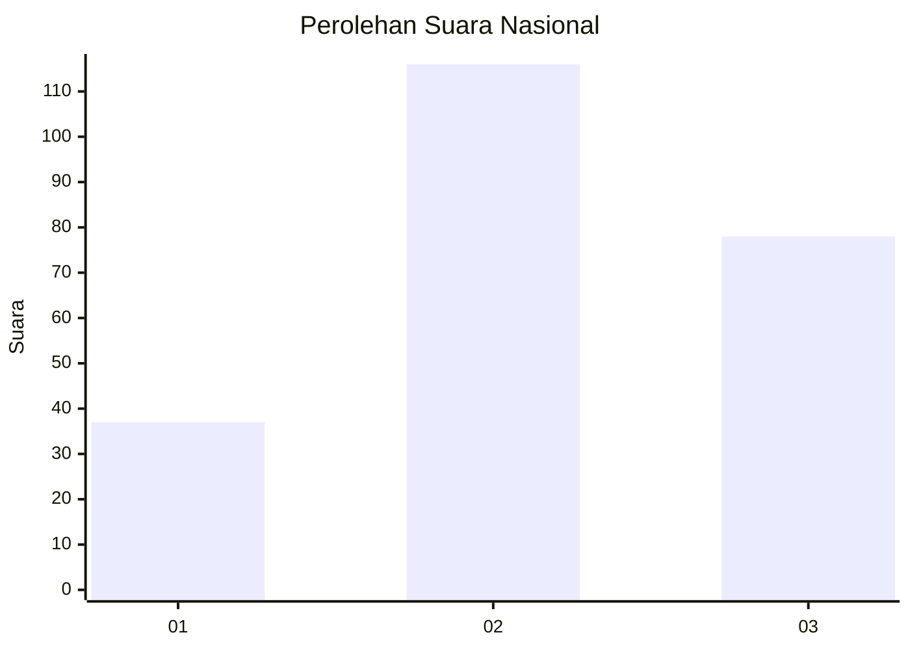
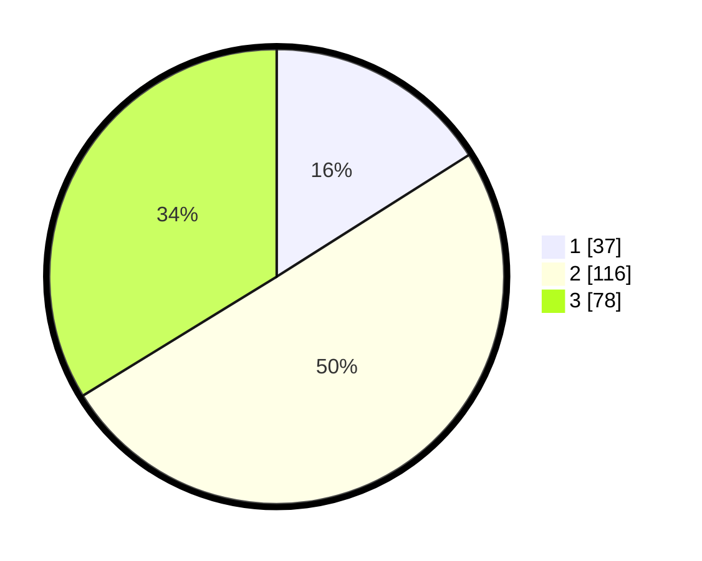

# Hasil

## Grafik

## Tabel

| No. | Nama Paslon    | Suara | Suara (raw) | Persentase |
|:--- |:-------------- | -----:| -----------:| ----------:|
| 1   | ANIES MUHAIMIN | 37    | [37][p-1]   | 16,02      |
| 2   | PRABOWO GIBRAN | 116   | [116][p-2]  | 50,22      |
| 3   | GANJAR MAHFUD  | 78    | [78][p-3]   | 33,77      |

[p-1]: https://github.com/gigit-pemilu/pemilu-2024/blob/main/pilpres/hitung-suara/sub/34-di-yogyakarta/sub/02-bantul/sub/15-sewon/sub/2002-timbulharjo/sub/076-tps/sub/paslon-1.txt
[p-2]: https://github.com/gigit-pemilu/pemilu-2024/blob/main/pilpres/hitung-suara/sub/34-di-yogyakarta/sub/02-bantul/sub/15-sewon/sub/2002-timbulharjo/sub/076-tps/sub/paslon-2.txt
[p-3]: https://github.com/gigit-pemilu/pemilu-2024/blob/main/pilpres/hitung-suara/sub/34-di-yogyakarta/sub/02-bantul/sub/15-sewon/sub/2002-timbulharjo/sub/076-tps/sub/paslon-3.txt

## Foto C Plano

https://sirekap-obj-formc.kpu.go.id/dc3f/pemilu/ppwp/34/02/15/20/02/3402152002076-20240215-005807--fa35aa52-ac0b-4c23-af0f-721605099192.jpg

https://sirekap-obj-formc.kpu.go.id/dc3f/pemilu/ppwp/34/02/15/20/02/3402152002076-20240215-005800--88286a23-cdfa-40cd-95e6-a10683773cb2.jpg

https://sirekap-obj-formc.kpu.go.id/dc3f/pemilu/ppwp/34/02/15/20/02/3402152002076-20240215-034211--529015af-2377-4630-9cc7-1ff061b0a9f7.jpg

## Metadata

| Key        | Value               |
| ---------- | ------------------- |
| Time Stamp | 2024-02-15 21:30:27 |

