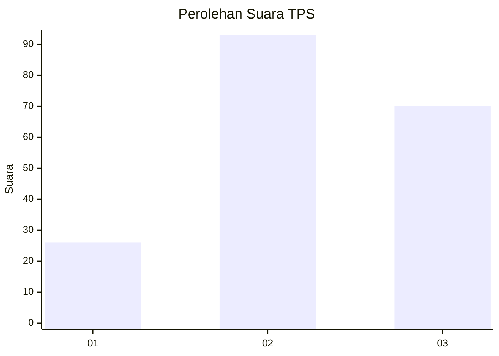
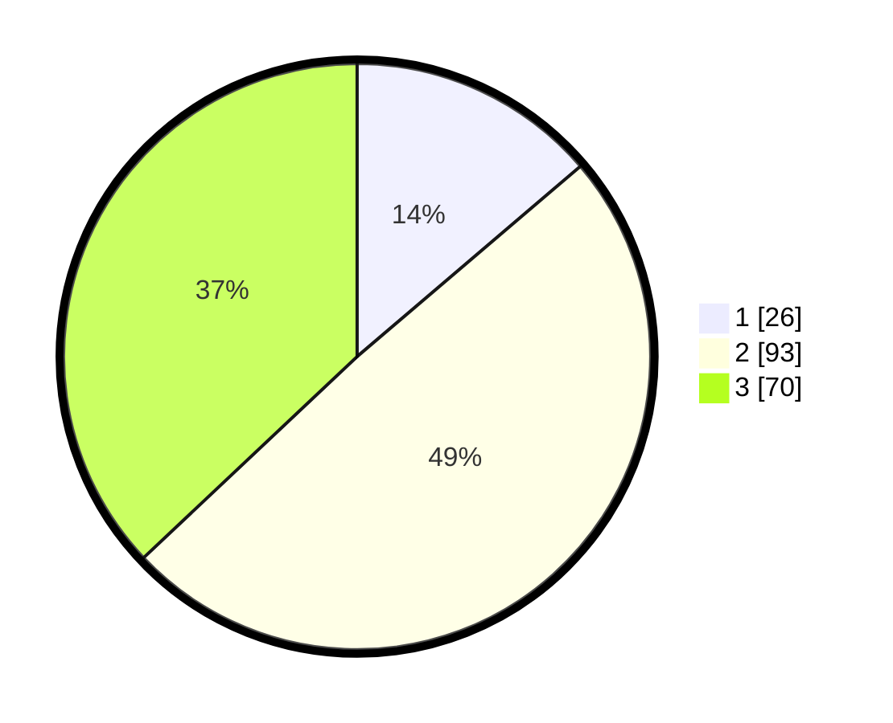

# Hasil

## Grafik

## Tabel

| No. | Nama Paslon    | Suara | Suara (raw) | Persentase |
|:--- |:-------------- | -----:| -----------:| ----------:|
| 1   | ANIES MUHAIMIN | 26    | [26][p-1]   | 13,76      |
| 2   | PRABOWO GIBRAN | 93    | [93][p-2]   | 49,21      |
| 3   | GANJAR MAHFUD  | 70    | [70][p-3]   | 37,04      |

[p-1]: https://github.com/gigit-pemilu/pemilu-2024-34-di-yogyakarta/blob/main/pilpres/hitung-suara/sub/34-di-yogyakarta/sub/02-bantul/sub/15-sewon/sub/2003-bangunharjo/sub/002-tps/sub/paslon-1.txt
[p-2]: https://github.com/gigit-pemilu/pemilu-2024-34-di-yogyakarta/blob/main/pilpres/hitung-suara/sub/34-di-yogyakarta/sub/02-bantul/sub/15-sewon/sub/2003-bangunharjo/sub/002-tps/sub/paslon-2.txt
[p-3]: https://github.com/gigit-pemilu/pemilu-2024-34-di-yogyakarta/blob/main/pilpres/hitung-suara/sub/34-di-yogyakarta/sub/02-bantul/sub/15-sewon/sub/2003-bangunharjo/sub/002-tps/sub/paslon-3.txt

## Foto C Plano

https://sirekap-obj-formc.kpu.go.id/abff/pemilu/ppwp/34/02/15/20/03/3402152003002-20240214-141733--42a31e60-3751-4c93-8a2f-ad651856aa71.jpg

https://sirekap-obj-formc.kpu.go.id/abff/pemilu/ppwp/34/02/15/20/03/3402152003002-20240214-215004--3c9116cd-48a0-4ea4-99b9-90fb580705d3.jpg

https://sirekap-obj-formc.kpu.go.id/abff/pemilu/ppwp/34/02/15/20/03/3402152003002-20240214-215127--5b4099b1-d04d-48ae-9e81-75df6b6565ce.jpg

## Metadata

| Key        | Value               |
| ---------- | ------------------- |
| Time Stamp | 2024-02-15 12:00:28 |

