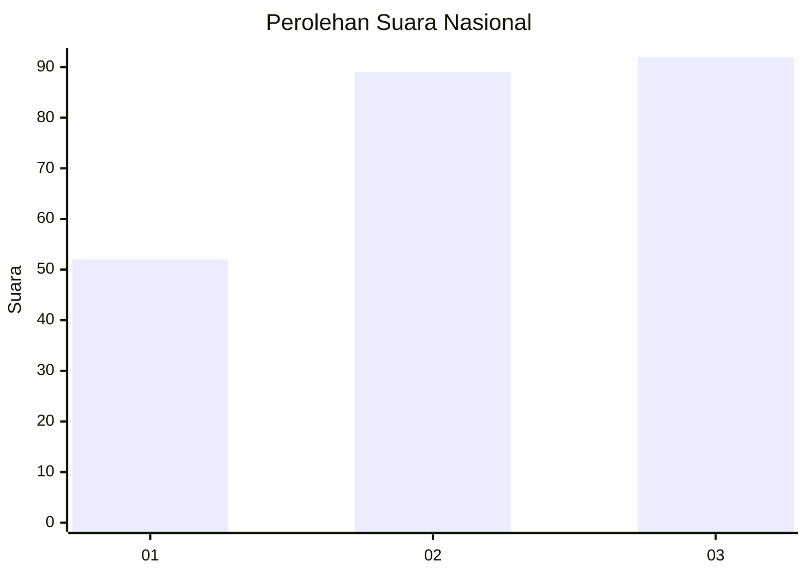
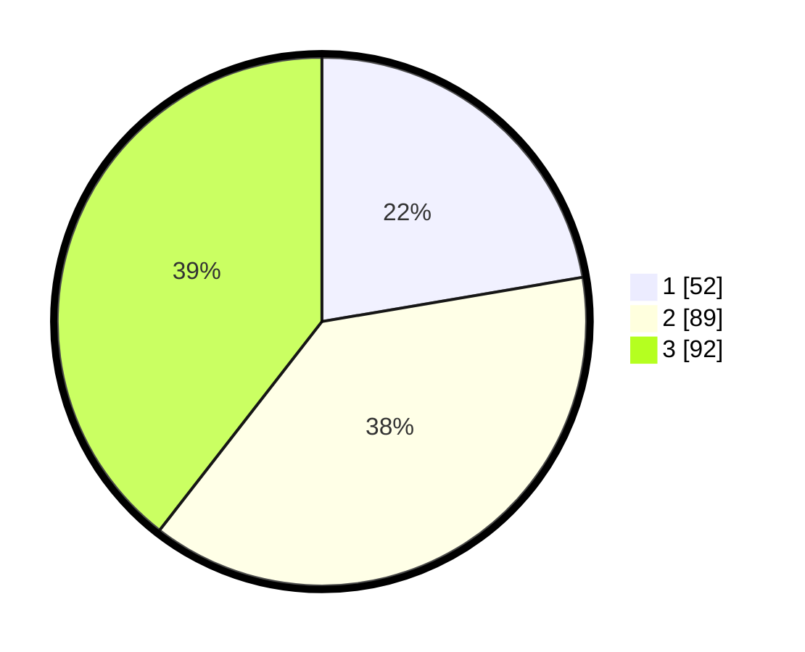

# Hasil

## Grafik

## Tabel

| No. | Nama Paslon    | Suara | Suara (raw) | Persentase |
|:--- |:-------------- | -----:| -----------:| ----------:|
| 1   | ANIES MUHAIMIN | 52    | [52][p-1]   | 22,32      |
| 2   | PRABOWO GIBRAN | 89    | [89][p-2]   | 38,20      |
| 3   | GANJAR MAHFUD  | 92    | [92][p-3]   | 39,48      |

[p-1]: https://github.com/gigit-pemilu/pemilu-2024/blob/main/pilpres/hitung-suara/sub/34-di-yogyakarta/sub/02-bantul/sub/15-sewon/sub/2003-bangunharjo/sub/003-tps/sub/paslon-1.txt
[p-2]: https://github.com/gigit-pemilu/pemilu-2024/blob/main/pilpres/hitung-suara/sub/34-di-yogyakarta/sub/02-bantul/sub/15-sewon/sub/2003-bangunharjo/sub/003-tps/sub/paslon-2.txt
[p-3]: https://github.com/gigit-pemilu/pemilu-2024/blob/main/pilpres/hitung-suara/sub/34-di-yogyakarta/sub/02-bantul/sub/15-sewon/sub/2003-bangunharjo/sub/003-tps/sub/paslon-3.txt

## Foto C Plano

https://sirekap-obj-formc.kpu.go.id/2e66/pemilu/ppwp/34/02/15/20/03/3402152003003-20240214-225559--9b4bc957-dd93-4d17-bcbc-ee94421fb7f8.jpg

https://sirekap-obj-formc.kpu.go.id/2e66/pemilu/ppwp/34/02/15/20/03/3402152003003-20240214-225730--4a5971b4-1471-4e2b-b0f2-a42e8285bea4.jpg

https://sirekap-obj-formc.kpu.go.id/2e66/pemilu/ppwp/34/02/15/20/03/3402152003003-20240214-225803--a9ba08b7-95f5-4837-a588-acc2d5f59ecc.jpg

## Metadata

| Key        | Value               |
| ---------- | ------------------- |
| Time Stamp | 2024-02-24 22:31:28 |

