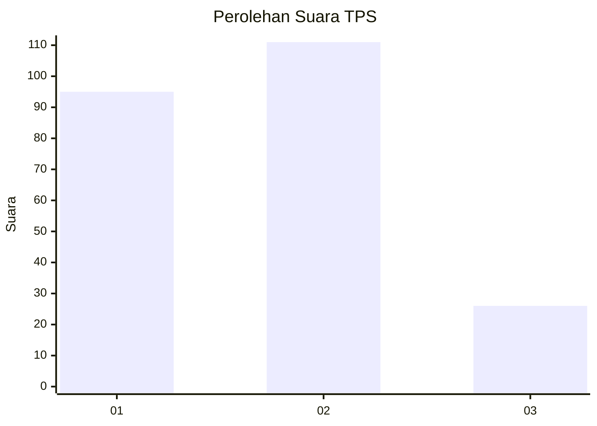
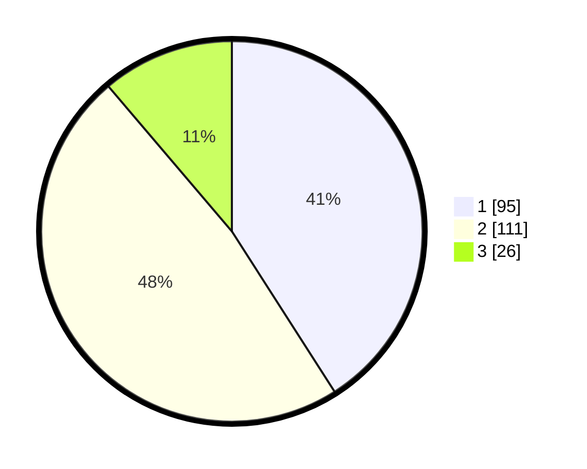

# Hasil

## Grafik

## Tabel

| No. | Nama Paslon    | Suara | Suara (raw) | Persentase |
|:--- |:-------------- | -----:| -----------:| ----------:|
| 1   | ANIES MUHAIMIN | 95    | [95][p-1]   | 40,95      |
| 2   | PRABOWO GIBRAN | 111   | [111][p-2]  | 47,84      |
| 3   | GANJAR MAHFUD  | 26    | [26][p-3]   | 11,21      |

[p-1]: https://github.com/gigit-pemilu/pemilu-2024-34-di-yogyakarta/blob/main/pilpres/hitung-suara/sub/34-di-yogyakarta/sub/02-bantul/sub/15-sewon/sub/2003-bangunharjo/sub/005-tps/sub/paslon-1.txt
[p-2]: https://github.com/gigit-pemilu/pemilu-2024-34-di-yogyakarta/blob/main/pilpres/hitung-suara/sub/34-di-yogyakarta/sub/02-bantul/sub/15-sewon/sub/2003-bangunharjo/sub/005-tps/sub/paslon-2.txt
[p-3]: https://github.com/gigit-pemilu/pemilu-2024-34-di-yogyakarta/blob/main/pilpres/hitung-suara/sub/34-di-yogyakarta/sub/02-bantul/sub/15-sewon/sub/2003-bangunharjo/sub/005-tps/sub/paslon-3.txt

## Foto C Plano

https://sirekap-obj-formc.kpu.go.id/9fb0/pemilu/ppwp/34/02/15/20/03/3402152003005-20240214-155231--dba18966-438f-4044-8c38-dcdc33bbf99b.jpg

https://sirekap-obj-formc.kpu.go.id/9fb0/pemilu/ppwp/34/02/15/20/03/3402152003005-20240214-155331--c8dd1d97-9f44-46e3-99ce-ef6055f68314.jpg

https://sirekap-obj-formc.kpu.go.id/9fb0/pemilu/ppwp/34/02/15/20/03/3402152003005-20240214-155415--6532e314-59aa-43d7-af4e-916dce96eca5.jpg

## Metadata

| Key        | Value               |
| ---------- | ------------------- |
| Time Stamp | 2024-02-24 22:31:28 |

