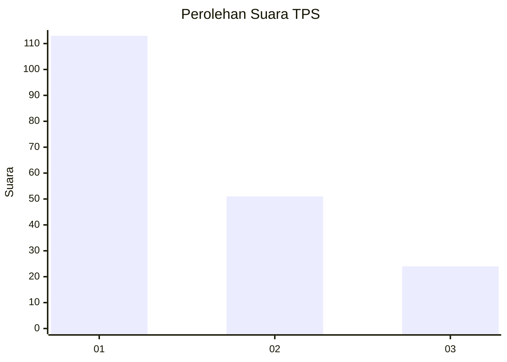
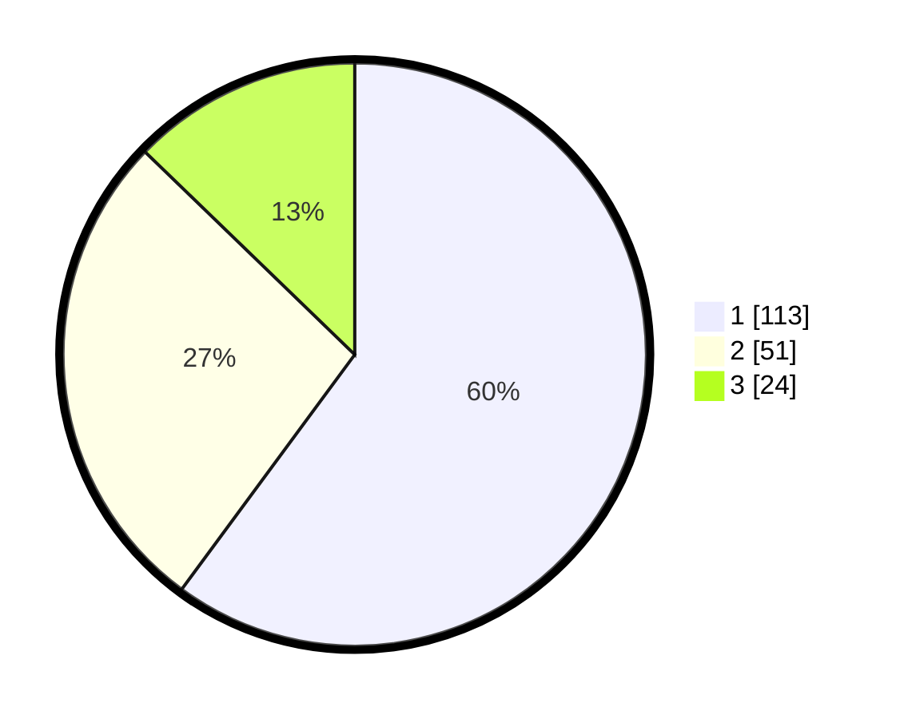

# Hasil

## Grafik

## Tabel

| No. | Nama Paslon    | Suara | Suara (raw) | Persentase |
|:--- |:-------------- | -----:| -----------:| ----------:|
| 1   | ANIES MUHAIMIN | 113   | [113][p-1]  | 60,11      |
| 2   | PRABOWO GIBRAN | 51    | [51][p-2]   | 27,13      |
| 3   | GANJAR MAHFUD  | 24    | [24][p-3]   | 12,77      |

[p-1]: https://github.com/gigit-pemilu/pemilu-2024-34-di-yogyakarta/blob/main/pilpres/hitung-suara/sub/34-di-yogyakarta/sub/02-bantul/sub/15-sewon/sub/2003-bangunharjo/sub/006-tps/sub/paslon-1.txt
[p-2]: https://github.com/gigit-pemilu/pemilu-2024-34-di-yogyakarta/blob/main/pilpres/hitung-suara/sub/34-di-yogyakarta/sub/02-bantul/sub/15-sewon/sub/2003-bangunharjo/sub/006-tps/sub/paslon-2.txt
[p-3]: https://github.com/gigit-pemilu/pemilu-2024-34-di-yogyakarta/blob/main/pilpres/hitung-suara/sub/34-di-yogyakarta/sub/02-bantul/sub/15-sewon/sub/2003-bangunharjo/sub/006-tps/sub/paslon-3.txt

## Foto C Plano

https://sirekap-obj-formc.kpu.go.id/3231/pemilu/ppwp/34/02/15/20/03/3402152003006-20240214-191707--0c06d158-f0e5-4834-a8c6-a30df953e20c.jpg

https://sirekap-obj-formc.kpu.go.id/3231/pemilu/ppwp/34/02/15/20/03/3402152003006-20240214-191942--51cd3d6e-14fa-4b50-ba3e-54d26e5352f9.jpg

https://sirekap-obj-formc.kpu.go.id/3231/pemilu/ppwp/34/02/15/20/03/3402152003006-20240214-203536--cf47ff14-642d-4ac1-835b-2300b1500b39.jpg

## Metadata

| Key        | Value               |
| ---------- | ------------------- |
| Time Stamp | 2024-02-16 00:30:27 |

