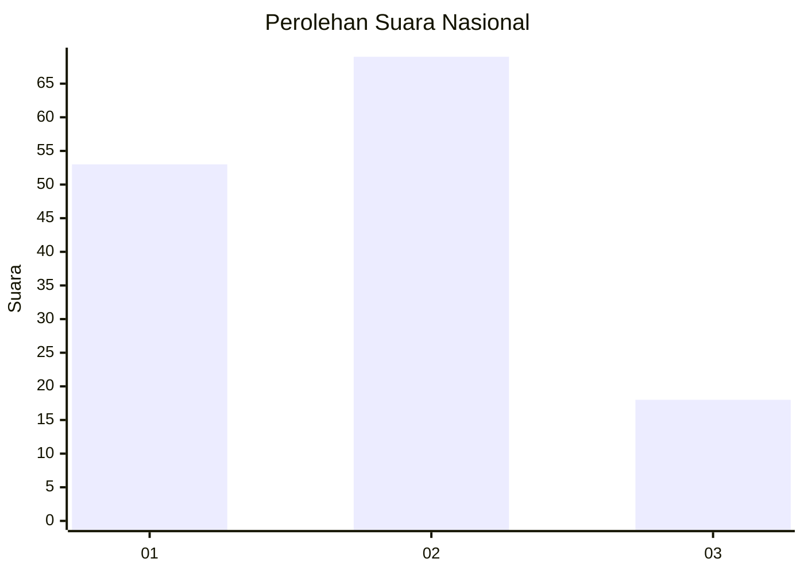
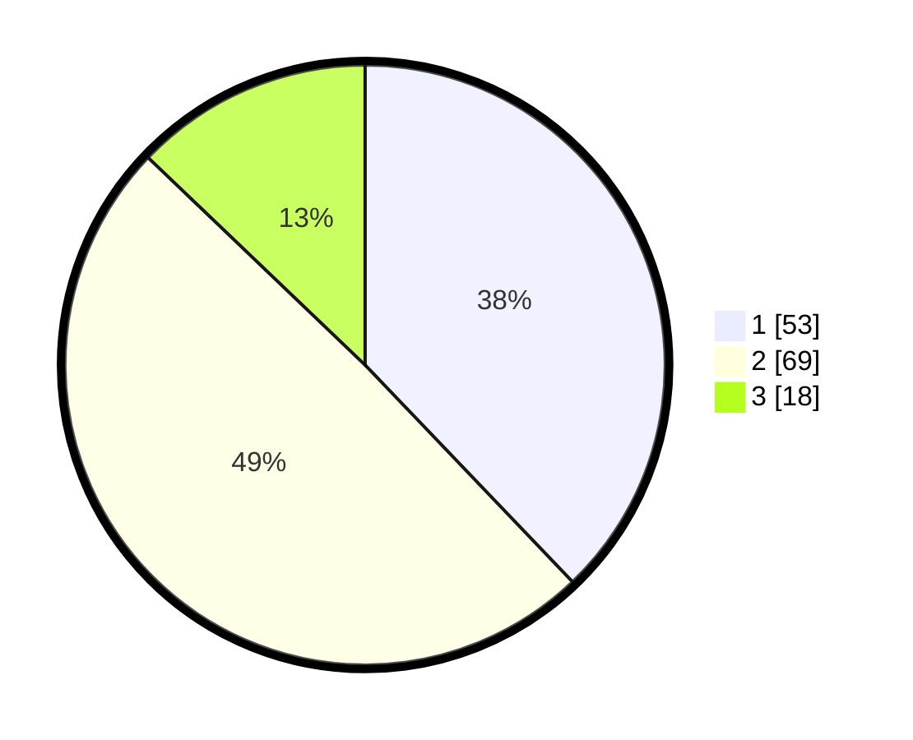

# Hasil

## Grafik

## Tabel

| No. | Nama Paslon    | Suara | Suara (raw) | Persentase |
|:--- |:-------------- | -----:| -----------:| ----------:|
| 1   | ANIES MUHAIMIN | 53    | [53][p-1]   | 37,86      |
| 2   | PRABOWO GIBRAN | 69    | [69][p-2]   | 49,29      |
| 3   | GANJAR MAHFUD  | 18    | [18][p-3]   | 12,86      |

[p-1]: https://github.com/gigit-pemilu/pemilu-2024/blob/main/pilpres/hitung-suara/sub/34-di-yogyakarta/sub/02-bantul/sub/15-sewon/sub/2003-bangunharjo/sub/010-tps/sub/paslon-1.txt
[p-2]: https://github.com/gigit-pemilu/pemilu-2024/blob/main/pilpres/hitung-suara/sub/34-di-yogyakarta/sub/02-bantul/sub/15-sewon/sub/2003-bangunharjo/sub/010-tps/sub/paslon-2.txt
[p-3]: https://github.com/gigit-pemilu/pemilu-2024/blob/main/pilpres/hitung-suara/sub/34-di-yogyakarta/sub/02-bantul/sub/15-sewon/sub/2003-bangunharjo/sub/010-tps/sub/paslon-3.txt

## Foto C Plano

https://sirekap-obj-formc.kpu.go.id/aec3/pemilu/ppwp/34/02/15/20/03/3402152003010-20240214-214145--8d4382f3-4305-4b7d-973e-f03ea771f306.jpg

https://sirekap-obj-formc.kpu.go.id/aec3/pemilu/ppwp/34/02/15/20/03/3402152003010-20240214-214237--7a7bbc34-6c91-424b-a9e5-d5169aeab1d8.jpg

https://sirekap-obj-formc.kpu.go.id/aec3/pemilu/ppwp/34/02/15/20/03/3402152003010-20240214-214446--5c554ba6-3071-4240-b0c6-41ef5340e0d5.jpg

## Metadata

| Key        | Value               |
| ---------- | ------------------- |
| Time Stamp | 2024-02-24 22:31:28 |

