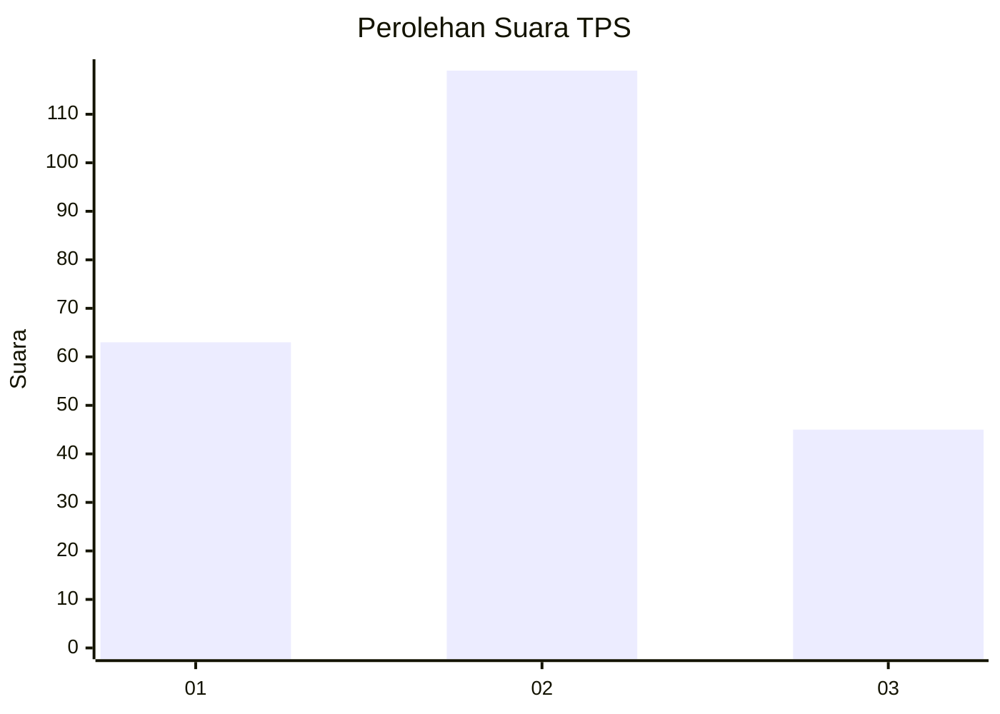
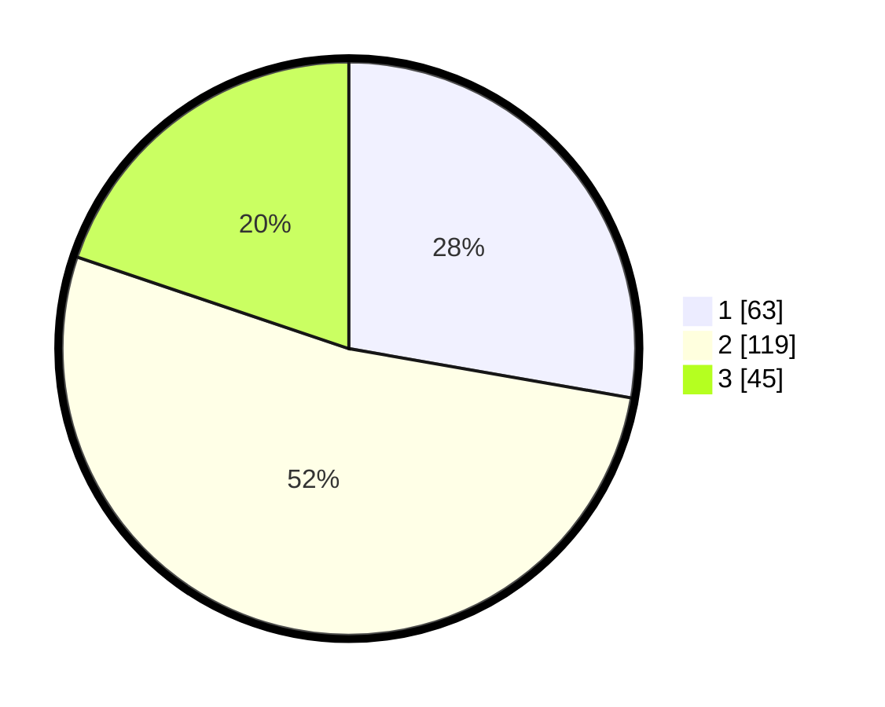

# Hasil

## Grafik

## Tabel

| No. | Nama Paslon    | Suara | Suara (raw) | Persentase |
|:--- |:-------------- | -----:| -----------:| ----------:|
| 1   | ANIES MUHAIMIN | 63    | [63][p-1]   | 27,75      |
| 2   | PRABOWO GIBRAN | 119   | [119][p-2]  | 52,42      |
| 3   | GANJAR MAHFUD  | 45    | [45][p-3]   | 19,82      |

[p-1]: https://github.com/gigit-pemilu/pemilu-2024-34-di-yogyakarta/blob/main/pilpres/hitung-suara/sub/34-di-yogyakarta/sub/02-bantul/sub/15-sewon/sub/2003-bangunharjo/sub/011-tps/sub/paslon-1.txt
[p-2]: https://github.com/gigit-pemilu/pemilu-2024-34-di-yogyakarta/blob/main/pilpres/hitung-suara/sub/34-di-yogyakarta/sub/02-bantul/sub/15-sewon/sub/2003-bangunharjo/sub/011-tps/sub/paslon-2.txt
[p-3]: https://github.com/gigit-pemilu/pemilu-2024-34-di-yogyakarta/blob/main/pilpres/hitung-suara/sub/34-di-yogyakarta/sub/02-bantul/sub/15-sewon/sub/2003-bangunharjo/sub/011-tps/sub/paslon-3.txt

## Foto C Plano

https://sirekap-obj-formc.kpu.go.id/db1a/pemilu/ppwp/34/02/15/20/03/3402152003011-20240214-202952--daac5050-01b7-43af-b765-2d05b9f25208.jpg

https://sirekap-obj-formc.kpu.go.id/db1a/pemilu/ppwp/34/02/15/20/03/3402152003011-20240219-145633--c028de9c-a12e-4679-9d2b-d132e42c572e.jpg

https://sirekap-obj-formc.kpu.go.id/db1a/pemilu/ppwp/34/02/15/20/03/3402152003011-20240214-202828--30a7938a-68f5-4ced-a78c-599f30fd61c6.jpg

## Metadata

| Key        | Value               |
| ---------- | ------------------- |
| Time Stamp | 2024-02-24 22:31:28 |

