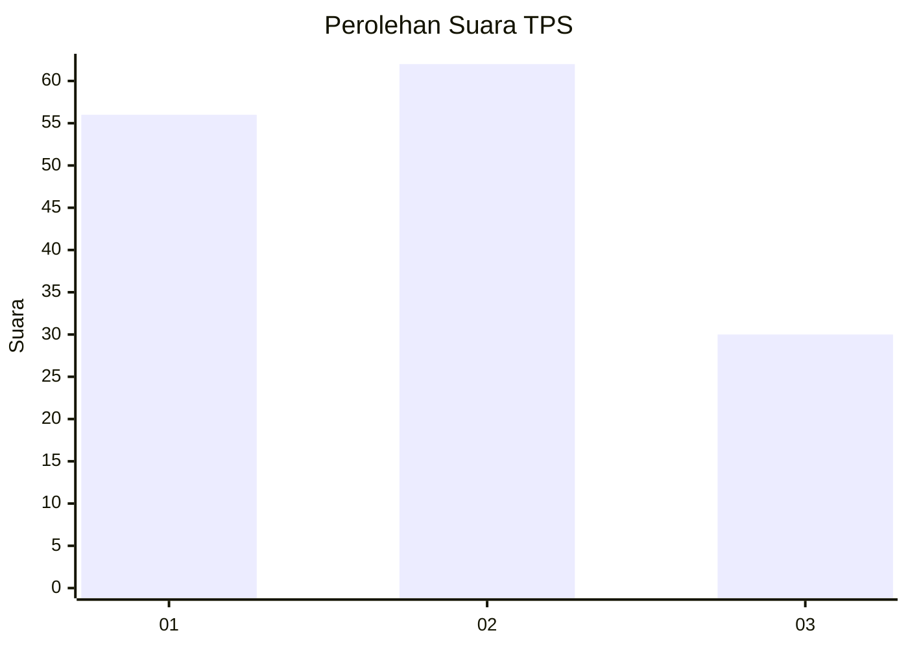
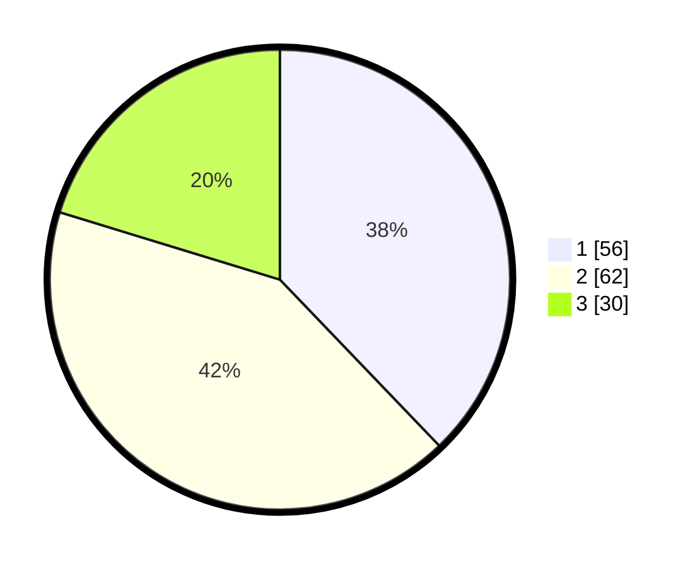

# Hasil

## Grafik

## Tabel

| No. | Nama Paslon    | Suara | Suara (raw) | Persentase |
|:--- |:-------------- | -----:| -----------:| ----------:|
| 1   | ANIES MUHAIMIN | 56    | [56][p-1]   | 37,84      |
| 2   | PRABOWO GIBRAN | 62    | [62][p-2]   | 41,89      |
| 3   | GANJAR MAHFUD  | 30    | [30][p-3]   | 20,27      |

[p-1]: https://github.com/gigit-pemilu/pemilu-2024-34-di-yogyakarta/blob/main/pilpres/hitung-suara/sub/34-di-yogyakarta/sub/02-bantul/sub/15-sewon/sub/2003-bangunharjo/sub/016-tps/sub/paslon-1.txt
[p-2]: https://github.com/gigit-pemilu/pemilu-2024-34-di-yogyakarta/blob/main/pilpres/hitung-suara/sub/34-di-yogyakarta/sub/02-bantul/sub/15-sewon/sub/2003-bangunharjo/sub/016-tps/sub/paslon-2.txt
[p-3]: https://github.com/gigit-pemilu/pemilu-2024-34-di-yogyakarta/blob/main/pilpres/hitung-suara/sub/34-di-yogyakarta/sub/02-bantul/sub/15-sewon/sub/2003-bangunharjo/sub/016-tps/sub/paslon-3.txt

## Foto C Plano

https://sirekap-obj-formc.kpu.go.id/2af5/pemilu/ppwp/34/02/15/20/03/3402152003016-20240215-013041--fef457cf-cd21-4484-9dfb-d73622417bbb.jpg

https://sirekap-obj-formc.kpu.go.id/2af5/pemilu/ppwp/34/02/15/20/03/3402152003016-20240215-013113--5caacc67-e74d-4d68-9c24-97bc63525a0b.jpg

https://sirekap-obj-formc.kpu.go.id/2af5/pemilu/ppwp/34/02/15/20/03/3402152003016-20240215-013155--4e28d5ac-161a-4d82-bcda-41417c30e822.jpg

## Metadata

| Key        | Value               |
| ---------- | ------------------- |
| Time Stamp | 2024-02-24 22:31:28 |

