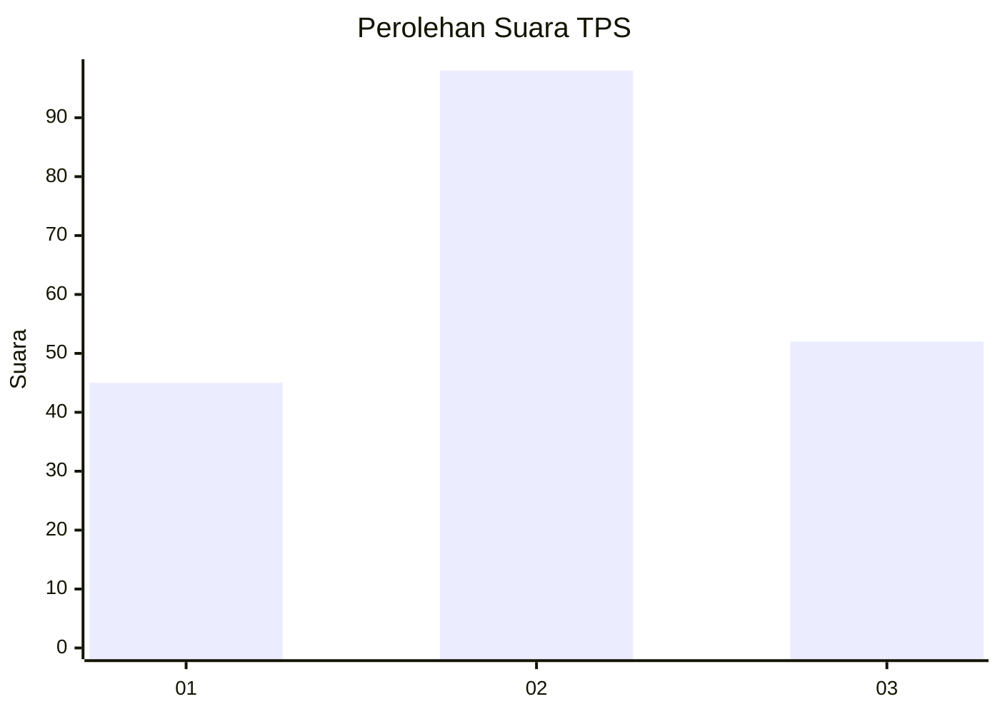
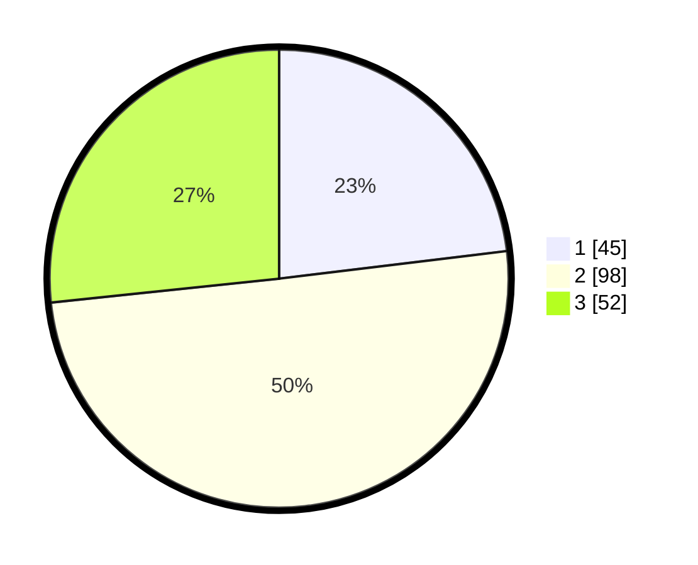

# Hasil

## Grafik

## Tabel

| No. | Nama Paslon    | Suara | Suara (raw) | Persentase |
|:--- |:-------------- | -----:| -----------:| ----------:|
| 1   | ANIES MUHAIMIN | 45    | [45][p-1]   | 23,08      |
| 2   | PRABOWO GIBRAN | 98    | [98][p-2]   | 50,26      |
| 3   | GANJAR MAHFUD  | 52    | [52][p-3]   | 26,67      |

[p-1]: https://github.com/gigit-pemilu/pemilu-2024-34-di-yogyakarta/blob/main/pilpres/hitung-suara/sub/34-di-yogyakarta/sub/02-bantul/sub/15-sewon/sub/2003-bangunharjo/sub/036-tps/sub/paslon-1.txt
[p-2]: https://github.com/gigit-pemilu/pemilu-2024-34-di-yogyakarta/blob/main/pilpres/hitung-suara/sub/34-di-yogyakarta/sub/02-bantul/sub/15-sewon/sub/2003-bangunharjo/sub/036-tps/sub/paslon-2.txt
[p-3]: https://github.com/gigit-pemilu/pemilu-2024-34-di-yogyakarta/blob/main/pilpres/hitung-suara/sub/34-di-yogyakarta/sub/02-bantul/sub/15-sewon/sub/2003-bangunharjo/sub/036-tps/sub/paslon-3.txt

## Foto C Plano

https://sirekap-obj-formc.kpu.go.id/38b1/pemilu/ppwp/34/02/15/20/03/3402152003036-20240215-000436--37bdafda-281a-4178-8c19-83aa0731d802.jpg

https://sirekap-obj-formc.kpu.go.id/38b1/pemilu/ppwp/34/02/15/20/03/3402152003036-20240215-000457--1bb294c5-0cf1-4a1d-a9ca-24dc8062c183.jpg

https://sirekap-obj-formc.kpu.go.id/38b1/pemilu/ppwp/34/02/15/20/03/3402152003036-20240215-000523--8a6b9800-e44b-49f8-9157-71af4970b1f3.jpg

## Metadata

| Key        | Value               |
| ---------- | ------------------- |
| Time Stamp | 2024-02-15 12:00:28 |

