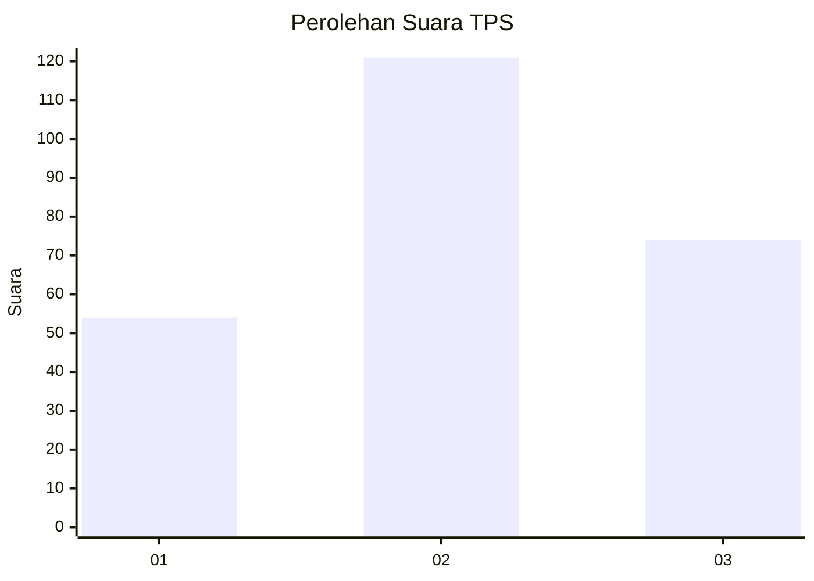
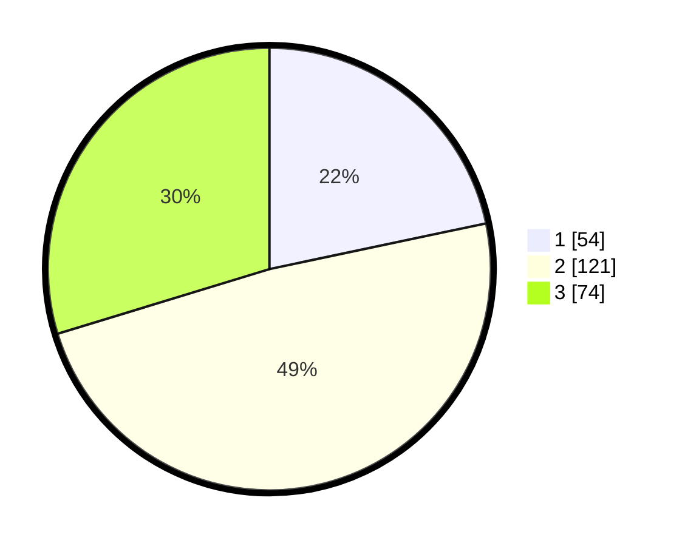

# Hasil

## Grafik

## Tabel

| No. | Nama Paslon    | Suara | Suara (raw) | Persentase |
|:--- |:-------------- | -----:| -----------:| ----------:|
| 1   | ANIES MUHAIMIN | 54    | [54][p-1]   | 21,69      |
| 2   | PRABOWO GIBRAN | 121   | [121][p-2]  | 48,59      |
| 3   | GANJAR MAHFUD  | 74    | [74][p-3]   | 29,72      |

[p-1]: https://github.com/gigit-pemilu/pemilu-2024-34-di-yogyakarta/blob/main/pilpres/hitung-suara/sub/34-di-yogyakarta/sub/02-bantul/sub/15-sewon/sub/2003-bangunharjo/sub/044-tps/sub/paslon-1.txt
[p-2]: https://github.com/gigit-pemilu/pemilu-2024-34-di-yogyakarta/blob/main/pilpres/hitung-suara/sub/34-di-yogyakarta/sub/02-bantul/sub/15-sewon/sub/2003-bangunharjo/sub/044-tps/sub/paslon-2.txt
[p-3]: https://github.com/gigit-pemilu/pemilu-2024-34-di-yogyakarta/blob/main/pilpres/hitung-suara/sub/34-di-yogyakarta/sub/02-bantul/sub/15-sewon/sub/2003-bangunharjo/sub/044-tps/sub/paslon-3.txt

## Foto C Plano

https://sirekap-obj-formc.kpu.go.id/089c/pemilu/ppwp/34/02/15/20/03/3402152003044-20240214-155007--6edfcf18-2242-4be6-b13a-0d879a60ea21.jpg

https://sirekap-obj-formc.kpu.go.id/089c/pemilu/ppwp/34/02/15/20/03/3402152003044-20240214-155018--71fc32e6-f82e-4482-a820-1bfa2f882f9d.jpg

https://sirekap-obj-formc.kpu.go.id/089c/pemilu/ppwp/34/02/15/20/03/3402152003044-20240214-155326--96749cb1-e9d7-4502-81fc-c3d9b324d861.jpg

## Metadata

| Key        | Value               |
| ---------- | ------------------- |
| Time Stamp | 2024-02-14 21:46:01 |

