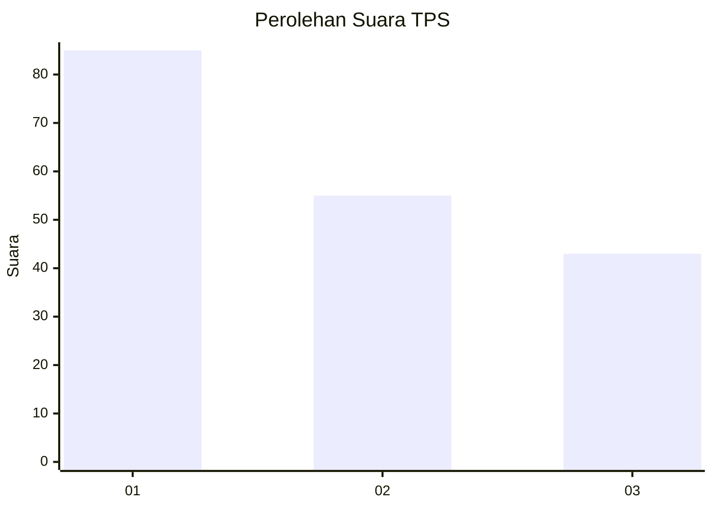
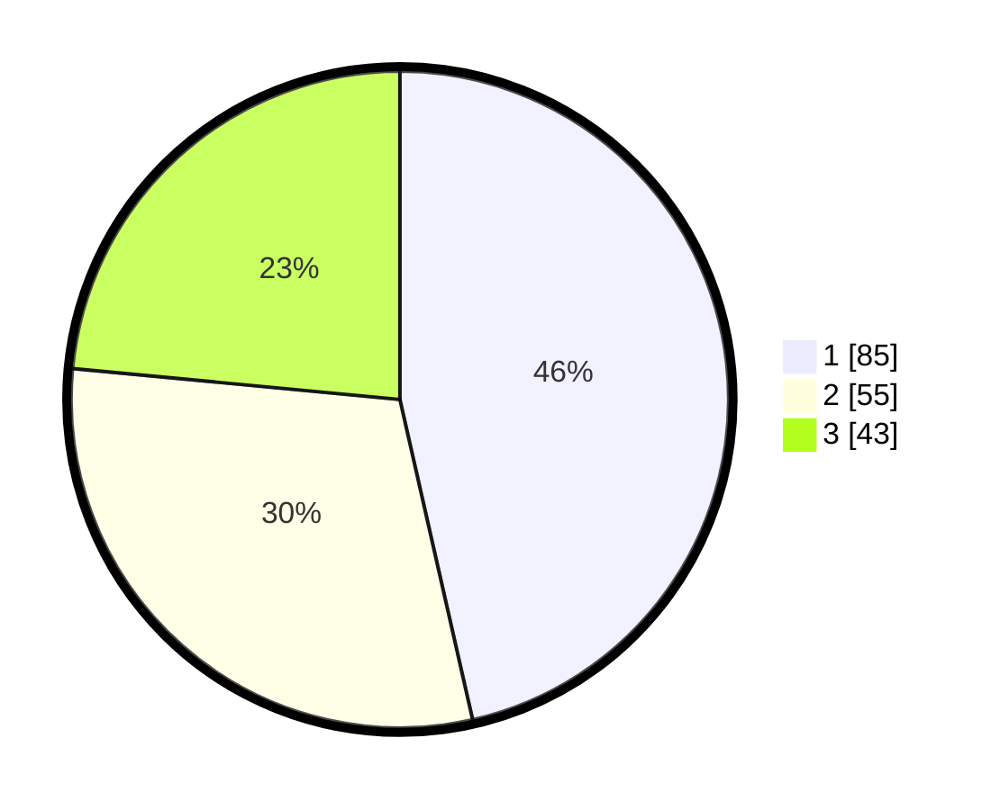

# Hasil

## Grafik

## Tabel

| No. | Nama Paslon    | Suara | Suara (raw) | Persentase |
|:--- |:-------------- | -----:| -----------:| ----------:|
| 1   | ANIES MUHAIMIN | 85    | [85][p-1]   | 46,45      |
| 2   | PRABOWO GIBRAN | 55    | [55][p-2]   | 30,05      |
| 3   | GANJAR MAHFUD  | 43    | [43][p-3]   | 23,50      |

[p-1]: https://github.com/gigit-pemilu/pemilu-2024-34-di-yogyakarta/blob/main/pilpres/hitung-suara/sub/34-di-yogyakarta/sub/02-bantul/sub/15-sewon/sub/2003-bangunharjo/sub/051-tps/sub/paslon-1.txt
[p-2]: https://github.com/gigit-pemilu/pemilu-2024-34-di-yogyakarta/blob/main/pilpres/hitung-suara/sub/34-di-yogyakarta/sub/02-bantul/sub/15-sewon/sub/2003-bangunharjo/sub/051-tps/sub/paslon-2.txt
[p-3]: https://github.com/gigit-pemilu/pemilu-2024-34-di-yogyakarta/blob/main/pilpres/hitung-suara/sub/34-di-yogyakarta/sub/02-bantul/sub/15-sewon/sub/2003-bangunharjo/sub/051-tps/sub/paslon-3.txt

## Foto C Plano

https://sirekap-obj-formc.kpu.go.id/49c8/pemilu/ppwp/34/02/15/20/03/3402152003051-20240214-155504--418a5bcc-bd07-408c-9a01-e2c0c22809ef.jpg

https://sirekap-obj-formc.kpu.go.id/49c8/pemilu/ppwp/34/02/15/20/03/3402152003051-20240214-155719--f33973c3-ad39-439d-b58f-f1c2f26fb6e4.jpg

https://sirekap-obj-formc.kpu.go.id/49c8/pemilu/ppwp/34/02/15/20/03/3402152003051-20240214-160118--f67c5fe5-0203-4c1e-83e4-fc40d763795b.jpg

## Metadata

| Key        | Value               |
| ---------- | ------------------- |
| Time Stamp | 2024-02-25 18:00:00 |

