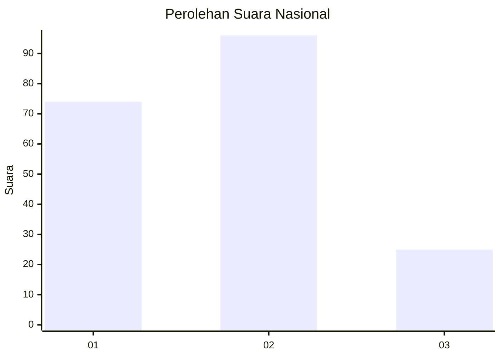
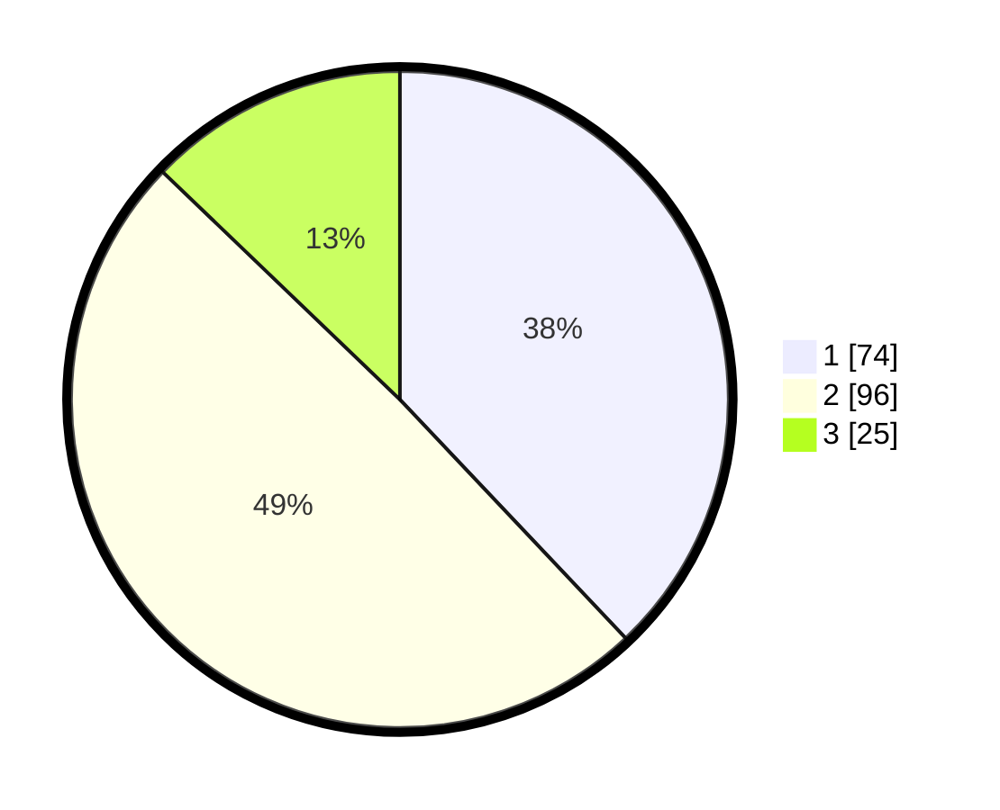

# Hasil

## Grafik

## Tabel

| No. | Nama Paslon    | Suara | Suara (raw) | Persentase |
|:--- |:-------------- | -----:| -----------:| ----------:|
| 1   | ANIES MUHAIMIN | 74    | [74][p-1]   | 37,95      |
| 2   | PRABOWO GIBRAN | 96    | [96][p-2]   | 49,23      |
| 3   | GANJAR MAHFUD  | 25    | [25][p-3]   | 12,82      |

[p-1]: https://github.com/gigit-pemilu/pemilu-2024/blob/main/pilpres/hitung-suara/sub/34-di-yogyakarta/sub/02-bantul/sub/15-sewon/sub/2003-bangunharjo/sub/054-tps/sub/paslon-1.txt
[p-2]: https://github.com/gigit-pemilu/pemilu-2024/blob/main/pilpres/hitung-suara/sub/34-di-yogyakarta/sub/02-bantul/sub/15-sewon/sub/2003-bangunharjo/sub/054-tps/sub/paslon-2.txt
[p-3]: https://github.com/gigit-pemilu/pemilu-2024/blob/main/pilpres/hitung-suara/sub/34-di-yogyakarta/sub/02-bantul/sub/15-sewon/sub/2003-bangunharjo/sub/054-tps/sub/paslon-3.txt

## Foto C Plano

https://sirekap-obj-formc.kpu.go.id/b4fc/pemilu/ppwp/34/02/15/20/03/3402152003054-20240214-232234--700b96b4-d733-492c-8b79-94294eaafb1b.jpg

https://sirekap-obj-formc.kpu.go.id/b4fc/pemilu/ppwp/34/02/15/20/03/3402152003054-20240214-232356--97ff65d8-e5ef-46f1-9864-fbffedeb83ba.jpg

https://sirekap-obj-formc.kpu.go.id/b4fc/pemilu/ppwp/34/02/15/20/03/3402152003054-20240214-233131--045db90a-e3d3-4219-b8a8-e400a9a0660c.jpg

## Metadata

| Key        | Value               |
| ---------- | ------------------- |
| Time Stamp | 2024-02-24 22:31:28 |

