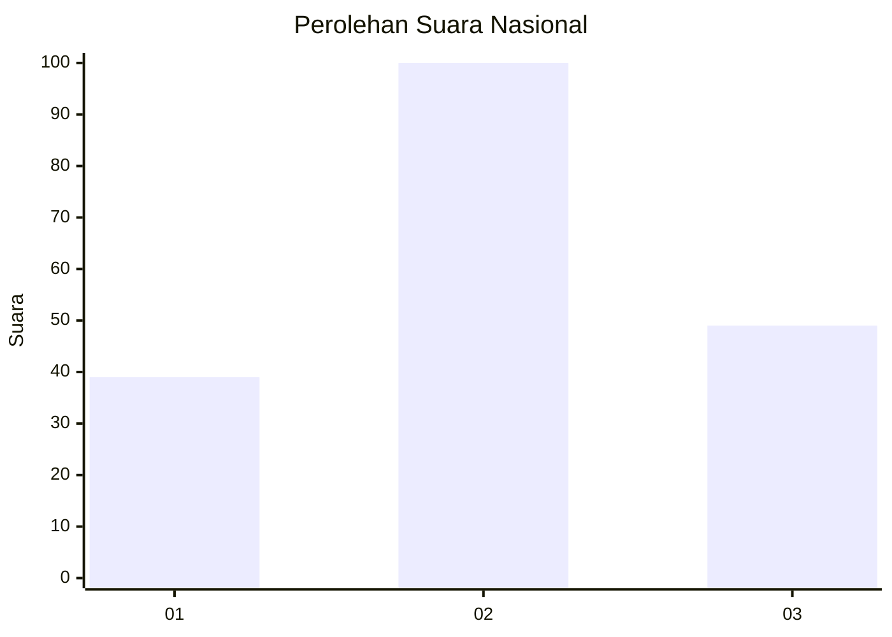
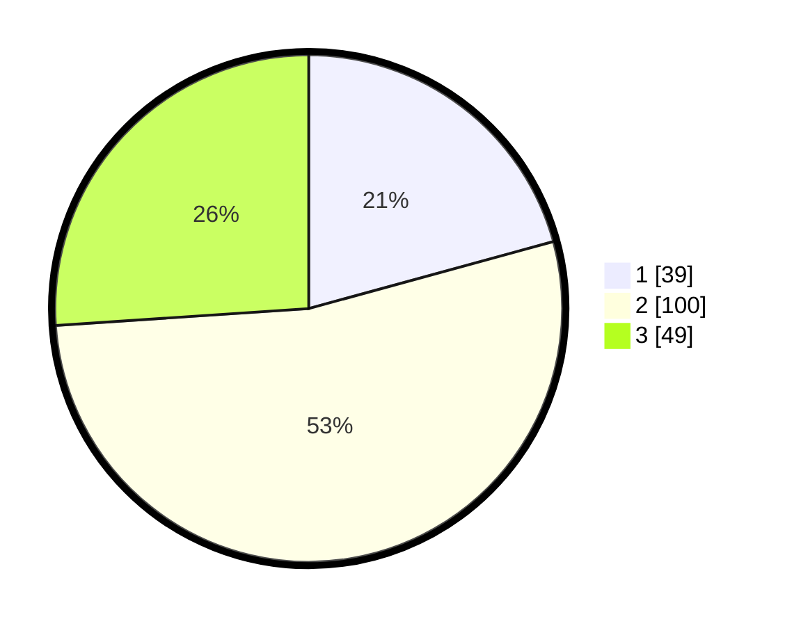

# Hasil

## Grafik

## Tabel

| No. | Nama Paslon    | Suara | Suara (raw) | Persentase |
|:--- |:-------------- | -----:| -----------:| ----------:|
| 1   | ANIES MUHAIMIN | 39    | [39][p-1]   | 20,74      |
| 2   | PRABOWO GIBRAN | 100   | [100][p-2]  | 53,19      |
| 3   | GANJAR MAHFUD  | 49    | [49][p-3]   | 26,06      |

[p-1]: https://github.com/gigit-pemilu/pemilu-2024/blob/main/pilpres/hitung-suara/sub/34-di-yogyakarta/sub/02-bantul/sub/15-sewon/sub/2003-bangunharjo/sub/060-tps/sub/paslon-1.txt
[p-2]: https://github.com/gigit-pemilu/pemilu-2024/blob/main/pilpres/hitung-suara/sub/34-di-yogyakarta/sub/02-bantul/sub/15-sewon/sub/2003-bangunharjo/sub/060-tps/sub/paslon-2.txt
[p-3]: https://github.com/gigit-pemilu/pemilu-2024/blob/main/pilpres/hitung-suara/sub/34-di-yogyakarta/sub/02-bantul/sub/15-sewon/sub/2003-bangunharjo/sub/060-tps/sub/paslon-3.txt

## Foto C Plano

https://sirekap-obj-formc.kpu.go.id/bf6a/pemilu/ppwp/34/02/15/20/03/3402152003060-20240214-191548--6eb0073b-8ab0-4349-9091-f860f70e4f78.jpg

https://sirekap-obj-formc.kpu.go.id/bf6a/pemilu/ppwp/34/02/15/20/03/3402152003060-20240214-192932--124ce7d0-5919-4384-9095-fa9173061ddd.jpg

https://sirekap-obj-formc.kpu.go.id/bf6a/pemilu/ppwp/34/02/15/20/03/3402152003060-20240214-193014--d249a56c-bd78-4da2-b308-5029f6c2ab2f.jpg

## Metadata

| Key        | Value               |
| ---------- | ------------------- |
| Time Stamp | 2024-02-24 22:31:28 |

