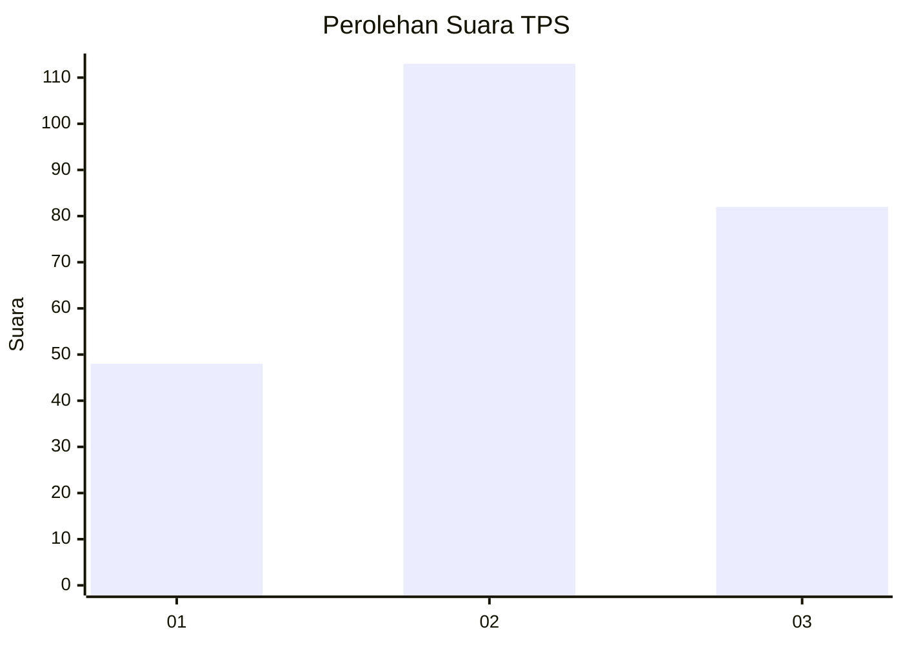
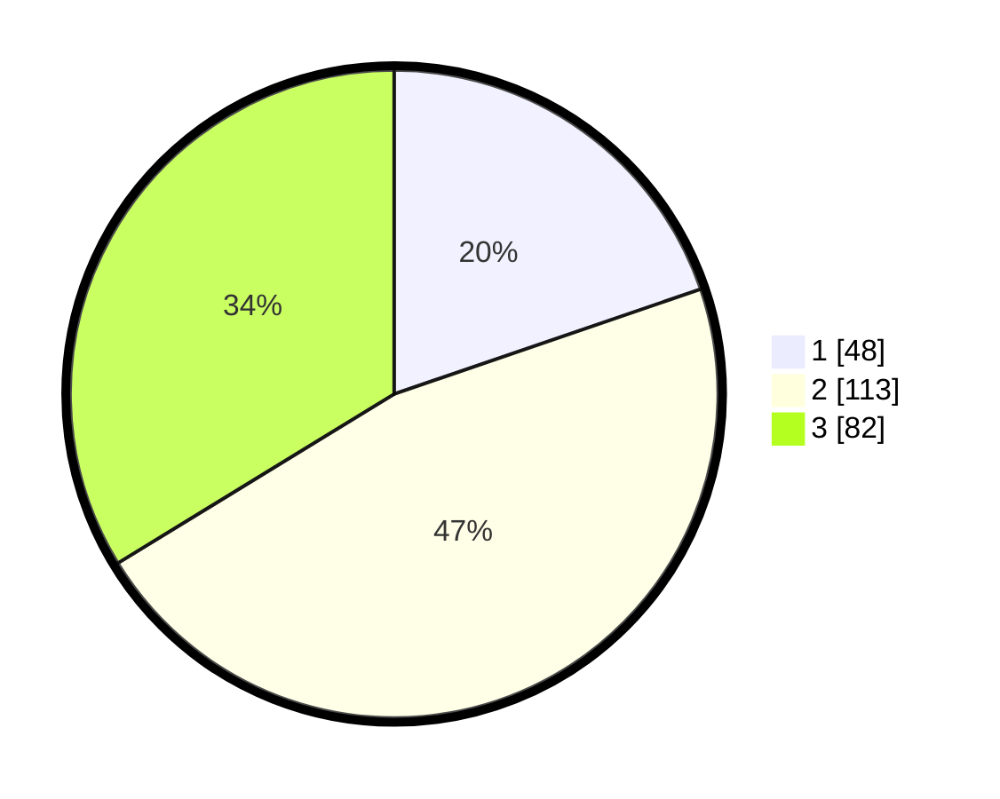

# Hasil

## Grafik

## Tabel

| No. | Nama Paslon    | Suara | Suara (raw) | Persentase |
|:--- |:-------------- | -----:| -----------:| ----------:|
| 1   | ANIES MUHAIMIN | 48    | [48][p-1]   | 19,75      |
| 2   | PRABOWO GIBRAN | 113   | [113][p-2]  | 46,50      |
| 3   | GANJAR MAHFUD  | 82    | [82][p-3]   | 33,74      |

[p-1]: https://github.com/gigit-pemilu/pemilu-2024-34-di-yogyakarta/blob/main/pilpres/hitung-suara/sub/34-di-yogyakarta/sub/02-bantul/sub/15-sewon/sub/2003-bangunharjo/sub/062-tps/sub/paslon-1.txt
[p-2]: https://github.com/gigit-pemilu/pemilu-2024-34-di-yogyakarta/blob/main/pilpres/hitung-suara/sub/34-di-yogyakarta/sub/02-bantul/sub/15-sewon/sub/2003-bangunharjo/sub/062-tps/sub/paslon-2.txt
[p-3]: https://github.com/gigit-pemilu/pemilu-2024-34-di-yogyakarta/blob/main/pilpres/hitung-suara/sub/34-di-yogyakarta/sub/02-bantul/sub/15-sewon/sub/2003-bangunharjo/sub/062-tps/sub/paslon-3.txt

## Foto C Plano

https://sirekap-obj-formc.kpu.go.id/8927/pemilu/ppwp/34/02/15/20/03/3402152003062-20240215-021632--f32cdeb4-2013-48ec-b357-fa357c8f1bdb.jpg

https://sirekap-obj-formc.kpu.go.id/8927/pemilu/ppwp/34/02/15/20/03/3402152003062-20240214-230949--9d26703b-ae14-4b67-a2b8-7ab89767a7a2.jpg

https://sirekap-obj-formc.kpu.go.id/8927/pemilu/ppwp/34/02/15/20/03/3402152003062-20240215-022052--917e55a2-4875-4a31-885f-59bf8782a4e6.jpg

## Metadata

| Key        | Value               |
| ---------- | ------------------- |
| Time Stamp | 2024-02-24 22:31:28 |

