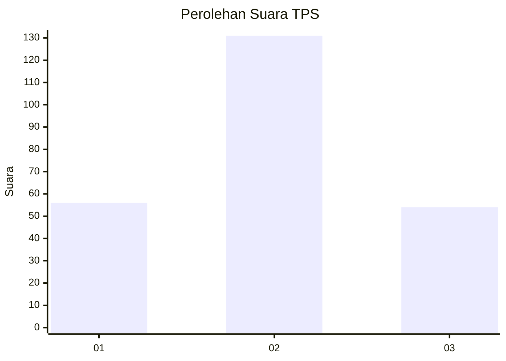
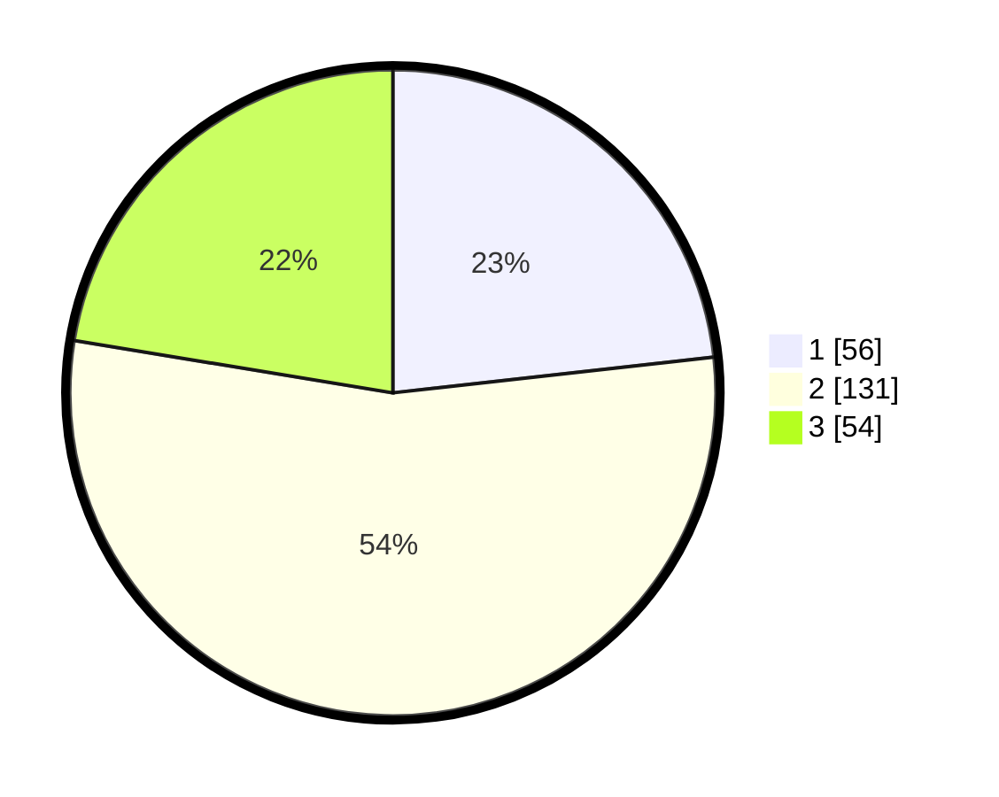

# Hasil

## Grafik

## Tabel

| No. | Nama Paslon    | Suara | Suara (raw) | Persentase |
|:--- |:-------------- | -----:| -----------:| ----------:|
| 1   | ANIES MUHAIMIN | 56    | [56][p-1]   | 23,24      |
| 2   | PRABOWO GIBRAN | 131   | [131][p-2]  | 54,36      |
| 3   | GANJAR MAHFUD  | 54    | [54][p-3]   | 22,41      |

[p-1]: https://github.com/gigit-pemilu/pemilu-2024-34-di-yogyakarta/blob/main/pilpres/hitung-suara/sub/34-di-yogyakarta/sub/02-bantul/sub/15-sewon/sub/2003-bangunharjo/sub/065-tps/sub/paslon-1.txt
[p-2]: https://github.com/gigit-pemilu/pemilu-2024-34-di-yogyakarta/blob/main/pilpres/hitung-suara/sub/34-di-yogyakarta/sub/02-bantul/sub/15-sewon/sub/2003-bangunharjo/sub/065-tps/sub/paslon-2.txt
[p-3]: https://github.com/gigit-pemilu/pemilu-2024-34-di-yogyakarta/blob/main/pilpres/hitung-suara/sub/34-di-yogyakarta/sub/02-bantul/sub/15-sewon/sub/2003-bangunharjo/sub/065-tps/sub/paslon-3.txt

## Foto C Plano

https://sirekap-obj-formc.kpu.go.id/29c5/pemilu/ppwp/34/02/15/20/03/3402152003065-20240219-144638--8f96b60d-96ce-420b-acc4-2eb784b4094d.jpg

https://sirekap-obj-formc.kpu.go.id/29c5/pemilu/ppwp/34/02/15/20/03/3402152003065-20240214-225808--b42b0cd8-df7e-45be-bd3c-a93cb4508722.jpg

https://sirekap-obj-formc.kpu.go.id/29c5/pemilu/ppwp/34/02/15/20/03/3402152003065-20240214-232157--5dc1d7d6-46d9-4525-a51e-24a67bf2cc8b.jpg

## Metadata

| Key        | Value               |
| ---------- | ------------------- |
| Time Stamp | 2024-02-19 15:00:00 |

