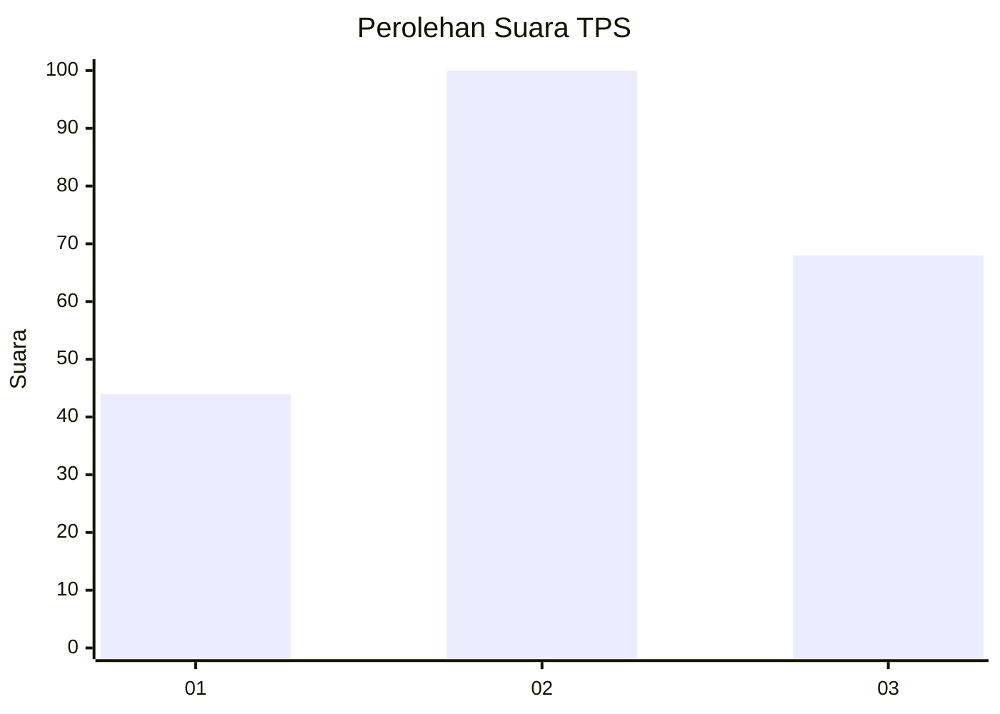
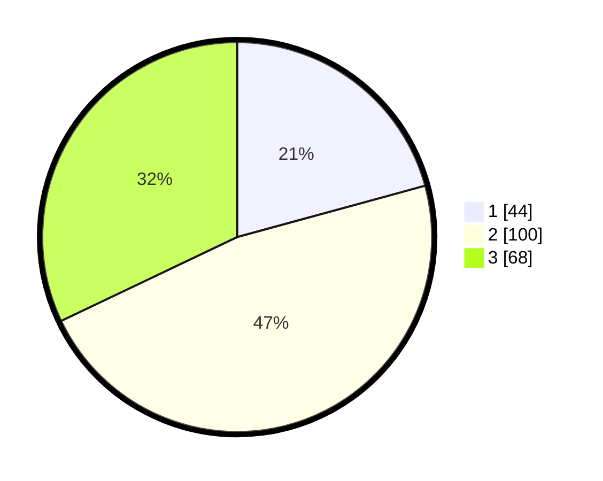

# Hasil

## Grafik

## Tabel

| No. | Nama Paslon    | Suara | Suara (raw) | Persentase |
|:--- |:-------------- | -----:| -----------:| ----------:|
| 1   | ANIES MUHAIMIN | 44    | [44][p-1]   | 20,75      |
| 2   | PRABOWO GIBRAN | 100   | [100][p-2]  | 47,17      |
| 3   | GANJAR MAHFUD  | 68    | [68][p-3]   | 32,08      |

[p-1]: https://github.com/gigit-pemilu/pemilu-2024-34-di-yogyakarta/blob/main/pilpres/hitung-suara/sub/34-di-yogyakarta/sub/02-bantul/sub/15-sewon/sub/2003-bangunharjo/sub/067-tps/sub/paslon-1.txt
[p-2]: https://github.com/gigit-pemilu/pemilu-2024-34-di-yogyakarta/blob/main/pilpres/hitung-suara/sub/34-di-yogyakarta/sub/02-bantul/sub/15-sewon/sub/2003-bangunharjo/sub/067-tps/sub/paslon-2.txt
[p-3]: https://github.com/gigit-pemilu/pemilu-2024-34-di-yogyakarta/blob/main/pilpres/hitung-suara/sub/34-di-yogyakarta/sub/02-bantul/sub/15-sewon/sub/2003-bangunharjo/sub/067-tps/sub/paslon-3.txt

## Foto C Plano

https://sirekap-obj-formc.kpu.go.id/3cd1/pemilu/ppwp/34/02/15/20/03/3402152003067-20240216-145617--2e304e51-a5a6-48b6-b46e-92bd03e3b7ce.jpg

https://sirekap-obj-formc.kpu.go.id/3cd1/pemilu/ppwp/34/02/15/20/03/3402152003067-20240214-202435--30d50ff5-5673-4cd6-a0f9-f34c0d26658a.jpg

https://sirekap-obj-formc.kpu.go.id/3cd1/pemilu/ppwp/34/02/15/20/03/3402152003067-20240214-202613--654118e2-622a-445c-bda7-2586ab703ea6.jpg

## Metadata

| Key        | Value               |
| ---------- | ------------------- |
| Time Stamp | 2024-02-24 22:31:28 |

