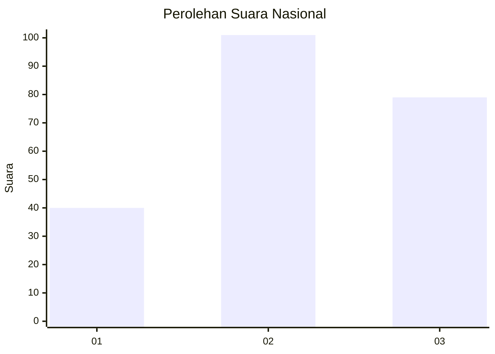
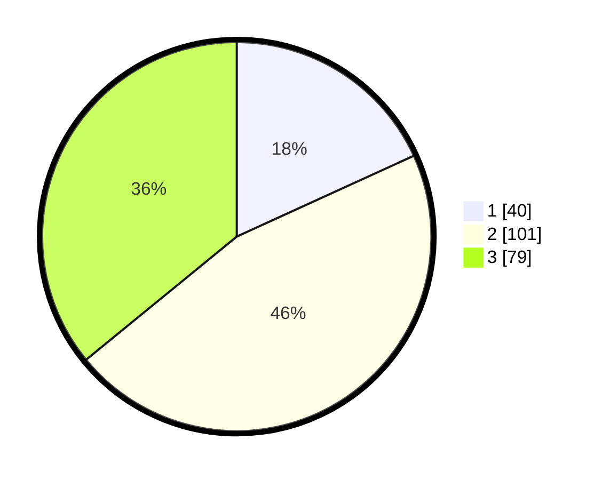

# Hasil

## Grafik

## Tabel

| No. | Nama Paslon    | Suara | Suara (raw) | Persentase |
|:--- |:-------------- | -----:| -----------:| ----------:|
| 1   | ANIES MUHAIMIN | 40    | [40][p-1]   | 18,18      |
| 2   | PRABOWO GIBRAN | 101   | [101][p-2]  | 45,91      |
| 3   | GANJAR MAHFUD  | 79    | [79][p-3]   | 35,91      |

[p-1]: https://github.com/gigit-pemilu/pemilu-2024/blob/main/pilpres/hitung-suara/sub/34-di-yogyakarta/sub/02-bantul/sub/15-sewon/sub/2003-bangunharjo/sub/068-tps/sub/paslon-1.txt
[p-2]: https://github.com/gigit-pemilu/pemilu-2024/blob/main/pilpres/hitung-suara/sub/34-di-yogyakarta/sub/02-bantul/sub/15-sewon/sub/2003-bangunharjo/sub/068-tps/sub/paslon-2.txt
[p-3]: https://github.com/gigit-pemilu/pemilu-2024/blob/main/pilpres/hitung-suara/sub/34-di-yogyakarta/sub/02-bantul/sub/15-sewon/sub/2003-bangunharjo/sub/068-tps/sub/paslon-3.txt

## Foto C Plano

https://sirekap-obj-formc.kpu.go.id/3c6a/pemilu/ppwp/34/02/15/20/03/3402152003068-20240214-202131--6d8ec9ad-8636-400e-89ab-7d7212e56d86.jpg

https://sirekap-obj-formc.kpu.go.id/3c6a/pemilu/ppwp/34/02/15/20/03/3402152003068-20240214-221456--176cbda9-b37e-4e52-b902-51d02ec741dd.jpg

https://sirekap-obj-formc.kpu.go.id/3c6a/pemilu/ppwp/34/02/15/20/03/3402152003068-20240214-202415--269b16e5-0ddd-408a-9c17-58e49e6874c2.jpg

## Metadata

| Key        | Value               |
| ---------- | ------------------- |
| Time Stamp | 2024-02-15 12:00:28 |

