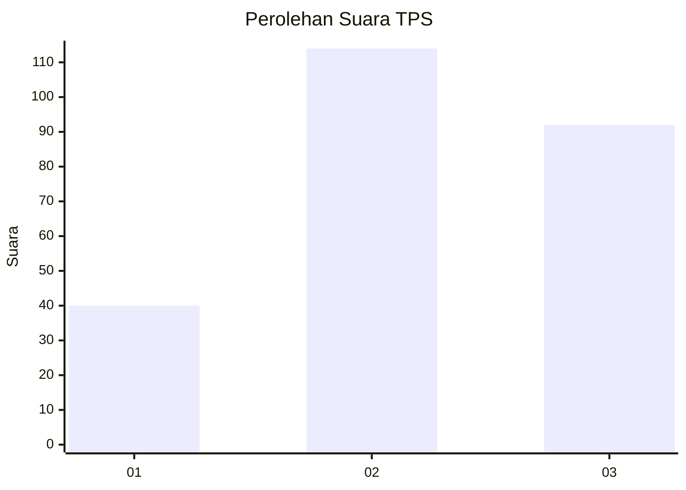
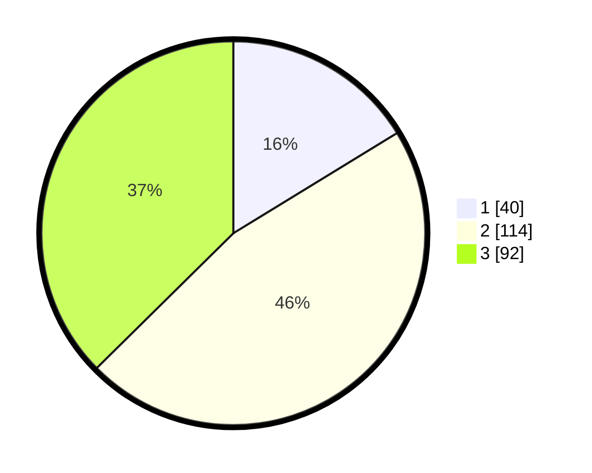

# Hasil

## Grafik

## Tabel

| No. | Nama Paslon    | Suara | Suara (raw) | Persentase |
|:--- |:-------------- | -----:| -----------:| ----------:|
| 1   | ANIES MUHAIMIN | 40    | [40][p-1]   | 16,26      |
| 2   | PRABOWO GIBRAN | 114   | [114][p-2]  | 46,34      |
| 3   | GANJAR MAHFUD  | 92    | [92][p-3]   | 37,40      |

[p-1]: https://github.com/gigit-pemilu/pemilu-2024-34-di-yogyakarta/blob/main/pilpres/hitung-suara/sub/34-di-yogyakarta/sub/02-bantul/sub/15-sewon/sub/2003-bangunharjo/sub/070-tps/sub/paslon-1.txt
[p-2]: https://github.com/gigit-pemilu/pemilu-2024-34-di-yogyakarta/blob/main/pilpres/hitung-suara/sub/34-di-yogyakarta/sub/02-bantul/sub/15-sewon/sub/2003-bangunharjo/sub/070-tps/sub/paslon-2.txt
[p-3]: https://github.com/gigit-pemilu/pemilu-2024-34-di-yogyakarta/blob/main/pilpres/hitung-suara/sub/34-di-yogyakarta/sub/02-bantul/sub/15-sewon/sub/2003-bangunharjo/sub/070-tps/sub/paslon-3.txt

## Foto C Plano

https://sirekap-obj-formc.kpu.go.id/278c/pemilu/ppwp/34/02/15/20/03/3402152003070-20240214-204411--88889fe1-e683-4d36-b249-9cdb165151cc.jpg

https://sirekap-obj-formc.kpu.go.id/278c/pemilu/ppwp/34/02/15/20/03/3402152003070-20240214-204422--c15357c4-d98a-481f-a03c-de4f76132c24.jpg

https://sirekap-obj-formc.kpu.go.id/278c/pemilu/ppwp/34/02/15/20/03/3402152003070-20240214-204435--d388b5bc-0a13-4785-a309-ba574293d9c3.jpg

## Metadata

| Key        | Value               |
| ---------- | ------------------- |
| Time Stamp | 2024-02-24 22:31:28 |

