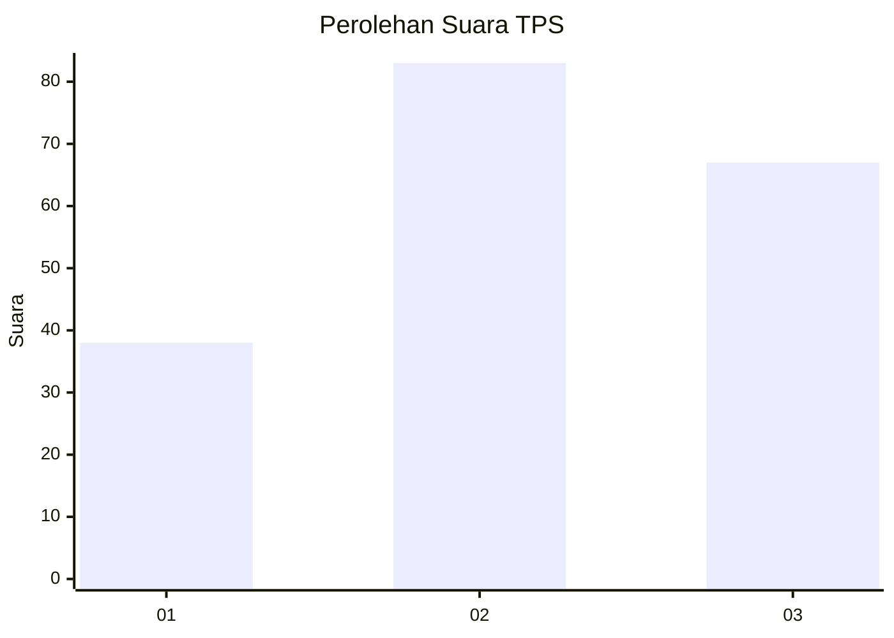
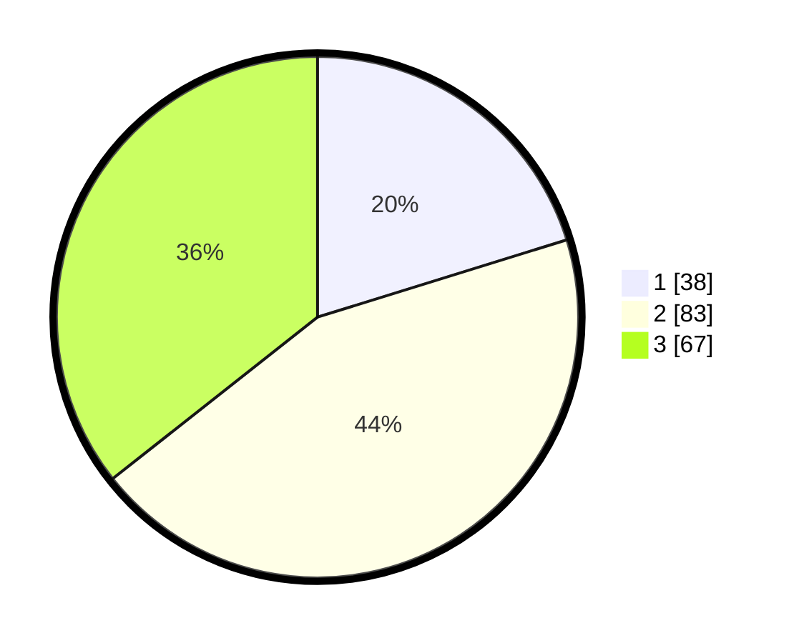

# Hasil

## Grafik

## Tabel

| No. | Nama Paslon    | Suara | Suara (raw) | Persentase |
|:--- |:-------------- | -----:| -----------:| ----------:|
| 1   | ANIES MUHAIMIN | 38    | [38][p-1]   | 20,21      |
| 2   | PRABOWO GIBRAN | 83    | [83][p-2]   | 44,15      |
| 3   | GANJAR MAHFUD  | 67    | [67][p-3]   | 35,64      |

[p-1]: https://github.com/gigit-pemilu/pemilu-2024-34-di-yogyakarta/blob/main/pilpres/hitung-suara/sub/34-di-yogyakarta/sub/02-bantul/sub/15-sewon/sub/2003-bangunharjo/sub/071-tps/sub/paslon-1.txt
[p-2]: https://github.com/gigit-pemilu/pemilu-2024-34-di-yogyakarta/blob/main/pilpres/hitung-suara/sub/34-di-yogyakarta/sub/02-bantul/sub/15-sewon/sub/2003-bangunharjo/sub/071-tps/sub/paslon-2.txt
[p-3]: https://github.com/gigit-pemilu/pemilu-2024-34-di-yogyakarta/blob/main/pilpres/hitung-suara/sub/34-di-yogyakarta/sub/02-bantul/sub/15-sewon/sub/2003-bangunharjo/sub/071-tps/sub/paslon-3.txt

## Foto C Plano

https://sirekap-obj-formc.kpu.go.id/c249/pemilu/ppwp/34/02/15/20/03/3402152003071-20240215-101935--1001283d-7b7c-4888-8232-14174cf48740.jpg

https://sirekap-obj-formc.kpu.go.id/c249/pemilu/ppwp/34/02/15/20/03/3402152003071-20240214-141013--95b30fa3-3756-4c19-9bb0-f6cebfd3c649.jpg

https://sirekap-obj-formc.kpu.go.id/c249/pemilu/ppwp/34/02/15/20/03/3402152003071-20240214-141921--5e3ca8dc-0348-46de-b7f2-2fd9ee98a171.jpg

## Metadata

| Key        | Value               |
| ---------- | ------------------- |
| Time Stamp | 2024-02-15 20:30:46 |

