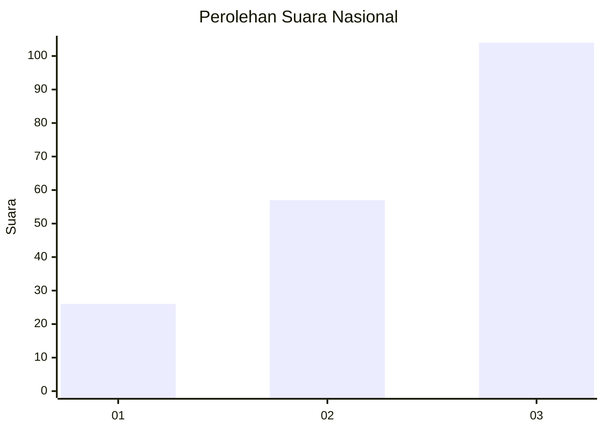
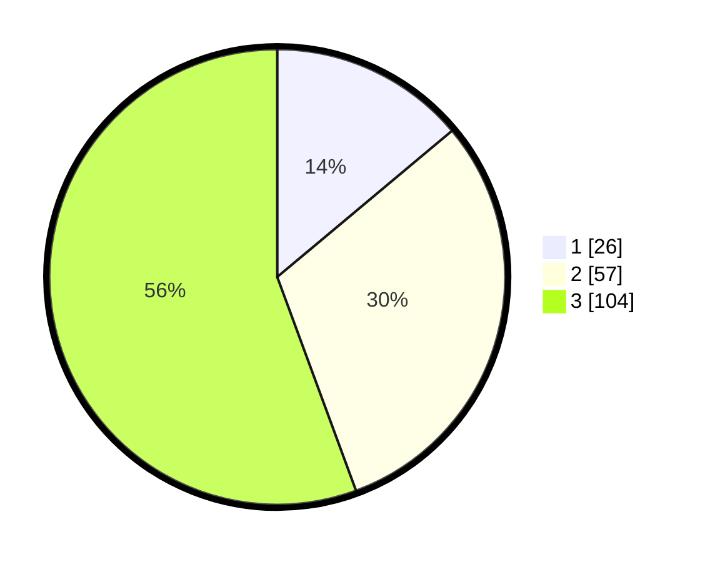

# Hasil

## Grafik

## Tabel

| No. | Nama Paslon    | Suara | Suara (raw) | Persentase |
|:--- |:-------------- | -----:| -----------:| ----------:|
| 1   | ANIES MUHAIMIN | 26    | [26][p-1]   | 13,90      |
| 2   | PRABOWO GIBRAN | 57    | [57][p-2]   | 30,48      |
| 3   | GANJAR MAHFUD  | 104   | [104][p-3]  | 55,61      |

[p-1]: https://github.com/gigit-pemilu/pemilu-2024/blob/main/pilpres/hitung-suara/sub/34-di-yogyakarta/sub/02-bantul/sub/15-sewon/sub/2003-bangunharjo/sub/072-tps/sub/paslon-1.txt
[p-2]: https://github.com/gigit-pemilu/pemilu-2024/blob/main/pilpres/hitung-suara/sub/34-di-yogyakarta/sub/02-bantul/sub/15-sewon/sub/2003-bangunharjo/sub/072-tps/sub/paslon-2.txt
[p-3]: https://github.com/gigit-pemilu/pemilu-2024/blob/main/pilpres/hitung-suara/sub/34-di-yogyakarta/sub/02-bantul/sub/15-sewon/sub/2003-bangunharjo/sub/072-tps/sub/paslon-3.txt

## Foto C Plano

https://sirekap-obj-formc.kpu.go.id/688a/pemilu/ppwp/34/02/15/20/03/3402152003072-20240214-141834--ecd23dcf-7957-48c5-b2e4-b8d1835469f4.jpg

https://sirekap-obj-formc.kpu.go.id/688a/pemilu/ppwp/34/02/15/20/03/3402152003072-20240214-141704--411a5c8c-238f-49b1-8e45-f13bccb7e08c.jpg

https://sirekap-obj-formc.kpu.go.id/688a/pemilu/ppwp/34/02/15/20/03/3402152003072-20240214-141757--20b8b840-34fe-43be-bd6a-fa241bd7addf.jpg

## Metadata

| Key        | Value               |
| ---------- | ------------------- |
| Time Stamp | 2024-02-24 22:31:28 |

