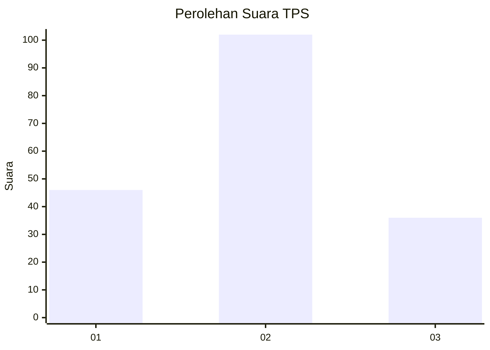
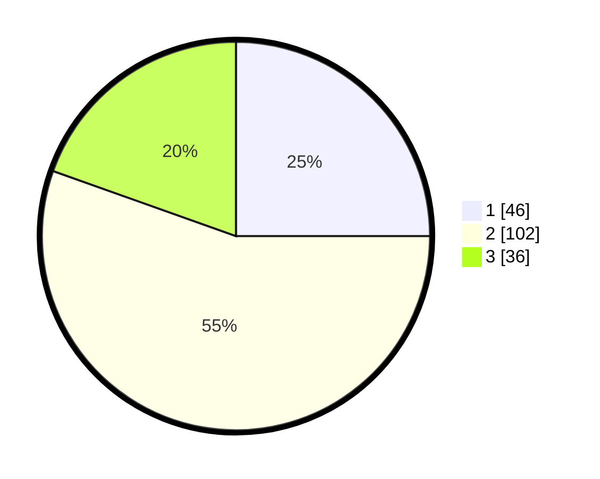

# Hasil

## Grafik

## Tabel

| No. | Nama Paslon    | Suara | Suara (raw) | Persentase |
|:--- |:-------------- | -----:| -----------:| ----------:|
| 1   | ANIES MUHAIMIN | 46    | [46][p-1]   | 25,00      |
| 2   | PRABOWO GIBRAN | 102   | [102][p-2]  | 55,43      |
| 3   | GANJAR MAHFUD  | 36    | [36][p-3]   | 19,57      |

[p-1]: https://github.com/gigit-pemilu/pemilu-2024-34-di-yogyakarta/blob/main/pilpres/hitung-suara/sub/34-di-yogyakarta/sub/02-bantul/sub/15-sewon/sub/2003-bangunharjo/sub/079-tps/sub/paslon-1.txt
[p-2]: https://github.com/gigit-pemilu/pemilu-2024-34-di-yogyakarta/blob/main/pilpres/hitung-suara/sub/34-di-yogyakarta/sub/02-bantul/sub/15-sewon/sub/2003-bangunharjo/sub/079-tps/sub/paslon-2.txt
[p-3]: https://github.com/gigit-pemilu/pemilu-2024-34-di-yogyakarta/blob/main/pilpres/hitung-suara/sub/34-di-yogyakarta/sub/02-bantul/sub/15-sewon/sub/2003-bangunharjo/sub/079-tps/sub/paslon-3.txt

## Foto C Plano

https://sirekap-obj-formc.kpu.go.id/8546/pemilu/ppwp/34/02/15/20/03/3402152003079-20240214-234721--dd76d980-33de-43f3-bc0e-c6dd525745e4.jpg

https://sirekap-obj-formc.kpu.go.id/8546/pemilu/ppwp/34/02/15/20/03/3402152003079-20240215-000657--9364b8f8-e647-4b21-b4c2-bb63f813560d.jpg

https://sirekap-obj-formc.kpu.go.id/8546/pemilu/ppwp/34/02/15/20/03/3402152003079-20240215-000727--9ae8416a-4709-4c6d-912b-0843a947e9f3.jpg

## Metadata

| Key        | Value               |
| ---------- | ------------------- |
| Time Stamp | 2024-02-24 22:31:28 |

