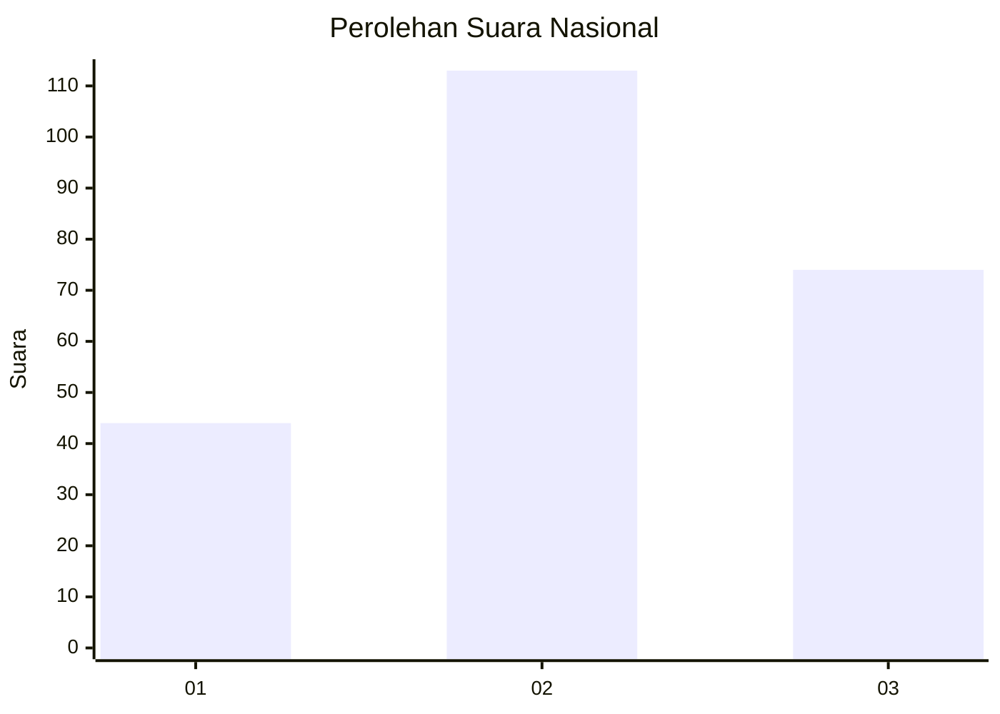
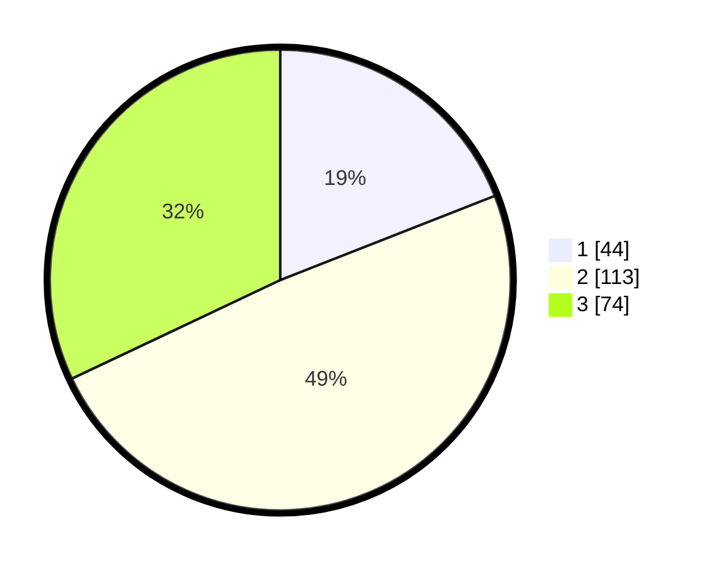

# Hasil

## Grafik

## Tabel

| No. | Nama Paslon    | Suara | Suara (raw) | Persentase |
|:--- |:-------------- | -----:| -----------:| ----------:|
| 1   | ANIES MUHAIMIN | 44    | [44][p-1]   | 19,05      |
| 2   | PRABOWO GIBRAN | 113   | [113][p-2]  | 48,92      |
| 3   | GANJAR MAHFUD  | 74    | [74][p-3]   | 32,03      |

[p-1]: https://github.com/gigit-pemilu/pemilu-2024/blob/main/pilpres/hitung-suara/sub/34-di-yogyakarta/sub/02-bantul/sub/15-sewon/sub/2003-bangunharjo/sub/084-tps/sub/paslon-1.txt
[p-2]: https://github.com/gigit-pemilu/pemilu-2024/blob/main/pilpres/hitung-suara/sub/34-di-yogyakarta/sub/02-bantul/sub/15-sewon/sub/2003-bangunharjo/sub/084-tps/sub/paslon-2.txt
[p-3]: https://github.com/gigit-pemilu/pemilu-2024/blob/main/pilpres/hitung-suara/sub/34-di-yogyakarta/sub/02-bantul/sub/15-sewon/sub/2003-bangunharjo/sub/084-tps/sub/paslon-3.txt

## Foto C Plano

https://sirekap-obj-formc.kpu.go.id/a9db/pemilu/ppwp/34/02/15/20/03/3402152003084-20240214-160135--8022d56d-9ac9-44fe-9f9b-47f188def51c.jpg

https://sirekap-obj-formc.kpu.go.id/a9db/pemilu/ppwp/34/02/15/20/03/3402152003084-20240214-160141--a62b5004-c0bb-4d77-a8d8-b32041069fd7.jpg

https://sirekap-obj-formc.kpu.go.id/a9db/pemilu/ppwp/34/02/15/20/03/3402152003084-20240214-160146--d7954f09-2905-4899-a2a2-016c40d13101.jpg

## Metadata

| Key        | Value               |
| ---------- | ------------------- |
| Time Stamp | 2024-02-24 22:31:28 |

