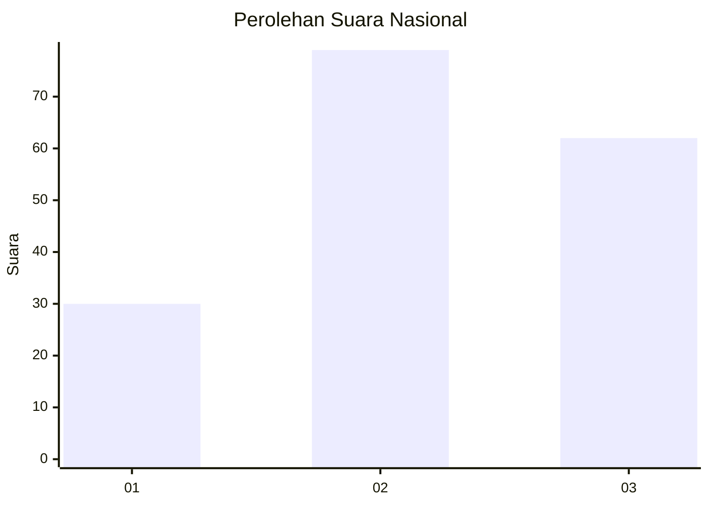
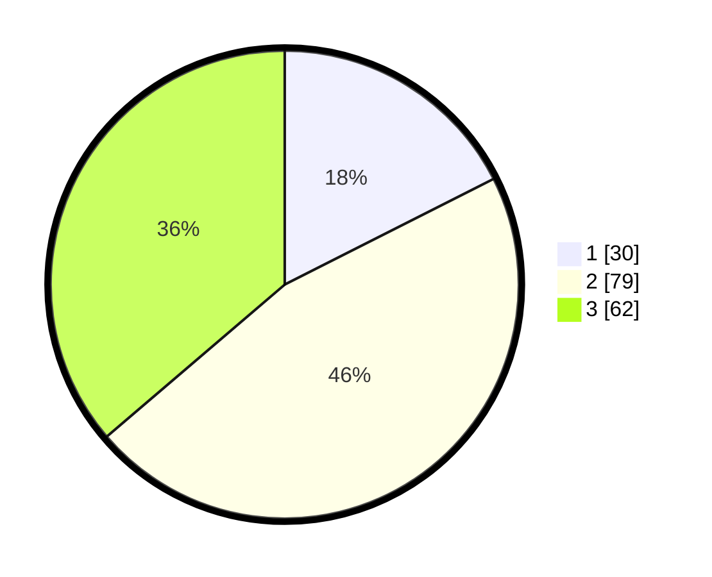

# Hasil

## Grafik

## Tabel

| No. | Nama Paslon    | Suara | Suara (raw) | Persentase |
|:--- |:-------------- | -----:| -----------:| ----------:|
| 1   | ANIES MUHAIMIN | 30    | [30][p-1]   | 17,54      |
| 2   | PRABOWO GIBRAN | 79    | [79][p-2]   | 46,20      |
| 3   | GANJAR MAHFUD  | 62    | [62][p-3]   | 36,26      |

[p-1]: https://github.com/gigit-pemilu/pemilu-2024/blob/main/pilpres/hitung-suara/sub/34-di-yogyakarta/sub/02-bantul/sub/15-sewon/sub/2003-bangunharjo/sub/086-tps/sub/paslon-1.txt
[p-2]: https://github.com/gigit-pemilu/pemilu-2024/blob/main/pilpres/hitung-suara/sub/34-di-yogyakarta/sub/02-bantul/sub/15-sewon/sub/2003-bangunharjo/sub/086-tps/sub/paslon-2.txt
[p-3]: https://github.com/gigit-pemilu/pemilu-2024/blob/main/pilpres/hitung-suara/sub/34-di-yogyakarta/sub/02-bantul/sub/15-sewon/sub/2003-bangunharjo/sub/086-tps/sub/paslon-3.txt

## Foto C Plano

https://sirekap-obj-formc.kpu.go.id/dc17/pemilu/ppwp/34/02/15/20/03/3402152003086-20240214-213134--0c1092a3-0635-41fd-944e-55f74bf0f540.jpg

https://sirekap-obj-formc.kpu.go.id/dc17/pemilu/ppwp/34/02/15/20/03/3402152003086-20240214-210425--6b0b1957-a32c-41c9-a0b2-e075d13b56ed.jpg

https://sirekap-obj-formc.kpu.go.id/dc17/pemilu/ppwp/34/02/15/20/03/3402152003086-20240214-214437--f2e8a576-80e2-46a8-8d74-63b474338a57.jpg

## Metadata

| Key        | Value               |
| ---------- | ------------------- |
| Time Stamp | 2024-02-26 12:00:00 |

