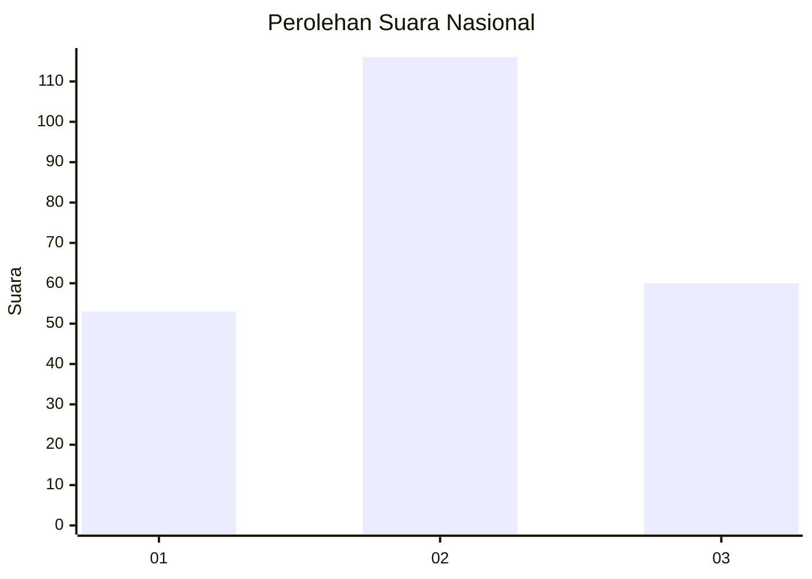
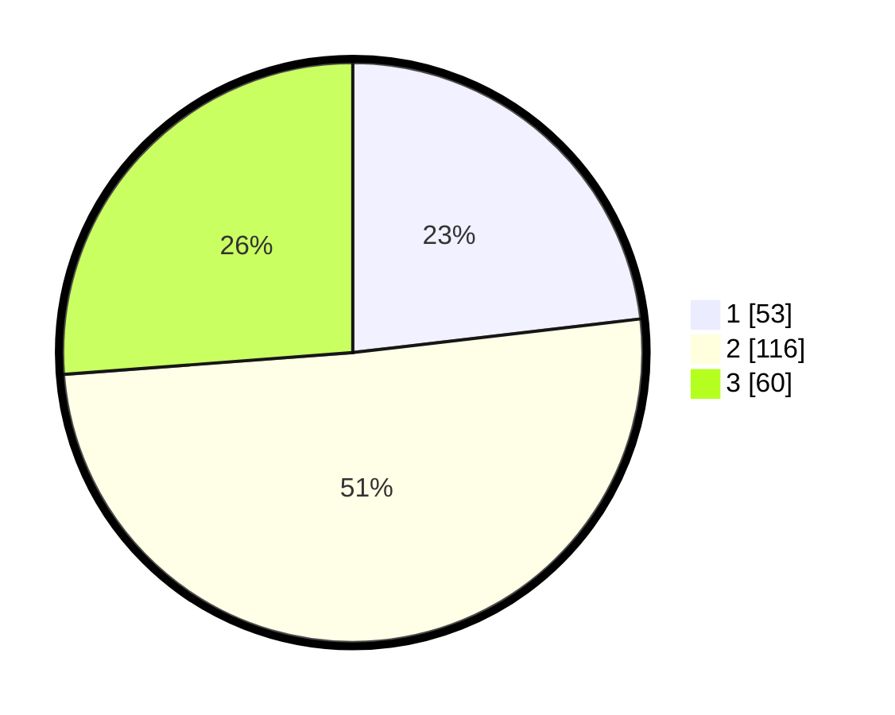

# Hasil

## Grafik

## Tabel

| No. | Nama Paslon    | Suara | Suara (raw) | Persentase |
|:--- |:-------------- | -----:| -----------:| ----------:|
| 1   | ANIES MUHAIMIN | 53    | [53][p-1]   | 23,14      |
| 2   | PRABOWO GIBRAN | 116   | [116][p-2]  | 50,66      |
| 3   | GANJAR MAHFUD  | 60    | [60][p-3]   | 26,20      |

[p-1]: https://github.com/gigit-pemilu/pemilu-2024/blob/main/pilpres/hitung-suara/sub/34-di-yogyakarta/sub/02-bantul/sub/15-sewon/sub/2004-panggungharjo/sub/003-tps/sub/paslon-1.txt
[p-2]: https://github.com/gigit-pemilu/pemilu-2024/blob/main/pilpres/hitung-suara/sub/34-di-yogyakarta/sub/02-bantul/sub/15-sewon/sub/2004-panggungharjo/sub/003-tps/sub/paslon-2.txt
[p-3]: https://github.com/gigit-pemilu/pemilu-2024/blob/main/pilpres/hitung-suara/sub/34-di-yogyakarta/sub/02-bantul/sub/15-sewon/sub/2004-panggungharjo/sub/003-tps/sub/paslon-3.txt

## Foto C Plano

https://sirekap-obj-formc.kpu.go.id/24c1/pemilu/ppwp/34/02/15/20/04/3402152004003-20240215-015031--3455aeac-cdc1-4baf-a137-84f5c5dc6aa4.jpg

https://sirekap-obj-formc.kpu.go.id/24c1/pemilu/ppwp/34/02/15/20/04/3402152004003-20240215-014923--f54cca99-d753-4c60-80a5-0a57422ad8ce.jpg

https://sirekap-obj-formc.kpu.go.id/24c1/pemilu/ppwp/34/02/15/20/04/3402152004003-20240215-015141--b6af6a19-aa14-4ff8-a75b-b00b0ff714fd.jpg

## Metadata

| Key        | Value               |
| ---------- | ------------------- |
| Time Stamp | 2024-02-24 22:31:28 |

