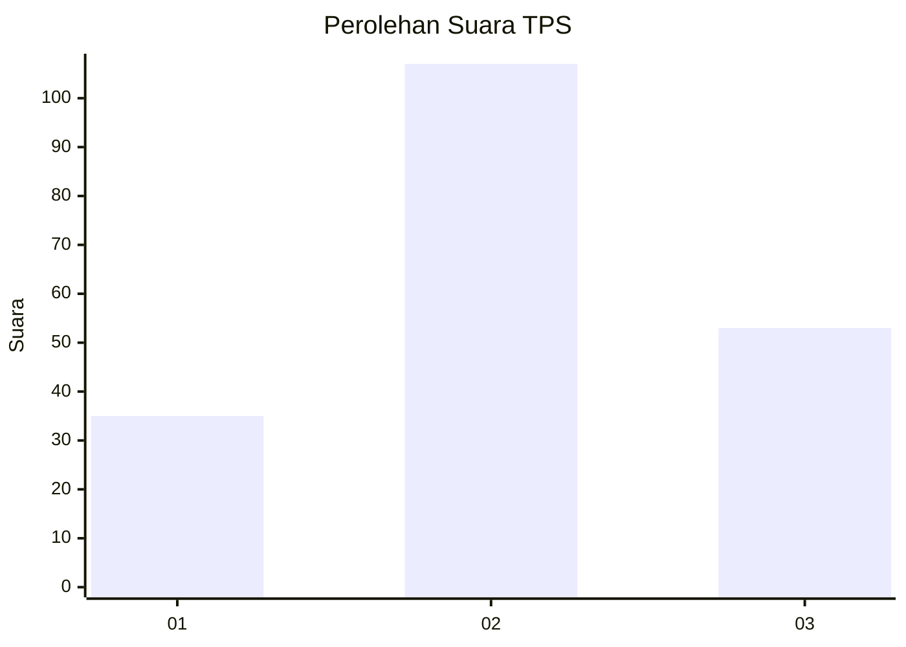
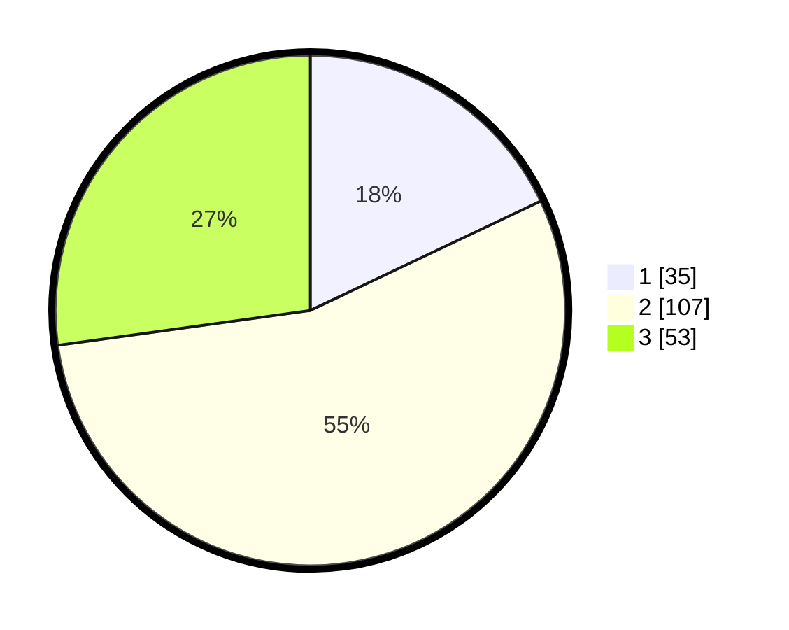

# Hasil

## Grafik

## Tabel

| No. | Nama Paslon    | Suara | Suara (raw) | Persentase |
|:--- |:-------------- | -----:| -----------:| ----------:|
| 1   | ANIES MUHAIMIN | 35    | [35][p-1]   | 17,95      |
| 2   | PRABOWO GIBRAN | 107   | [107][p-2]  | 54,87      |
| 3   | GANJAR MAHFUD  | 53    | [53][p-3]   | 27,18      |

[p-1]: https://github.com/gigit-pemilu/pemilu-2024-34-di-yogyakarta/blob/main/pilpres/hitung-suara/sub/34-di-yogyakarta/sub/02-bantul/sub/15-sewon/sub/2004-panggungharjo/sub/010-tps/sub/paslon-1.txt
[p-2]: https://github.com/gigit-pemilu/pemilu-2024-34-di-yogyakarta/blob/main/pilpres/hitung-suara/sub/34-di-yogyakarta/sub/02-bantul/sub/15-sewon/sub/2004-panggungharjo/sub/010-tps/sub/paslon-2.txt
[p-3]: https://github.com/gigit-pemilu/pemilu-2024-34-di-yogyakarta/blob/main/pilpres/hitung-suara/sub/34-di-yogyakarta/sub/02-bantul/sub/15-sewon/sub/2004-panggungharjo/sub/010-tps/sub/paslon-3.txt

## Foto C Plano

https://sirekap-obj-formc.kpu.go.id/d3f4/pemilu/ppwp/34/02/15/20/04/3402152004010-20240214-203617--0adecefd-469f-4e00-a779-897041f13842.jpg

https://sirekap-obj-formc.kpu.go.id/d3f4/pemilu/ppwp/34/02/15/20/04/3402152004010-20240214-203708--746f2c41-23f1-484e-833a-d5aadf0cf7fb.jpg

https://sirekap-obj-formc.kpu.go.id/d3f4/pemilu/ppwp/34/02/15/20/04/3402152004010-20240214-203756--edf56e1c-b11a-4488-97f4-cda1ea5859c2.jpg

## Metadata

| Key        | Value               |
| ---------- | ------------------- |
| Time Stamp | 2024-02-24 22:31:28 |

