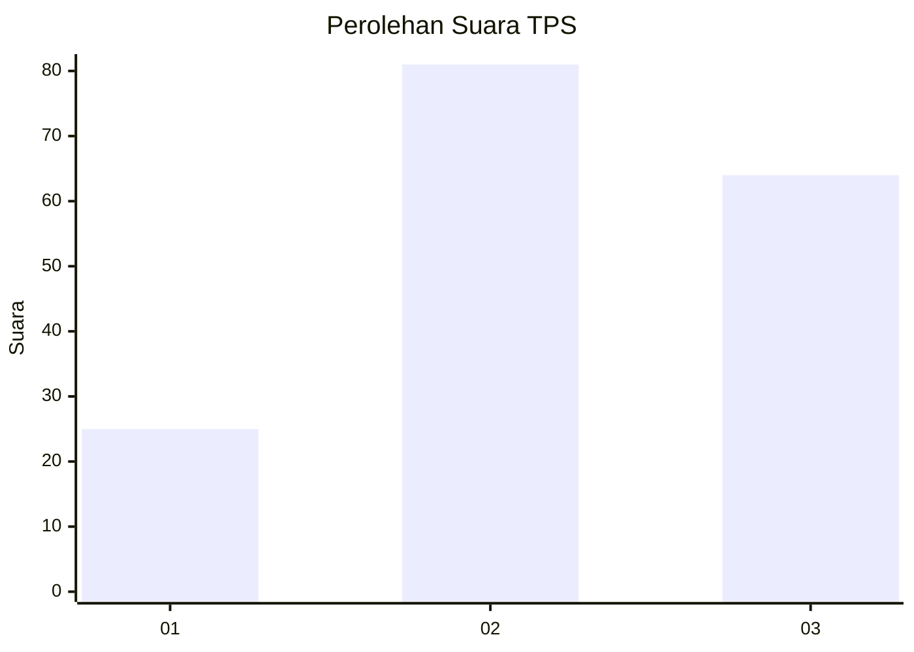
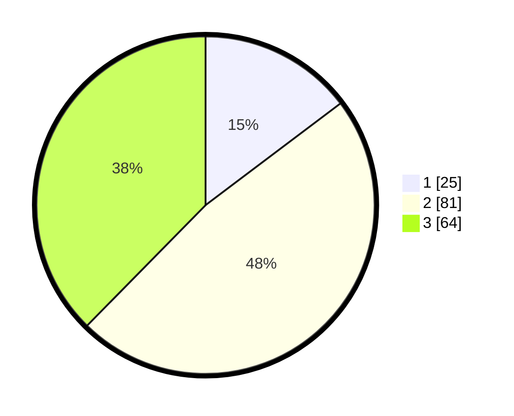

# Hasil

## Grafik

## Tabel

| No. | Nama Paslon    | Suara | Suara (raw) | Persentase |
|:--- |:-------------- | -----:| -----------:| ----------:|
| 1   | ANIES MUHAIMIN | 25    | [25][p-1]   | 14,71      |
| 2   | PRABOWO GIBRAN | 81    | [81][p-2]   | 47,65      |
| 3   | GANJAR MAHFUD  | 64    | [64][p-3]   | 37,65      |

[p-1]: https://github.com/gigit-pemilu/pemilu-2024-34-di-yogyakarta/blob/main/pilpres/hitung-suara/sub/34-di-yogyakarta/sub/02-bantul/sub/15-sewon/sub/2004-panggungharjo/sub/015-tps/sub/paslon-1.txt
[p-2]: https://github.com/gigit-pemilu/pemilu-2024-34-di-yogyakarta/blob/main/pilpres/hitung-suara/sub/34-di-yogyakarta/sub/02-bantul/sub/15-sewon/sub/2004-panggungharjo/sub/015-tps/sub/paslon-2.txt
[p-3]: https://github.com/gigit-pemilu/pemilu-2024-34-di-yogyakarta/blob/main/pilpres/hitung-suara/sub/34-di-yogyakarta/sub/02-bantul/sub/15-sewon/sub/2004-panggungharjo/sub/015-tps/sub/paslon-3.txt

## Foto C Plano

https://sirekap-obj-formc.kpu.go.id/7264/pemilu/ppwp/34/02/15/20/04/3402152004015-20240214-193302--5ea33e24-827d-4554-846a-d593edd92414.jpg

https://sirekap-obj-formc.kpu.go.id/7264/pemilu/ppwp/34/02/15/20/04/3402152004015-20240214-193421--8dd999c4-aa81-4169-b175-cae2fc3bdefc.jpg

https://sirekap-obj-formc.kpu.go.id/7264/pemilu/ppwp/34/02/15/20/04/3402152004015-20240214-195558--55d11a31-d850-4652-bf0f-b9419ed79f9e.jpg

## Metadata

| Key        | Value               |
| ---------- | ------------------- |
| Time Stamp | 2024-02-14 21:46:01 |

