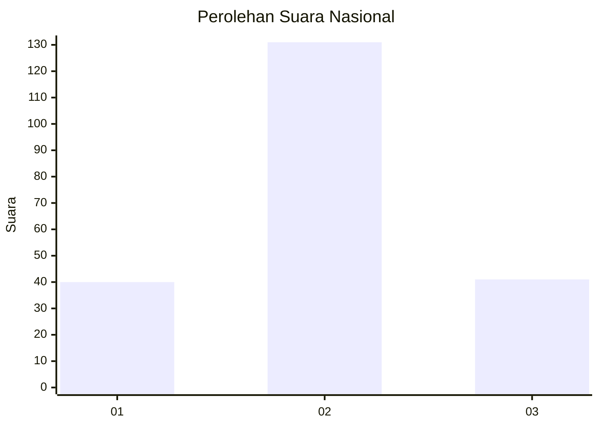
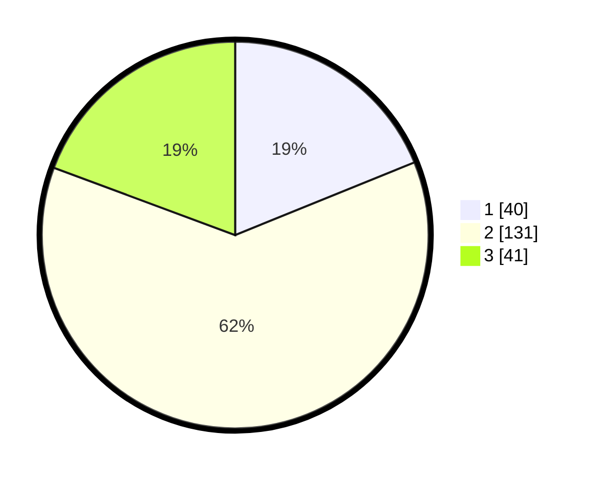

# Hasil

## Grafik

## Tabel

| No. | Nama Paslon    | Suara | Suara (raw) | Persentase |
|:--- |:-------------- | -----:| -----------:| ----------:|
| 1   | ANIES MUHAIMIN | 40    | [40][p-1]   | 18,87      |
| 2   | PRABOWO GIBRAN | 131   | [131][p-2]  | 61,79      |
| 3   | GANJAR MAHFUD  | 41    | [41][p-3]   | 19,34      |

[p-1]: https://github.com/gigit-pemilu/pemilu-2024/blob/main/pilpres/hitung-suara/sub/34-di-yogyakarta/sub/02-bantul/sub/15-sewon/sub/2004-panggungharjo/sub/021-tps/sub/paslon-1.txt
[p-2]: https://github.com/gigit-pemilu/pemilu-2024/blob/main/pilpres/hitung-suara/sub/34-di-yogyakarta/sub/02-bantul/sub/15-sewon/sub/2004-panggungharjo/sub/021-tps/sub/paslon-2.txt
[p-3]: https://github.com/gigit-pemilu/pemilu-2024/blob/main/pilpres/hitung-suara/sub/34-di-yogyakarta/sub/02-bantul/sub/15-sewon/sub/2004-panggungharjo/sub/021-tps/sub/paslon-3.txt

## Foto C Plano

https://sirekap-obj-formc.kpu.go.id/2781/pemilu/ppwp/34/02/15/20/04/3402152004021-20240214-193018--cd9616fd-bc4b-4194-8252-9f10d620254e.jpg

https://sirekap-obj-formc.kpu.go.id/2781/pemilu/ppwp/34/02/15/20/04/3402152004021-20240214-202304--4861b41a-d16b-468c-ace7-a7e639c9bbb4.jpg

https://sirekap-obj-formc.kpu.go.id/2781/pemilu/ppwp/34/02/15/20/04/3402152004021-20240214-220622--de7f68a5-4717-4b19-a5c6-94b89225981f.jpg

## Metadata

| Key        | Value               |
| ---------- | ------------------- |
| Time Stamp | 2024-02-15 09:00:24 |

