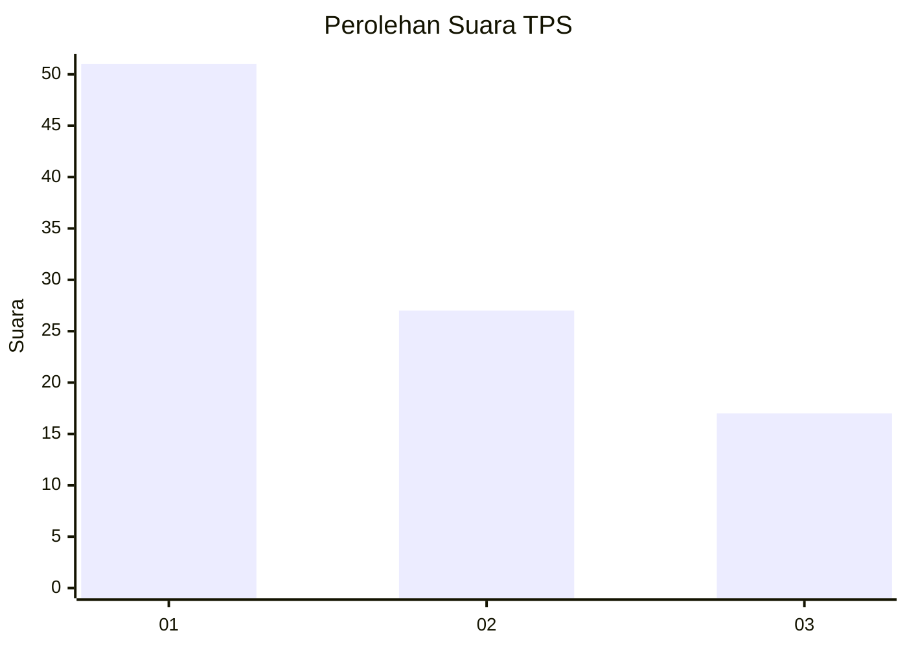
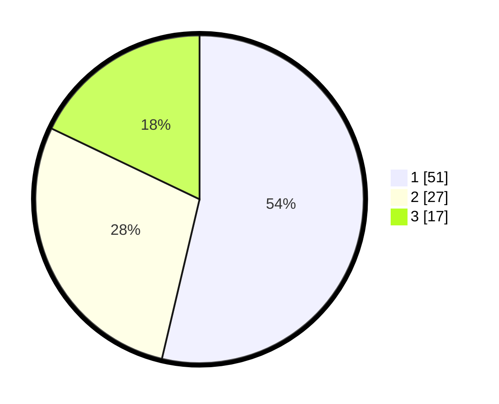

# Hasil

## Grafik

## Tabel

| No. | Nama Paslon    | Suara | Suara (raw) | Persentase |
|:--- |:-------------- | -----:| -----------:| ----------:|
| 1   | ANIES MUHAIMIN | 51    | [51][p-1]   | 53,68      |
| 2   | PRABOWO GIBRAN | 27    | [27][p-2]   | 28,42      |
| 3   | GANJAR MAHFUD  | 17    | [17][p-3]   | 17,89      |

[p-1]: https://github.com/gigit-pemilu/pemilu-2024-34-di-yogyakarta/blob/main/pilpres/hitung-suara/sub/34-di-yogyakarta/sub/02-bantul/sub/15-sewon/sub/2004-panggungharjo/sub/026-tps/sub/paslon-1.txt
[p-2]: https://github.com/gigit-pemilu/pemilu-2024-34-di-yogyakarta/blob/main/pilpres/hitung-suara/sub/34-di-yogyakarta/sub/02-bantul/sub/15-sewon/sub/2004-panggungharjo/sub/026-tps/sub/paslon-2.txt
[p-3]: https://github.com/gigit-pemilu/pemilu-2024-34-di-yogyakarta/blob/main/pilpres/hitung-suara/sub/34-di-yogyakarta/sub/02-bantul/sub/15-sewon/sub/2004-panggungharjo/sub/026-tps/sub/paslon-3.txt

## Foto C Plano

https://sirekap-obj-formc.kpu.go.id/6014/pemilu/ppwp/34/02/15/20/04/3402152004026-20240214-200136--86548d11-c524-4e09-bbdf-29aaae9e40a6.jpg

https://sirekap-obj-formc.kpu.go.id/6014/pemilu/ppwp/34/02/15/20/04/3402152004026-20240214-190839--546fd634-cd38-4e8d-b46f-a620fdd78580.jpg

https://sirekap-obj-formc.kpu.go.id/6014/pemilu/ppwp/34/02/15/20/04/3402152004026-20240216-135053--3da76969-f704-4a4c-8ec8-c73f6fc91a5f.jpg

## Metadata

| Key        | Value               |
| ---------- | ------------------- |
| Time Stamp | 2024-02-16 14:00:34 |

## DATA PEMILIH TETAP

Jumlah pemilih dalam DPT: **113**.
 * L: **62**.
 * P: **51**.

## DATA PENGGUNA HAK PILIH

Jumlah pengguna hak pilih dalam DPT: **94**.
 * L: **50**.
 * P: **44**.

Jumlah pengguna hak pilih dalam DPTb: **0**.
 * L: **0**.
 * P: **0**.

Jumlah pengguna hak pilih dalam DPK: **1**.
 * L: **0**.
 * P: **1**.

Jumlah pengguna hak pilih: **95**.
 * L: **50**.
 * P: **45**.

## JUMLAH SUARA SAH DAN TIDAK SAH

JUMLAH SELURUH SUARA SAH: **95**.

JUMLAH SUARA TIDAK SAH: **0**.

JUMLAH SELURUH SUARA SAH DAN SUARA TIDAK SAH: **95**.

