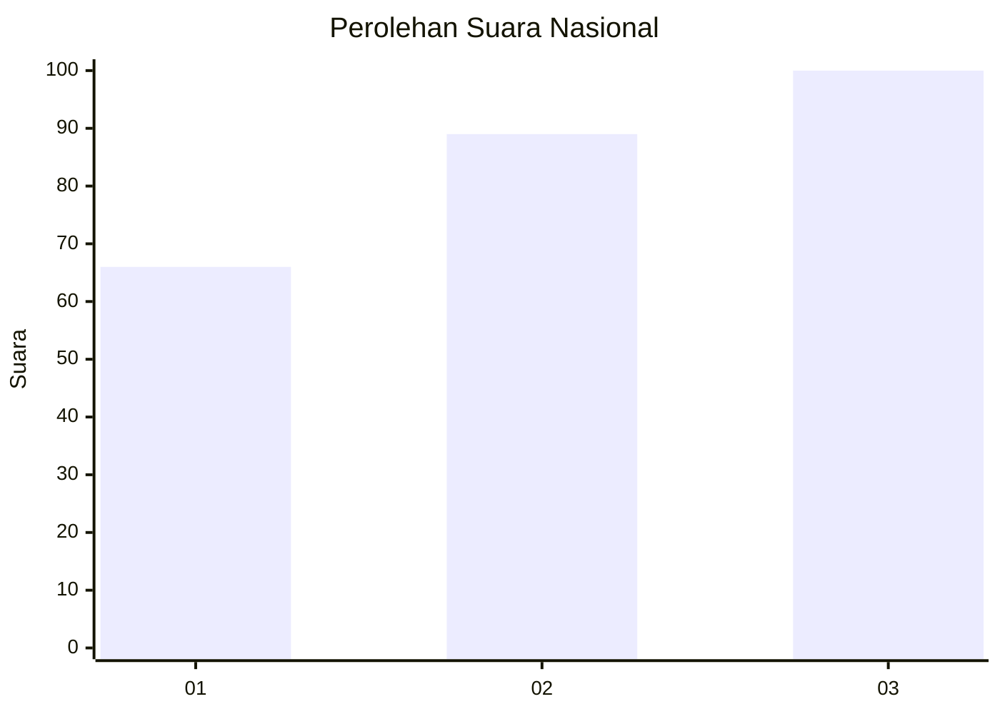
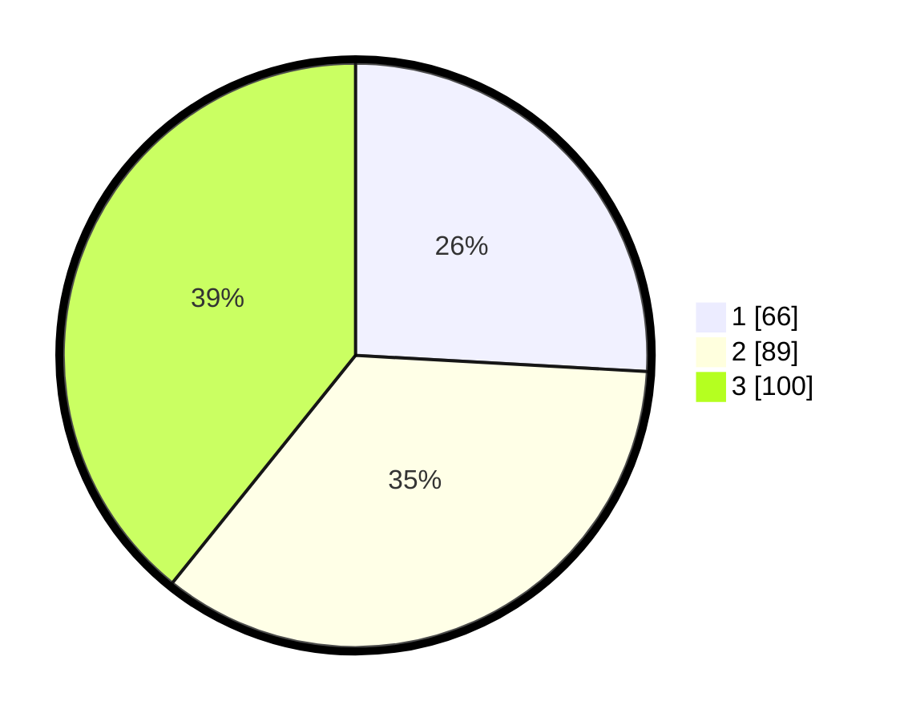

# Hasil

## Grafik

## Tabel

| No. | Nama Paslon    | Suara | Suara (raw) | Persentase |
|:--- |:-------------- | -----:| -----------:| ----------:|
| 1   | ANIES MUHAIMIN | 66    | [66][p-1]   | 25,88      |
| 2   | PRABOWO GIBRAN | 89    | [89][p-2]   | 34,90      |
| 3   | GANJAR MAHFUD  | 100   | [100][p-3]  | 39,22      |

[p-1]: https://github.com/gigit-pemilu/pemilu-2024/blob/main/pilpres/hitung-suara/sub/34-di-yogyakarta/sub/02-bantul/sub/15-sewon/sub/2004-panggungharjo/sub/028-tps/sub/paslon-1.txt
[p-2]: https://github.com/gigit-pemilu/pemilu-2024/blob/main/pilpres/hitung-suara/sub/34-di-yogyakarta/sub/02-bantul/sub/15-sewon/sub/2004-panggungharjo/sub/028-tps/sub/paslon-2.txt
[p-3]: https://github.com/gigit-pemilu/pemilu-2024/blob/main/pilpres/hitung-suara/sub/34-di-yogyakarta/sub/02-bantul/sub/15-sewon/sub/2004-panggungharjo/sub/028-tps/sub/paslon-3.txt

## Foto C Plano

https://sirekap-obj-formc.kpu.go.id/a900/pemilu/ppwp/34/02/15/20/04/3402152004028-20240216-013119--14683f0d-21b3-480a-8443-ae319f7b66f2.jpg

https://sirekap-obj-formc.kpu.go.id/a900/pemilu/ppwp/34/02/15/20/04/3402152004028-20240216-001004--c6ee67a7-cb06-4e8d-b741-5fae9cfe2356.jpg

https://sirekap-obj-formc.kpu.go.id/a900/pemilu/ppwp/34/02/15/20/04/3402152004028-20240214-235531--5a05158f-5403-4dbe-98d6-273a9a50df6f.jpg

## Metadata

| Key        | Value               |
| ---------- | ------------------- |
| Time Stamp | 2024-02-21 21:00:04 |

