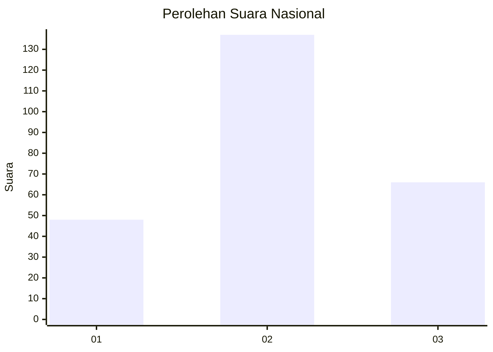
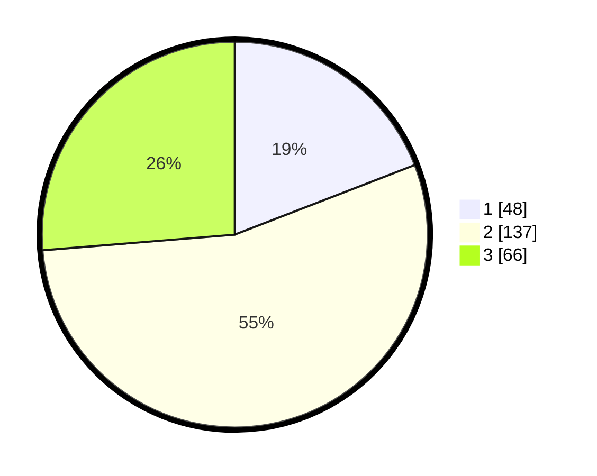

# Hasil

## Grafik

## Tabel

| No. | Nama Paslon    | Suara | Suara (raw) | Persentase |
|:--- |:-------------- | -----:| -----------:| ----------:|
| 1   | ANIES MUHAIMIN | 48    | [48][p-1]   | 19,12      |
| 2   | PRABOWO GIBRAN | 137   | [137][p-2]  | 54,58      |
| 3   | GANJAR MAHFUD  | 66    | [66][p-3]   | 26,29      |

[p-1]: https://github.com/gigit-pemilu/pemilu-2024/blob/main/pilpres/hitung-suara/sub/34-di-yogyakarta/sub/02-bantul/sub/15-sewon/sub/2004-panggungharjo/sub/032-tps/sub/paslon-1.txt
[p-2]: https://github.com/gigit-pemilu/pemilu-2024/blob/main/pilpres/hitung-suara/sub/34-di-yogyakarta/sub/02-bantul/sub/15-sewon/sub/2004-panggungharjo/sub/032-tps/sub/paslon-2.txt
[p-3]: https://github.com/gigit-pemilu/pemilu-2024/blob/main/pilpres/hitung-suara/sub/34-di-yogyakarta/sub/02-bantul/sub/15-sewon/sub/2004-panggungharjo/sub/032-tps/sub/paslon-3.txt

## Foto C Plano

https://sirekap-obj-formc.kpu.go.id/bc4e/pemilu/ppwp/34/02/15/20/04/3402152004032-20240215-014727--c72e8e55-2f57-4386-b8ca-0215f8a5b73c.jpg

https://sirekap-obj-formc.kpu.go.id/bc4e/pemilu/ppwp/34/02/15/20/04/3402152004032-20240215-014809--5d275c26-8b9f-4a5f-b399-3dcae37dfede.jpg

https://sirekap-obj-formc.kpu.go.id/bc4e/pemilu/ppwp/34/02/15/20/04/3402152004032-20240215-014850--f0ac0eb3-0b08-40fc-ac0f-3654e5f043e0.jpg

## Metadata

| Key        | Value               |
| ---------- | ------------------- |
| Time Stamp | 2024-02-24 22:31:28 |

