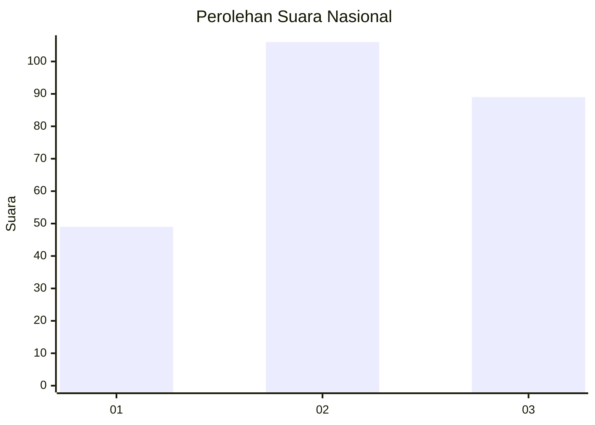
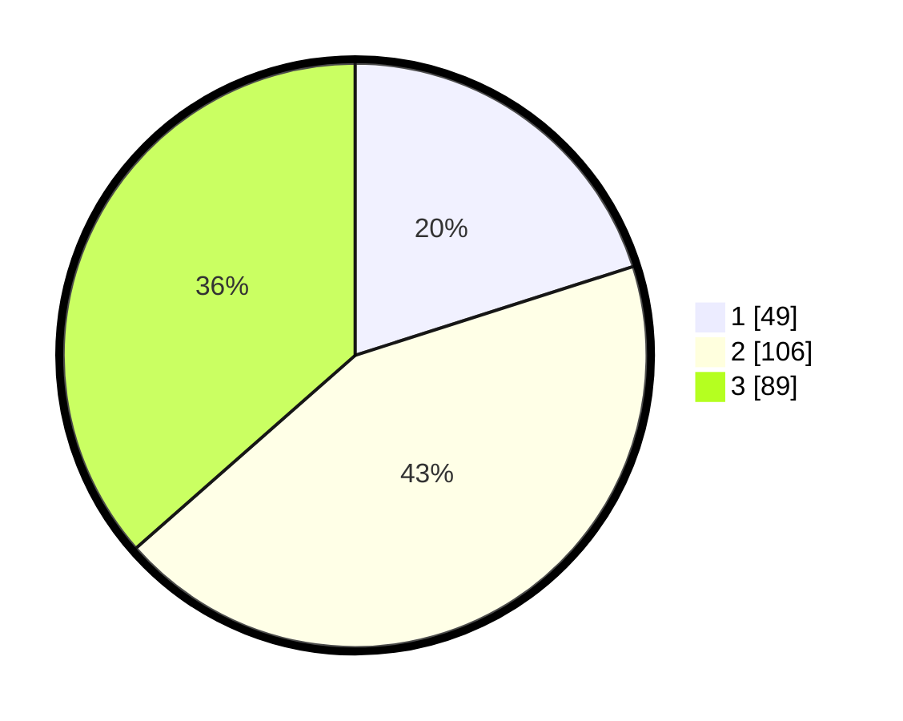

# Hasil

## Grafik

## Tabel

| No. | Nama Paslon    | Suara | Suara (raw) | Persentase |
|:--- |:-------------- | -----:| -----------:| ----------:|
| 1   | ANIES MUHAIMIN | 49    | [49][p-1]   | 20,08      |
| 2   | PRABOWO GIBRAN | 106   | [106][p-2]  | 43,44      |
| 3   | GANJAR MAHFUD  | 89    | [89][p-3]   | 36,48      |

[p-1]: https://github.com/gigit-pemilu/pemilu-2024/blob/main/pilpres/hitung-suara/sub/34-di-yogyakarta/sub/02-bantul/sub/15-sewon/sub/2004-panggungharjo/sub/034-tps/sub/paslon-1.txt
[p-2]: https://github.com/gigit-pemilu/pemilu-2024/blob/main/pilpres/hitung-suara/sub/34-di-yogyakarta/sub/02-bantul/sub/15-sewon/sub/2004-panggungharjo/sub/034-tps/sub/paslon-2.txt
[p-3]: https://github.com/gigit-pemilu/pemilu-2024/blob/main/pilpres/hitung-suara/sub/34-di-yogyakarta/sub/02-bantul/sub/15-sewon/sub/2004-panggungharjo/sub/034-tps/sub/paslon-3.txt

## Foto C Plano

https://sirekap-obj-formc.kpu.go.id/3309/pemilu/ppwp/34/02/15/20/04/3402152004034-20240214-204659--ed7ba797-351e-4356-ba04-067491e49731.jpg

https://sirekap-obj-formc.kpu.go.id/3309/pemilu/ppwp/34/02/15/20/04/3402152004034-20240215-015215--81519ba9-4768-4ba0-b533-a7cb9f491022.jpg

https://sirekap-obj-formc.kpu.go.id/3309/pemilu/ppwp/34/02/15/20/04/3402152004034-20240214-204655--a0b0a93e-0e83-406f-bf0f-3c1dbfd38666.jpg

## Metadata

| Key        | Value               |
| ---------- | ------------------- |
| Time Stamp | 2024-02-15 20:30:46 |

